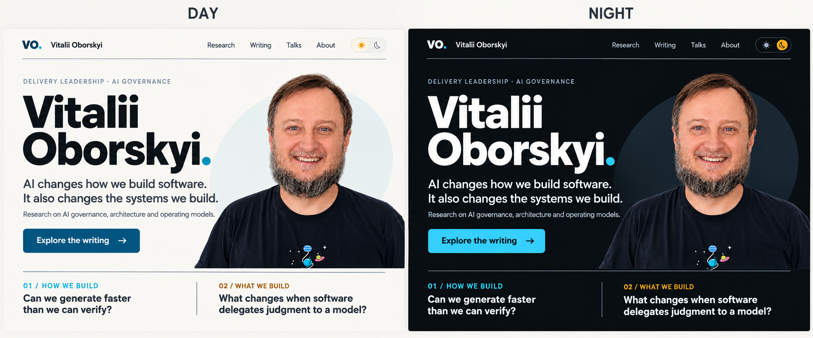

# Site visual review and proposed direction

## Approved next direction — 2026-10-03

[Issue #14](https://github.com/oborskyivitalii/oborskyivitalii/issues/14) and
[v11 Sol tasks](review/sol-visual-v11-20261003/SOL-TASKS.md) record the accepted
executive-oriented direction, original concept and exact 70% fog calibration.
Make atmosphere stronger than the shown reference; repair Day text contrast
first; refine hierarchy/palette/wordmark while preserving the five living worlds,
24-second cycle, source-bound content and SEO. Defocus is a measured optional
far-field enhancement. The concept is not a full-site implementation or evidence.
Continue Draft PR #10; this preparation changes no public bytes. The completed
`0333c4d` renderer/evidence is the baseline; older “current v8” descriptions below
are historical. Read the task's visual/contrast/SEO acceptance before editing.

## Current v8 — living thematic environments, 2026-10-03

The maintainer explicitly superseded the v7 still-life and no-idle-motion limits.
Symbols now form finite recursive environments; native scroll flies through
successive open structures. Each route uses eight thematic symbols, three symbol
scales and one cyan/bronze/paper material language. A bounded 48-second ambient
loop articulates immutable geometry even without scroll. The camera remains
scroll/topic-controlled. Off/reduced freezes the displayed camera and ambient
phase; hidden/print pauses without catch-up. Mobile reduces detail and repaint
frequency. No pointer camera, extra scroll spacing or new runtime dependency.

[All five pages](review/site-v1-20261003-v8-index.html) ·
[Execution and checks](review/sol-visual-v8-20261003/EXECUTION.md) ·
[Rules, formulas and original graphics sources](review/sol-visual-v8-20261003/DESIGN.md).
Public content/identity and portrait bytes are preserved except the Credits
paragraph explaining the newly authorized motion. Historical editions below are
evidence of their own revisions. Draft #10 and launch #1 remain open for visual
acceptance and the previously recorded release decisions.


## Historical v7 — subjects belong to their page

The maintainer rejected v6's interchangeable abstract forms. v7 uses a floating
still life for each route, sharing cyan metal, bronze accents, paper, faceted
lighting and scroll-driven perspective. Home has a compass, stairs and arch;
Research has a gyroscope, branching hypotheses and verification frames; Writing
has a modeled open book, curved loose pages and a solid letterpress A; Talks has
a microphone, wave fronts and screen; Credits has quotation marks, source links
and bookmarked source cards. Recursive detail remains in Research's branching
hypotheses. The scene is decorative; it does not depict accepted research results.

[All five pages](review/site-v1-20261002-v7-index.html) and
[execution/evidence](review/sol-visual-v7-20261002/EXECUTION.md) hold the current
candidate. Public text, LinkedIn identities/contribution boundaries, publication
inventory and portrait bytes remain as verified in v6. Native scrolling, Off/
reduced freeze, idle stop, filters/history/reflow and print behavior remain.
Opening composition, mobile framing and static fallbacks are updated together.
PR #10 remains Draft; maintainer visual acceptance and launch decisions stay open.

## Historical v6 — camera journeys and recursive sculpture

The maintainer rejected v5's slow linear motion and simple forms. v6 follows
smooth cylindrical splines around more intricate compositions, with changes of
angle, height and distance. Recursive tetrahedral structures and branching
contours share the existing cyan/amber palette. Writing uses helicoidal strata;
Talks uses an outward loop; Credits uses an abstract recursive network.
Home/Research now give the eight existing discussion entries LinkedIn profiles
and evidence-bounded professional context. Employer gaps are documented in
[SITE-SOURCE-AUDIT](SITE-SOURCE-AUDIT.md), not filled by inference.

[All five pages](review/site-v1-20261002-v6-index.html) and
[execution/evidence](review/sol-visual-v6-20261002/EXECUTION.md) own current
checks, browser observations and limits. Native scroll/topic behavior, Off/reduced
freeze and idle stop remain. No merge, release or new independent review.
The checkpoints below describe their historical editions.


## Historical v5 — implemented and rendered

The instructed V1–V5 follow-up is implemented. The [all-page gallery](review/site-v1-20261002-v5-index.html)
shows all five pages in Day/Night with real desktop/mobile captures and native-scroll
recordings; [execution evidence](review/sol-visual-v5-20261002/EXECUTION.md) records
source hashes, tests and observed limits.

Artistic assessment from the actual renders: the paper/graphite/cyan/amber language
now has open scene regions and visibly different near/middle/distant elements.
The still portrait anchors Home; Research separates control and verification;
Writing has a legible stack of planes; Talks uses widening ribbons; Credits is
sparser and calmer. Local translucent text patches leave reading clear while
revealing scene crossings. Camera travel changes relative depth rather than only
panning a flat picture. Motion remains scroll/topic-driven, with no idle loop.

The real sampled contrast check covers 40 views/4,368 glyph-center samples: normal
text minimum 5.450:1 and large text 6.848:1. All five routes were observed at desktop
and mobile widths in both themes. This is implementer review in headless Chromium,
not complete accessibility certification or independent release acceptance.

The follow-up assessment and v4 checkpoints below are historical source/planning
evidence. Their browser-block and static-only statements do not describe v5.

## Visual follow-up — 2026-10-02

The maintainer reports an almost invisible background, insufficient depth and a
Home-only review experience. This assessment inspected actual v4 source at
`cfa48f1c7b61b4bc373087d4cb3b58f3812d8bbc`, latest commits, five page files,
shared CSS/renderer, prior visual specification and PR/issue evidence. Current
Playwright Chromium/Firefox/WebKit executable paths are absent. **This is a
source-grounded artistic recommendation, not a new visual/browser acceptance.**

### Confirmed source findings

| Finding | Source evidence | Implication |
| --- | --- | --- |
| The reading layer largely conceals the scene. | `docs/styles.css`: broad section/archive/Credits masks use paper at 96%, hero copy 95%; `.space-scene` opacity is .55, .45 on mobile. Typical renderer line alpha is .6 and face fill alpha .07. | A typical line under a 96% mask has an approximate effective alpha of `.6 × .55 × .04 = .0132`; a face `.07 × .55 × .04 = .00154`. These are compositing estimates, not pixel/contrast measurements. Overlapping surfaces can suppress the result further. |
| A 3D projection already exists. | `docs/space.js`: positioned 3D nodes, camera position/target, perspective division and clipped segments. | The defect is not absence of 3D math. Visibility, depth cues, composition and camera calibration need work before another library. |
| Depth hierarchy is weakly encoded. | Most strokes share `lineWidth=1`; faces are very faint; faces are sorted, then all segments and wireframe nodes are drawn above them. | Uniform wireframe emphasis and indiscriminate overlap can flatten the scene. Review controlled foreground/middle/distant forms and deliberate translucent materials. |
| Two known routes are permanently still. | `pageStops` contains Home and Research; Writing has a separate path; the scroll listener returns for Talks/Credits. The old spec explicitly requires static overview. | This is previous intended behavior, now superseded by the maintainer's all-page motion request when there is native scroll range. |
| Secondary pages exist, but their review is hard to discover. | Five `docs/*.html` routes and fifteen v4 exports are in the tree. The PR handoff foregrounds three Home links and a ZIP, without a single visual gallery. | The missing deliverable is an accessible overview of the implemented pages, not five pages that must be invented from scratch. |

### Artistic judgment and proposed direction

The useful direction is an editorial research site with a visible spatial identity.
Readability and a strong background can coexist when the composition reserves
space for each. Lowering every panel's alpha uniformly is insufficient: a dense
wireframe behind every paragraph can become visual noise. Use local translucent
text protection, open scene areas, and fewer, larger depth landmarks.

Keep warm paper / graphite, cyan / amber and asymmetric facets. Make the nearest
facet clearly larger and stronger, the central motif legible, and the distant
structure softer. Use overlap, restrained face shading and different projected
speeds under camera movement. An actual scroll should reveal depth without
requiring the visitor to stare at tiny line changes. Avoid a generic field of
particles, heavy frosted-glass cards or an unrelated animation on each page.

Home gives the broad view; Research emphasizes the two research motifs; Writing
uses quieter ordered layers; Talks suggests outward communication; Credits uses
a sparse related network. This is one design grammar with page-specific geometry,
not five unrelated worlds, and none of these motifs carries factual evidence.

The accepted interaction baseline is still scroll/topic-only. Ambient movement
while stationary remains an explicit optional choice; it must not be silently
added to compensate for hidden scenery. A short page with no native scroll range
keeps a composed still view under that baseline, without manufactured spacing.

The [V1–V5 Sol tasks](SOL-HANDOFF.md#next-visual-iteration--maintainer-request-2026-10-02)
define the implementation sequence, page matrix and real screenshot/motion
handoff. That dated amendment supersedes static-only Talks/Credits and identical
geometry across routes. Everything in the v4 checkpoint below remains an accurate
record of the current implementation, not acceptance of this requested follow-up.

## Historical v4 source implementation — visual acceptance was pending

Six asymmetric Day/Night native facets replace both circular portrait
pseudo-elements behind the unchanged cutout. Home follows the new seven-stop
sequence, five selected works and compact three-lead/five-short public discussion.
Appearance uses a native disclosure; controls retain 44px minimum height and
anchor clearance uses the measured header height when JS runs.

The renderer now contains 11 positioned nodes with separate UA feedback and
narrowing verification motifs, triangulated translucent faces, directed links,
near-plane segment clipping, fixed world-up and explicit finite topic paths.
Home/Research have semantic section-local paths; Writing uses result bounds;
Talks/Credits remain overview. All pointer/hover camera influence is removed.
Off/reduced freezes the pose; no idle loop or invented scientific meaning.
The same-world static SVG is projected from that overview geometry.

The 150ms settling and shorter mobile path are code-level choices. Their actual
motion/contrast/portrait quality still needs the specified browser matrix. Current
Browser Use rejected localhost with net::ERR_BLOCKED_BY_CLIENT; official Chromium
installation failed. No screenshot or browser-calibration claim is made.
[Execution and remaining acceptance](review/sol-execution-20261002/EXECUTION.md).
Current outputs are [v4 interactive](review/site-v1-20261002-v4-interactive.html),
[Day](review/site-v1-20261002-v4-day.html), [Night](review/site-v1-20261002-v4-night.html)
and [bundle](review/site-v1-20261002-v4.zip). Everything below describes earlier
recorded editions, including their pointer-motion implementation and old counts.

## Historical records — earlier editions

## Applied candidate — 2026-10-02

The maintainer's next request explicitly authorizes fixing the findings and
splitting navigation. The design is now applied consistently in `docs/`, with
Home, Research, Writing and Talks plus Credits. Home has four featured editions,
four selected exact-source attributions and the author/research introduction.
Research retains all seven bounded conversations and the living vocabulary;
Writing has 27 editions grouped by year and topic with optional language filters.

The hero uses the transparent derivative as a 780×721, 55,458-byte WebP. Original
JPEG and full PNG remain unchanged. Sans-serif hierarchy, readable metadata,
flattened project routes and Day/Night cyan/amber tokens apply to all pages.
The homepage questions now sit below the integrated bust; mobile source rules
place a small portrait beside the name.

`docs/space.js` projects 96 nodes, linked rings, branching paths and a narrow
flow throat into a decorative perspective scene. Scroll moves the viewpoint
between section positions; mouse movement adds bounded parallax. It is not an
actual scientific diagram, measured telemetry or simulation. The scene draws
only on demand, coalesces events into one pending frame, caps pixel ratio at 1.5,
ignores touch/mobile pointer motion, pauses when hidden/printing and respects
saved Off plus reduced motion. A static SVG remains when Canvas is unavailable.
Theme changes redraw both animated and static states. No animation library,
external font, service or package dependency is added to the site.

Current handoff: [interactive](review/site-v1-20261002-v3-interactive.html),
[Day](review/site-v1-20261002-v3-day.html),
[Night](review/site-v1-20261002-v3-night.html),
[catalog](review/site-v1-20261002-v3-writing-day.html) and the
[offline bundle](review/site-v1-20261002-v3.zip). These derive from current pages,
not the illustrative raster board. Browser desktop/mobile/keyboard/print QA
remains pending; the prior access block was not bypassed. Candidate implementation
does not authorize merge, Pages, URL selection or release.

The original proposal/findings below are **historical at their recorded ref**.
Their "public unchanged" and pending-application statements describe that earlier
iteration, not the applied candidate. The old generator now checks stored-output
integrity only; reproduce its original behavior from local commit
`585aa52b12d7b8ab11ea90c105281f2e109a510e` (equivalent remote
`75d3911890303d60dfa44271f8f88d0f154cd368`). Current generation belongs to
`tools/build_site_previews.cjs` and `tools/build_site_bundle.py`.

Date: 2026-10-02. Owning intent: [launch #1](https://github.com/oborskyivitalii/oborskyivitalii/issues/1).
Implementation context: Draft [PR #10](https://github.com/oborskyivitalii/oborskyivitalii/pull/10).
The maintainer requested an integrated portrait with background removal and a
visual proposal informed by the presentation style, retaining **Day and Night**.

## Inspected material and limits

- Current public candidate: remote `ccfa20fb16928ff5dbbc3855b5a3965bcd7286f5`,
  tree `2d1a7fd4598f9a2f32c63866ef4a0a3509128f34`, equivalent local
  `f925b0f8e2af14bdb44ce9589844e45256a6c8c6`. Homepage structure and the full
  stylesheet were read; published edition links and theme behavior remain intact.
- Supplied original JPEG was visually inspected. The background is a light wall;
  its rectangle is independent of the page theme.
- PMDay v33 rendered slides 1, 2, 11 and 13 were visually inspected. PPTX style
  metadata was read: Arial, background `#0b0f14`, primary text `#f4f7fa`, muted
  text `#adb8c5`, cyan `#28c7f7`, amber `#f5b61c`, thin rules `#344454`.
  This is a visual reference, not a claim that this is the accepted latest deck
  edition or authorization to import its claims/artwork into the website.
- The generated cutout was visually compared with the source; its real RGBA alpha
  channel was inspected. The website itself has **not** received desktop/mobile/
  print browser inspection: the previously observed local browser access block
  is not bypassed. Layout findings below come from inspected source structure,
  styles, actual portrait and actual slide renders. No generated image is called
  a screenshot of the site.

## Findings and suggested changes

| Priority | Current observation | Why it matters | Proposal / remaining choice |
| --- | --- | --- | --- |
| P0 | Homepage places the full photo and the large question card vertically in `.hero-aside`. The original photo retains its wall background. | The right column grows; the portrait looks like a separate attached picture. In Night the light wall remains a conspicuous rectangle. | Replace the rectangle with a transparent bust integrated against the page. Anchor its existing lower crop to the hero baseline. Put the two questions in a flat strip below the introduction. |
| P0 | Large headings use Georgia; the deck uses strong sans-serif hierarchy. The site has a single terracotta accent. | The site and presentation have different visual identities. This is a stylistic difference, not a defect in Georgia. | Use system sans-serif in the proposal and deck-derived cyan/amber accents for delivery/product directions. Keep the warm Day surface and adapt the dark surface to the deck's graphite. No external fonts or deck font bundle added. |
| P1 | Body text is commonly 14px, publication metadata 11px and tags 10px. Existing muted colors themselves are reasonably contrasted. | Small type makes an already dense page harder to scan, especially on mobile; shrinking more would be the wrong remedy for long content. | Use 16px descriptive text, 13px metadata, 12px language labels and a clearer heading hierarchy. Reserve small text for secondary details. Browser size/contrast checks remain pending. |
| P1 | Box borders, tag pills, a shadowed question card and repeated topic grids compete for attention. | Many similar containers flatten hierarchy. The projects, writing and acknowledgements deserve different emphasis. | Flatten the questions/project routes, retain fine section rules, simplify tags and language labels, and give article titles more visual prominence. Decorative geometry stays behind the portrait, away from text. |
| P1 | Nine selected works, four detailed topic explanations and seven acknowledgement entries make the homepage long. | Readers may need to scroll through definitions before finding an article. | A later editorial pass could feature 3–4 works and put more detail in the existing archive/about routes. **This proposal retains all nine titles, links, dates and language labels**; selection/content removal is not silently accepted. |
| P1 | At the mobile breakpoint the existing portrait/question column follows the full intro as another tall block. | The author photo can occupy too much vertical space before useful destinations. | Proposal places a smaller portrait beside the name, then the introduction/CTA and two stacked questions. This responsive source treatment needs actual device/browser inspection. |
| P2 | Public interaction details use a relatively large two-column area. | Visibility is useful, but prominence should follow the author's research and writing. | Keep exact sources and bounded wording. In the next editorial pass consider a concise acknowledgement summary with a full linked evidence page; do not turn it into endorsement logos. |

The recommended direction is a personal research site with the presentation's
technical visual language: a readable author identity, a naturally integrated
portrait and recognizable research colors. Avoid a collection of dashboard
widgets, fake telemetry, decorative metrics, corporate logos or excessive neon.
The portrait's expression already makes the page approachable; it needs no
beautification or invented scene.

## Concrete review proposal



This comparison board was created with built-in imagegen using the cutout as a
reference. It illustrates the proposed direction; it is not a browser screenshot
or an exact rendering of the HTML below. The raster board uses a shorter summary
and symbolic theme controls; the actual HTML keeps the original homepage copy
and uses text-labelled native controls. Foreground details in an AI mockup are
not asserted to be pixel-identical to the source.

Open [site-visual-proposal-20261002.html](review/site-visual-proposal-20261002.html).
Day/Night labels switch **the same page** using native radio inputs and CSS, with
no JavaScript. The transparent PNG is embedded once, so the photo also works when
the HTML is opened alone. The proposal changes the full homepage's visual
hierarchy, not just the photo. Desktop composition uses a bust beside the intro;
mobile source rules use a smaller portrait beside the name.

| Token | Day | Night |
| --- | --- | --- |
| Surface | `#f8f7f3` | `#0b0f14` |
| Primary text | `#142632` | `#f4f7fa` |
| Secondary text | `#4b5c69` | `#adb8c5` |
| Delivery accent | `#075d7b` | `#28c7f7` |
| Product/system accent | `#895710` | `#f5b61c` |

The Day accents are darker for use on a light surface; the Night accents match
the inspected deck. Color is supplementary: both directions have explicit text
labels. No color communicates evidence acceptance or a new framework meaning.

The writing archive and credits links intentionally open the previous candidate
pages, labelled as such in the proposal notice. This is a homepage design
proposal, not a complete themed redesign of every publication page or Auto-mode
demonstration. Applying the selected direction later must cover all public pages,
their responsive/print states, theme fallback and review exports together.

No `docs/` file was changed. The current public asset, visitor-clock Auto/Day/Night,
existing SEO metadata, language groups and publication inventory are preserved.
The proposal, stylesheet, PNG, generator and hash record stay outside the proposed
Pages source. No merge, public release or deployment decision is inferred.

## Portrait provenance and prompt

Source: `docs/assets/vitalii-oborskyi.jpg`, supplied by the maintainer.
Derived asset: `review/assets/vitalii-oborskyi-cutout-20261002.png`.
Tool mode: built-in **imagegen**, `transparent_background: true`.
The original JPEG is retained. This AI-assisted cutout is not asserted to preserve
every foreground pixel identically; likeness/hair-edge acceptance belongs to the
maintainer. The shoulders, expression, black T-shirt and planet graphic were
visually compared. No rights/general-reuse permission is inferred from extraction.

Final prompt:

```text
Use case: background-extraction. Asset type: transparent author portrait for a personal research website, to work equally on warm off-white Day and dark graphite Night themes. Input image 1 is the edit target: the supplied photograph of Vitalii Oborskyi. Primary request: carefully remove ONLY the light wall background, creating a clean, genuine transparent alpha cutout of the existing man. Preserve the existing foreground photograph as closely as possible: identical facial identity, expression and smile, teeth, eyes, beard shape and individual hairs, hairline, skin texture, head position, body proportions, black T-shirt and its small colorful planet graphic. Keep the full originally visible bust and the original lower crop; do not invent arms, shoulders or additional body. Preserve natural fine hair and beard edges without a white halo. The space outside the person must be fully transparent, not a white or checkerboard background painted into the image. No face beautification, no skin smoothing, no relighting, no recoloring, no stylization, no added shadows, no rim light, no text, no badge, no frame, no logo or watermark. Keep this an identity-preserving background removal, not a newly imagined portrait. Use a near-square canvas with only a small amount of transparent margin around the original visible subject.
```

Inspection: RGBA, 1305×1206, 1,456,176 bytes; 792,467 pixels have alpha 0.
Most foreground pixels have alpha 253, near opaque, and finer edges are partially
transparent. The actual alpha is retained, not flattened onto white or dark.
This full-resolution review asset needs a web-weight optimization pass before a
public release; the proposal is not a measured performance improvement.

## Reproduction and acceptance

The comparison-board prompt is recorded in
[site-visual-concept-prompt.txt](review/site-visual-concept-prompt.txt); source and
illustrative asset hashes are recorded in the manifest. It is a design reference,
not a second live website image or a reproducible browser output.

```bash
node review/build_visual_proposal.cjs
node review/build_visual_proposal.cjs --check
```

The [manifest](review/site-visual-proposal-20261002.json) records exact sources,
asset size/derivation, output hash, theme tokens and transformations. One-off
integrity checks cover IDs/ARIA/labels/local links, all original publication
metadata, no executable script, PNG embedding, review-only indexing status and
unchanged public hashes. Existing public-candidate checks remain separate.

Pending before applying/releasing: maintainer design/likeness choice, browser
desktop/mobile/keyboard/print inspection, portrait/publication rights acceptance,
cross-page consistency and the existing URL/deployment decisions. The previous
independent confirmations do not certify this proposal.

Recorded one-off checks: nine selected edition rows identical to the current
candidate; 22 unique IDs with resolving ARIA/label/fragment targets; local review
links resolve; one embedded PNG, two native theme inputs and no executable script;
all seven public hashes unchanged. Calculated CSS-token contrast ratios are
Day: primary 14.48, secondary 6.46, cyan 6.85, amber 5.70; Night: primary 17.88,
secondary 9.55, cyan 9.70, amber 10.61. These token calculations do not certify
actual browser layout, device readability or overall accessibility. The illustrative
raster board approximates the design and is not the source for those token values.
