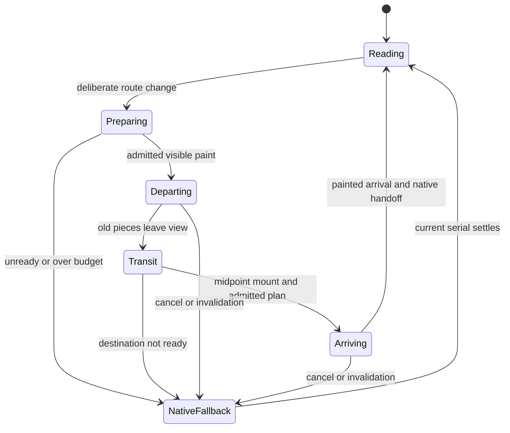

# Issue 49 — 2026-10-08 consolidated execution and Sol handoff

Owning issue: [#49](https://github.com/oborskyivitalii/oborskyivitalii/issues/49#stationary-reading-and-two-sided-fragment-flight--8-october-2026).
Owning Draft PR: [#53](https://github.com/oborskyivitalii/oborskyivitalii/pull/53).
Role: source-backed execution/handoff, with separate read-only source/design reviews.
Deterministic prototype contracts, actual visual admission and independent implementation
acceptance are separate observations.
Inspected main: `9da2476c9269345a242c7524374a645b0a21c2d4`, tree
`a1426cdf9ca1f740f56a6a66bd8f555d8820ddd6`.

This revision answers the maintainer's 8 October request: remove camera movement
caused by reading scroll, retain scroll-triggered route flights, disassemble the
outgoing visible content into unequal spatial fragments, fly through it and the
scene, then assemble the incoming content from the fractal's interior.
The original revision authorized assessment and planning only. The later dated
consolidation/execution decision below now authorizes implementation; prototype
admission, final merge and deployment remain separate gates. The earlier [7d2d889 analysis](https://github.com/oborskyivitalii/oborskyivitalii/blob/7d2d8893275c9217cb513a1be1841473ae020ff4/review/issue-49/2026-10-08-analysis.md)
is preserved history: its optional outgoing effect, old source owners and
unchanged reading-camera contract are superseded by this explicit revision.

Read root AGENTS, CONTRIBUTING, CODE-STYLE, site/README, current source owners,
acceptance/profile/budget contracts and live issue49/PR53. Only root AGENTS applies.
Issue58/PR60 is merged and closed; PMDay recording and active ribbon removal are
already in main. PR53's old seven-file planning tree is reconciled with this main,
without importing stale runtime, catalog or memory copies. Issue50/PR52 remain
closed duplicate/superseded history. Issue48 is now superseded after its full
acceptance transfer; merged PR51 stays historical delivery. Publication and
implementation checks belong in the live PR53.

## Consolidation and execution decision — 2026-10-08

The maintainer explicitly requests consolidating issues48/49 and their PR routes,
then implementing the result. **Issue49 and Draft PR53 are the sole active owner
and execution route**, including fixes, phases and model handoffs. The earlier
plan-only restriction is superseded. Do not create a phase issue or import a
second historical planning branch as another implementation authority.

Issue48 is closed `not_planned` as superseded **after** transferring all six
criteria, rather than declared completed or an identical duplicate. Its original
intent, IDs, pending gates and checked historical outcomes remain at the original
[issue48](https://github.com/oborskyivitalii/oborskyivitalii/issues/48).
[PR51](https://github.com/oborskyivitalii/oborskyivitalii/pull/51) is already merged:
tested head `3e8944af985d8d06c24348fc5227f27f97cad97d`, merge
`a06b530ee42f0ddde538f719d89f9f10fc1e156c`, identical tree
`ca02b3829ec67d806598705cfcc38cbafaf7966a`. Its source/editorial/independent/CI and
bounded stable-staging observations retain their original identities and scope.
They do not admit fragments or authorize new-fragment stable promotion.

| Current issue49 AC | Original issue48 AC | Whole-criterion disposition |
| --- | --- | --- |
| AC09 | AC01 theory association | Open: narrow Day/Night perception, wrapping and visual acceptance. |
| AC10 | AC02 formula midpoint | Open: matching narrow Day/Night placement, visibility and ambient motion. |
| AC11 | AC03 Matthew response | Accepted historical scope; preserve exact sources/claims and unrelated responses. |
| AC12 | AC04 canonical delivery | Accepted PR51 delivery only; new implementation delivery remains open under AC07. |
| AC13 | AC05 sourced Talks | Accepted historical scope; preserve event/date/language/resource identities, including separately approved later PMDay recording. |
| AC14 | AC06 shared Talks backdrop | Accepted historical scope; preserve canonical material/bounds and native wrapping. |

Original issue49 AC01-AC08 and issue48 AC01-AC06 are not renumbered or weakened.
The crosswalk creates new issue49 IDs, retaining each original issue-qualified ID.
The bounded runner accepts `AC` followed by two or three digits; no validator
change or ambiguous namespaced ID is needed. Actual issue49 checkboxes retain
AC01 and inherited AC11-AC14 checked for their accepted scope; AC02-AC10 stay open.
Current source changes must preserve those inherited outcomes and clear a tick
if its whole pass condition is invalidated.

### Current implementation checkpoint and admission boundary

T02 replaces the complete settled camera policy in the canonical lifecycle;
native Y/filter/hash/history, layout/resize, ambient phase and edge-flight
semantics remain meaningful current tests. T03 builds an **opt-in** small
heading/paragraph/portrait departure-and-arrival prototype driven by the actual
painted camera/clock. Native clipped fragments are not visually admitted merely
because geometry or DOM fixtures pass. T04 depth/native-seam/framing and isolated
measured-cost admission precede broad/default owner integration under T05-T06.
The existing reverse Back/top-edge direction and Credits instant route remain.
No formula/fractal movement, revived Ribbon or longer flight hides a defect.

This working checkpoint starts from published planning head `2b838f2` and approved
main `9da2476`; in-progress source bytes and uncommitted tests are not a published
candidate or source-bound browser/performance pass. Final exact head/tree/results,
independent review and applicable CI/preview evidence belong in PR53/issue49.
All feature visual, accessibility, navigation, measured-cost and final delivery
manual gates remain pending until their actual required observations/review.

### Current policy and test allocation

`.github/acceptance/issue-49.json` now maps all14 criteria. Its new named
`test_issue49_acceptance.Issue49AcceptanceTests` selectors run current source suites
with nonzero test accounting and zero failures/skips/cancellations/todo:

| Policy check | Current source contract | Limitation |
| --- | --- | --- |
| FRAGMENT-PLAN | `tests/fragment-plan.test.cjs`: complete seeded unequal partition, shared cap admission, canonical camera roundtrip, bounded native/world endpoints, safe near plane and executable serialized factory. | Pure geometry/resources; no perceived depth, glyph fidelity or measured browser cost. |
| FRAGMENT-DOM | `tests/fragment-dom.test.cjs`: opted-in actual paint-copy prototype, native restoration and serial/cleanup/invalid-paint behavior. | DOM fixtures are not actual browser visual/native-depth or performance acceptance. Missing/unimplemented cases fail the selector. |
| STATIONARY | Current `tests/space.test.cjs` and `tests/navigation.test.cjs`: fixed settled camera through native scroll/filter/history/reflow, ambient/freeze, painted progress, route/cancellation/head transactions. | Current thematic desktop/narrow framing and browser continuity still require observations. |
| THEORY-ASSOCIATION / FORMULA-MIDPOINT | Existing two individually selected `test_issue48_acceptance` methods. | Transferred AC09/AC10 narrow visual gates remain open. |
| MATTHEW-EVIDENCE / TALKS-CURATION / SHARED-READING-SURFACES / GENERATION-SEO | Existing individually selected semantic/source/paint-owner methods. | Preserve accepted content/surface scope and historical delivery; not fragment admission. |
| CURRENT-RI / RI-CI / OWNER / BASIC / PENDING | Existing maintained governance/source/generation/owner/accounting checks. | Do not manufacture human approval or performance from green infrastructure. |

Each shared check runs once. The historical issue48 **whole policy** remains
preserved evidence, never a second current owner. Its meaningful selected source
contracts remain usable; frozen unrelated task snapshots and superseded active
scroll-camera expectations do not become new feature gates. The provisional
fragment caps and original budgets below remain strict; browser cost is measured
against the same-source stationary-camera legacy presentation.

New canonical pure planner and opted-in DOM helper are `site/effects/fragment-plan.cjs`
and `site/effects/fragment-dom.cjs`, owned by `site/README.md`. Their meaningful
JS suites are permanent PR-targeted/staging/production contracts owned by
`guides/SITE-CHECK-PROFILES.md`; the issue49 Python selector stays issue-policy-only.
Coordinate catalog, format/lint inventory, source registry, architecture/RI/CI
routes and generated views with the implementation owner before exact-source
verification. This analysis does not claim those generated views are already fresh.

## Assessment and intended experience

The direction is coherent: native reading becomes calm and spatial movement marks
an intentional route change. It also removes the need to map changing article
length/filter results onto a camera path. This is a behavior change, not a parity
refactor, and removing one listener is insufficient. Ambient fractal motion remains;
there is no measured performance gain yet.

| User action | Intended result |
| --- | --- |
| Scroll within a page | Native text scroll; the route's settled camera stays fixed; existing ambient objects/fog remain alive when Motion is on. |
| Continue deliberately beyond a page edge | Existing wheel/touch/key intent gate starts one route transaction. Inertial tails must not skip a second route. |
| Depart | The actual visible text and images separate into varied fragments. The forward camera passes through their expanding arrangement; pieces leave the near plane safely. |
| Travel | Existing room/world composition and route flight remain visible between content layers; a giant fading paper rectangle must not conceal them. |
| Arrive | Next landing viewport's fragments emerge from a world-space corridor inside its fractal and converge exactly onto native HTML. |
| Read the next page | Ordinary complete semantic HTML is visible; fragment nodes/resources and per-frame work are gone. |

Incoming and outgoing fragmentation are both required. Pieces may be planar
paint surfaces moving/tilting in 3D; extrusion of individual letters is not assumed.
Mixed sub-glyph, glyph, word and image fragments remain the visual goal.

**Proposed direction default:** next/bottom-edge travel goes forward; previous,
top-edge and history travel preserve current route direction and native landing.
Both directions receive the fragment treatment, including emergence from depth.
The phrase "forward" describes the next-page journey here. Always-forward travel
even on Back would change room traversal/turnaround and is a separate unresolved
choreography choice, not silently included in this plan.

## Baseline source findings — before T02-T03

The table retains the reviewed approved-main9da2476 intake. In-progress T02-T03
changes are described above; these original findings are not a claim that the
latest working source still has every old scroll-camera consumer.

| ID | Verified source | Finding and consequence |
| --- | --- | --- |
| F01 | `site/engine/lifecycle.cjs`: `scrollPose`, scroll handler, `flushLayout`, `initialize`, `preferenceChanged`, `site:scene-focus`, `landingPose` | Reading Y, Writing topic paths and layout events select/retarget camera poses. Replace the complete settled-pose policy; deleting the listener alone leaves movement. AC08/04. |
| F02 | `lifecycle.cjs`: `frame`, `draw`, `reportTravel`, `advanceJourney` | One scene RAF owns actual painted camera/progress. Route duration is `min(1700, 1000 + abs(depth delta) * 2)`; use its existing deadline. AC02/04. |
| F03 | `site/engine/navigation.js`: `navigate`, `flight`, `queueMount`, `mountNative` | One router serial/AbortController owns fetched data, hidden midpoint mount, filters, native Y/hash, head metadata, focus and readiness. Capture departure before hiding; capture arrival after real mount/landing. AC03–05. |
| F04 | `site/effects/flight.cjs`: `createPresentation`, `flightPose`, `measurePlane` | Active Color moves one whole content plane using perspective 1200px and `mountAt: 0.5`. It is not a shared world-projected fragment system. The old review prototype is no longer the editing owner. AC02/07. |
| F05 | `flight.cjs`: `installEndScroll`, `endScrollGate`; navigation input-tail/endpoint owners | Deliberate edge navigation is already independent from scene scroll-pose mapping. Preserve its controls, nested-input exclusions, cooldown and native reverse-bottom behavior. AC04/08. |
| F06 | `site/engine/math.cjs`: `cameraView`; projection/world/scene paths | Camera origin is x=.66w desktop/.42w compact, y=.48h. Rooms are offset by 128; projection, not viewport 50%50%, determines perceived center. AC02. |
| F07 | `styles.css`, `reading-surfaces.css`, `renderer.cjs` | Canvas is a separate background layer. Native fragments above it do not automatically pass behind individual fractal faces. Paper panels can conceal the origin. Real motion review must admit the backend. AC02/03. |
| F08 | `projection.cjs`: `loopTransform`; lifecycle ambient/cache owners | Ambient animation is separate from camera motion. Preserve one clock, phase continuity, adaptive policy and bounded room/model caches. Do not turn Motion off to make reading stationary. AC06/08. |
| F09 | `site/README.md`, scroll/engine/functional/navigation/staging validators | At inspected main, active contracts require scroll-driven camera movement. Replace affected assertions explicitly while retaining native-scroll, route, freeze and budget checks. Historical reports keep their original identities. AC07/08. |
| F10 | `tools/quality/budgets.json`, current main build | Writing is 99,996 raw bytes against 100,000. New runtime must stay in shared declared sources; an extra inline payload or annotation can breach the limit. No byte limit increase. AC06/07. |

## Architecture and backend decision

Keep three owners: router for page transaction/semantics, scene for camera/time,
and Travel presentation for temporary content paint. Use existing explicit effect
assembly in `tools/site/effects.cjs` and export/variant consumers. Suggested pure
fragment-plan/projection helpers belong under `site/effects/`, with static rules
in canonical effect CSS. Names below are proposed contracts, not existing APIs.

| Backend | Assessment | Disposition |
| --- | --- | --- |
| Clipped native paint copies with shared world projection | Preserves browser shaping/crop/alpha; can cut inside glyphs; avoids capture dependency. DOM/compositor duplication must be bounded. No automatic per-face Canvas occlusion. | First small two-sided prototype; visual admission is mandatory. |
| Textured quads in the existing globally sorted Canvas scene | Can share actual depth ordering with fractal primitives. Faithful arbitrary HTML capture, alpha, perspective mapping and upload cost are unresolved. Existing formula bitmap handles compiled known artwork, not generic DOM. | Contingency if native pieces fail depth/fidelity; evaluate explicitly before implementation. |
| Per-character spans, full-page clones or whole-page screenshots | Character reconstruction risks shaping/wrapping; archive copies and generic capture expand memory, layout and compatibility work. Word-only motion misses partial glyphs. | Rejected default. |
| Separate WebGL/Three.js scene or independent animation timeline | Adds a second world/clock and a large unrelated migration. | Out of scope. |

Browser contracts checked against primary documentation on 8 October:
[CSS Transforms 2](https://drafts.csswg.org/css-transforms-2/#grouping-property-values)
describes flat transformed surfaces and grouping properties that flatten descendants;
[CSS Masking](https://drafts.csswg.org/css-masking-1/#clipping-paths) clips painted output;
[HTML Canvas](https://html.spec.whatwg.org/multipage/canvas.html#canvasimagesource)
does not provide arbitrary HTML subtrees as `drawImage` sources. Therefore placing
`preserve-3d` on a clipped parent is not a complete scene-composition solution.
Use one projected transform wrapper per piece with its clipped paint child and
verify the actual result. This recommendation is engineering judgment, not a
browser guarantee of depth or frame rate.

### A. Fixed reading camera, living scene

Choose one canonical settled pose per primary route using current route/scene
owners, initially the existing initial poses. Validate thematic composition and
Writing's formula in desktop/narrow Day/Night before freezing those choices.
No content-length/topic/hash-to-camera mapping remains while settled. Native
history Y, anchors, reverse-bottom and Writing filters still work normally.
Resize may recompute viewport projection/aspect, but cannot advance a path because
page height changed. Font/image/layout changes must not silently restore scroll
camera movement. Ambient world phase continues; Off/reduced/hidden/print preserve
their actual freeze/fallback behavior.

Use this same settled target for route arrival from top, bottom, hash and restored
history. Depart from the actual last painted camera, including interruption.
Removing old interior reading movement deliberately changes route endpoints when
departing from page bottom; retain room arrangement, flight algorithm and duration
rule rather than falsely claiming every old camera sample is identical. Do not
move the fractal/formula or revive ribbons to accommodate the new presentation.
Any necessary new framing choice must be shown in the prototype review.

### B. One route transaction and one painted clock

Extend the existing painted progress callback with a read-only view of camera,
viewport, projection, direction, progress and transaction identity. It describes
an actually painted frame; skipped Canvas paints cannot advance visible pieces.
Do not parse diagnostic `dataset.camera` or build a second projector/RAF/CSS clock.
The shared `math.cjs::cameraView` remains canonical; caller-specific near-plane
and visibility rules remain explicit.

After route data is ready, measure the current visible departure once before the
first breakup paint. This cost counts in input-to-ready/preparation. At the hidden
midpoint, dispose departure pieces, mount the real destination through the existing
router, apply filters/Y/hash and reuse its native layout boundary for arrival
measurement. Add a bounded post-mount presentation hook; do not clone or measure
fetched detached HTML as though it had the final layout.

Use the existing normalized progress as choreography: departing breakup before
midpoint, exposed scene transit around midpoint, assembly after midpoint, exact
native handoff at actual arrival. Ratios are prototype tuning, not added delays.
Do not make the whole camera trip longer to hide expensive capture or a late
incoming plan. Require at least 250ms of arrival window after readiness; otherwise
use the ordinary fallback for that transaction and retain the reason.

### C. Actual content fragments with safe geometry

Capture only each side's actual visible viewport plus at most 64 CSS px overscan.
Header/Appearance/skip link are persistent. Native content keeps its dimensions;
there is no permanent per-letter markup. Offscreen page content is already complete
and gets no new effect on later scroll. At a page bottom the departure contains
what the visitor actually sees there, not an invented return to the page top.

Choose the smallest bounded paint owner retaining shaped lines, inline ink and
image crop. Batch layout/style reads before writes. Bounded Range measurements
may guide glyph-sized cuts but do not provide glyph outlines or screenshots.
Preserve ligatures/combining marks/ink overhangs. Define a complete unequal mask
partition with shared boundaries and larger remainder cells; random omissions or
uniform word-only tiles do not meet AC03. Unsupported complex SVG/contextual CSS,
pseudo-elements or unready visible media trigger explicit whole-transition fallback.
Transparent portrait pixels, SVG references and responsive currentSrc must survive.
Copies are inert, aria-hidden, noninteractive and stripped of live identity/handlers;
rewrite admitted internal SVG references safely. No per-piece image download.

Initialize departure pieces at their exact native screen positions and unproject
them onto a finite plane ahead of the current camera. Give seeded bounded lateral
separation, depth offsets and mild rotation; actual camera motion supplies the
flight-through. Never project through z=0: clip/cull/fade before the near plane so
pieces leave the viewport without exploding or mirroring. Reverse trajectories
follow the selected route direction; no unreviewed camera turnaround is invented.

For arrival, derive a route-local emergence anchor from the existing world/fractal
geometry (or one explicit scene-owned anchor if needed), apply roomOffset and
project it with the painted camera. It must sit in the actual visible corridor,
not a fixed screen center. At a camera-facing endpoint depth d, unproject pixel
(x,y) using cameraPosition + right*((x-originX)*d/focal) +
up*((originY-y)*d/focal) + forward*d. Projected corners must converge onto the actual
native rectangle, including restored scroll and visual viewport offsets. Proposed
terminal corner error is at most 0.5 CSS px; actual ink/seams still need visual review.

Paper/reading surfaces have a coordinated fade/return separate from fine shards;
keep their canonical final appearance. On each handoff expose exactly one visual
representation, atomically revealing native content and removing decorative pieces.
No doubled glyph, line-wrap change, image jump or empty interval is acceptable.

### D. Cancellation and bounded work

One router serial owns preparation, fragments and disposal. Async font/image/route
results check that serial; canceled targets cannot return. Retarget from actually
displayed fragments only within the shared cap, otherwise cleanly take the ordinary
fallback. Never retain successive ghost layers. Resize/zoom/theme/font changes
allow one coalesced reprepare only when the existing deadline permits; otherwise
settle native content. Off/reduced/Content flight disabled allocate zero pieces;
no-Canvas/CSS failure, device hold, hidden, print and exceptions clear resources
through existing navigation completion/cancel paths. Controls/history/focus remain
usable, with a single announcement and no duplicate analytics event.

The previous provisional caps remain one shared experiment, not an additive budget:

| Resource | Prototype admission cap |
| --- | --- |
| Live pieces, both sides combined | 96 desktop / 40 compact, including retarget remnants |
| Distinct paint owners | 32 desktop / 20 compact |
| DOM descendants across copies | 1,500 desktop / 600 compact, bounded before cloning |
| Repeated text across copies | 32 KiB desktop / 12 KiB compact |
| Full owner surface area times actual DOM DPR squared | 8M desktop / 3M compact pixels; an admission proxy, not a GPU-memory claim. The Canvas DPR cap does not apply to native DOM copies. |
| Layout work | Batched departure snapshot plus batched native arrival snapshot; no layout reads in the frame loop |
| Steady state | Zero fragment nodes, retained copied surfaces, new observers or fragment style writes after completion |

Coarsen while preserving complete visible paint or fall back. Do not multiply caps
for departure and arrival, clone an entire archive per tile, or assume a small clip
means a small compositor surface. Avoid animated blur/shadows and permanent
will-change. Extra capture/prepare waits and allocations remain in the measured
transaction. Incoming and outgoing callbacks must preserve the existing scene tier.

## Measurement and economical verification

Keep all original budgets: transition preparation <=160ms, callback p95 <=80ms,
max <=200ms, gap <=300ms, ready <=3200ms, minimum 8 paints; ordinary callback p95
<=33ms and idle busy <=20%; Lighthouse LCP <=2500ms, TBT <=200ms, CLS <=0.1; existing
raw/gzip/asset/geometry limits. No actual performance claim is made by this plan.
Provisional incremental admission remains median added preparation <=30ms desktop/
50ms compact CPU x4, inclusive transition-work p95 delta <=8ms/12ms and added
input-to-ready <=100ms. Freeze definitions/conditions before collecting data;
report browser layout/paint/compositor work separately from JS callback timing.

Isolate the feature cost with same-source pairs: **stationary camera + legacy
presentation versus stationary camera + fragments**, with the same scene quality,
route, landing, input and cache state. Camera-policy savings cannot offset a failed
fragment budget. Measure scroll-camera removal separately only if claiming a gain;
ambient Canvas still paints while reading. Keep source/tree/artifact/served-runtime
identity, complete raw trials, fallback reasons and failed samples.

One bounded experiment: three serial pairs for each of four cases (24 measured
transitions total): desktop Home-to-Writing cold; compact CPU x4 same cold arrival;
desktop Research-to-Home portrait arrival; compact CPU x4 reverse-to-bottom with a
real picture-bearing departure. Freeze exact viewport/input/native Y and visible
owners first. These are transitions, not 24 Lighthouse runs. Retain representative
Day/Night desktop/narrow motion clips from the prototype; widen only to investigate
an observed defect. Early native macOS WebKit fidelity smoke is useful if available;
production/device gates remain with their release owners.

| Profile | Required disposition |
| --- | --- |
| Historical planning checkpoint | Five original policy checks (including Basic), formatting, bounded style and RI/CI regressions; preserve its original source identity. |
| Current consolidated checkpoint | Fourteen-criterion owning policy with named current fragment/stationary and individually inherited source checks, maintained format/lint/architecture, RI/CI and relevant regressions. Actual prototype visual/cost admission stays separate. |
| Implementation source | Extend existing flight/navigation/space/scroll-sync/engine suites with fixed reading pose, mixed partition coverage, projected endpoints/near plane, serial races, native handoff and bounded cleanup. Meaningful negative cases must fail. |
| Active behavior migration | Replace scroll-camera movement assertions in site/README, `tests/space.test.cjs`, `tools/quality/scroll-browser.cjs`, `engine-browser.cjs` writing gestures, `functional.cjs`, `navigation.cjs`, `staging-regression.cjs` and their dependent fixtures. Retain native Y/bounds/filters/history/edge-input and ambient/freeze tests. Inventory exact callers before edits. |
| PR hosted smoke | Reuse two-width persistent navigation; add one real two-sided text/image flight and reverse landing with progress frames. |
| Bounded staging | Existing Chromium/Firefox journeys, ten failures, motion windows, four cold/warm flights and two Lighthouse trials; add assertions within cases. No duplicate full diagnostic campaign. |
| Production | Existing full/native macOS WebKit/device/release coverage. No Linux WebKit expansion. |

Keep legacy whole-plane numerical assertions for the retained fallback. Old
scroll-camera route-policy expectations become dated history; pure path/projection
math tests stay where still used by route flights. Register new helpers/meaningful
tests under current RI/test-profile owners. Do not run frozen issue58 migration
snapshots as future feature semantics. Preserve CI/static identity and exact scanner
review, without widening frozen debt or changing security thresholds.

## Sol tasks

| Task | Owner and expected result | AC / verification | Dependency and status |
| --- | --- | --- | --- |
| T01 | Revalidate the bound issue49/PR53 and actual main; retain merged R2–R6, transfer issue48 AC01-AC06 as49 AC09-AC14 and preserve PMDay/no-ribbons. | AC01/07/09-14; exact branch/tree/owner/criteria crosswalk. | Consolidation decision recorded; final source/RI/CI review remains current. |
| T02 | In lifecycle and existing route/scene owners define settled reading pose; decouple scroll/filter/history/layout from camera while retaining native navigation and ambient phase. Inventory and revise the conflicting active contracts together. | AC08/04; fixed camera across native Y/filter/hash/reflow, live ambient on, correct Off/hidden and edge-triggered flight. | Authorized implementation underway; current source contracts plus actual framing, especially Writing formula, remain required. |
| T03 | Extend actual painted-frame presentation seam. Build bounded opt-in departure + arrival prototype for a real heading, paragraph and portrait using shared projection. | AC02/03; identity-pose fidelity, unequal sub-glyph/glyph/word/image coverage, correct scene anchor, safe near plane. | Authorized opt-in source prototype after T02; T04 admission before broad/default rollout. |
| T04 | Record real two-sided clips and isolated same-source performance/resource pairs; review depth, framing and native seam. | AC02/03/06; original and incremental limits, all raw failures retained; maintainer visual decision. | Gate. If flat or costly, stop and review Canvas/capture alternative. |
| T05 | Integrate bounded visible owners and native midpoint/landing capture; preserve one serial/history/head/focus transaction. | AC03/04; forward/reverse/nonadjacent, bottom/hash/filter/history landings, no full-main clones. | Only after prototype admission. |
| T06 | Complete retarget, cleanup, reflow/readiness, disabled/failure modes and semantics. | AC04/05/06; adversarial stale callbacks, no duplicate identities, no retained pieces or growing caches. | With T05. |
| T07 | Canonical/export/offline identities, CSS, mapped tests/profile registry, source scanners and RI. Replace pending-only mappings with actual named feature checks. | AC07; CS01–CS10, clean/incremental parity and exact coverage; no weakened budgets. | With implementation; update same file's task status. |
| T08 | Run relevant PR and bounded-stage evidence through existing controller; independent implementation review and final actual AC evaluation. | AC02-AC10 and preserved AC11-AC14; source-bound browser/raw evidence, author visual acceptance and final merge/main gate. | Final candidate; separate release/promotion authorization. |

Execution is now requested: Sol implements T02-T03 on this same route. Astra/design role reviews
T04's geometry, depth and failure tradeoffs before broad integration. Model names
are roles, not evidence of model superiority or independent review. The code work
is suitable for Sol; backend admission and visual judgment should not be delegated
to generic green tests.

## Decisions, acceptance and handoff

Accepted scope from this request: stationary reading camera, preserved native
edge-scroll route flights, required outgoing breakup and incoming assembly.
Recommended but not yet visually admitted: native clipped backend, initial settled
route poses, exact fragment trajectories/phase tuning and provisional caps.
Proposed navigation default: preserve reverse Back/top-edge behavior; always-forward
travel remains a separate choreography decision. The later consolidation request
authorizes execution under T02-T04; final merge/stable promotion/production retain
their applicable decisions.

Stable issue49 AC01-AC08 are retained; inherited AC09-AC14 follow the explicit
issue48 crosswalk above. AC01 covers reviewed design delivery only, while
AC11-AC14 retain historical accepted content/canonical-delivery scope. AC02-AC10
remain unchecked until their whole implementation and visual/resource conditions
are met. The executable policy maps actual prototype/stationary/source contracts
and keeps manual admission pending; it does not pass behavior with prose checks.

AC07 includes CS01-CS10: canonical ownership/dependencies, content/CSS separation,
readable bounded factories, one clock/disposal, measured limits, meaningful tests,
reviewed exceptions and accurate issue/PR evidence. Configuration and selectors
follow pinned formatting; new source/helper ownership, actual source lint/security,
current generated output and independent implementation review remain mandatory.

Two separate read-only agents reviewed current camera/source ownership and the
UX/performance/backend design. Their findings are incorporated: full pose-policy
replacement, both-sided prototype, native landings, shared caps, isolated paired
baseline and reverse-direction caveat. Those retained observations are independent design review only.
Current prototype source/check results and independent implementation review are
recorded separately; no browser visual or performance pass follows from the plan.
Exact publication and deterministic results are recorded in PR53 and the issue
anchor; the original plan/checkpoint links remain historical evidence.

## Incoming assembly refinement — 9 October 2026

The maintainer reviewed the effect and requests stronger incoming construction:
visible text and blocks should assemble in staggered pieces from the real fractal
interior over 1–2 seconds. This checkpoint stays in issue49/PR53 and focuses on
that effect. Other open visual/scene criteria retain their existing scope.

The original arrival moves every piece synchronously during the last half of
camera travel, with remaining native paint revealed by one page-wide fade. The
refinement keeps the camera path/duration unchanged and adds a finite incoming
presentation tail on the existing painted scene callback. The duration request
authorizes that content tail; it does not authorize a longer camera flight or
another animation loop. Use approximately1.8seconds and staggered piece-local
progress so text becomes progressively readable before the native handoff.

Validation belongs to the existing fragment geometry/DOM and scene/router
contracts plus the current two-width Color preview smoke. Preserve original
resource caps and ready/frame budgets; automatic passes do not supply the
maintainer's final visual acceptance or the full added-cost admission.

Implementation: incoming visible headings, paragraphs, short context text and
ready images share the existing resource allowance. A reading-order schedule
releases pieces over half of the incoming window; each travels from the actual
room anchor on a curved path and resolves at exact native coordinates. The
normal window is1800ms; late captures scale it to1000–1800ms with300ms provisional
headroom inside the existing ready budget. That headroom is not a guarantee of
full input-to-ready timing: the hosted smoke measures the actual whole transaction.
Native reading surfaces reveal during the first300ms while captured native text
and pictures remain hidden until handoff. Camera travel and departure are unchanged.

Independent implementation review found and verified fixes for three defects:
device hold could strand a settled-camera tail, candidate enumeration could
exceed its preparation deadline, and a failed browser check could discard its
raw measurements. The reviewer found no remaining implementation blocker and
independently passed four focused regressions. Local current-source checks pass
42 fragment/router cases, all46 generated-scene cases and16 collector/validator
cases, plus Basic at99996maximum HTML bytes and RI28/coupling19 regressions.
CS01–CS10 retain canonical sources, measured declarative paint, original caps,
pinned formatting, substantive review and one clock/cancellation owner.

The existing two-width Color smoke now enables fragments, observes declared and
actual assembly duration, successive settled groups, native handoff and an Off
abort, and retains inclusive callback/ready/gap/preparation evidence even on
failure. Its390px case uses DPR1; native DPR2/3/iPad fidelity remains open. Native
depth/seams, all-route acceptance and same-source paired added-cost admission
also remain open. The local browser download was unavailable, so actual browser
results must be observed through the existing hosted preview workflow.

## T02-T03 implemented prototype checkpoint — 8 October 2026

The user-authorized implementation continues solely in PR53. T02 now uses the
canonical initial route pose for settled reading, independently of native scroll,
filters, hashes, restored Y and layout changes. Ambient scene phase, deliberate
edge gestures, inter-room flights, native endpoints, freeze modes and caches retain
their owners. Active browser collectors and both report validators require native
scroll plus a fixed camera and positive ambient paints; historical diagnostics
record old camera observations without admitting them as the new contract.

T03 adds an opt-in **Fragment flight preview** control beside Content flight.
Default Color retains its legacy whole-plane presentation for the same-source
cost comparison. Enabled animated preview temporarily partitions one actual
visible heading, substantive paragraph and ready picture into unequal masks.
Native semantic DOM stays authoritative; copies are inert, hidden from accessibility,
without IDs, live links or handlers. Unsupported paint, unavailable fonts/images,
resource overflow or preparation deadlines use the existing presentation.

The existing scene progress callback supplies a frozen last-painted camera,
viewport/projection, existing destination root anchor and remaining flight time.
No extra RAF or animation clock is introduced. Departure stays in world space;
arrival waits until the actual fractal root is in the forward visible corridor.
This matters on reverse travel, where the destination root can initially be behind
the camera. Preparation deducts snapshot age and its own work from the remaining
time, retaining at least 250ms for assembly; a late arrival falls back. Assembly
normalizes from actual readiness to the existing final deadline. Near-plane
rejection prevents inversion or enormous tiles. Router cleanup atomically restores
native paint and removes pieces and subscriptions.

Independent integration review found and corrected actual-DPR undercounting,
temporary blueprint accounting, nonrepresentative paragraph selection, fallback
flashes, arrival-window accounting and behind-camera reverse anchors. The reviewer
found no remaining source blocker for this opt-in prototype and independently
roundtripped eight tilted homographies. Meaningful pure geometry and serialized
DOM tests cover coverage/caps, native corners, safe copies, one-time reads, shared
painted progress, no-allocation waiting/disabled modes and cleanup/deadlines.
These tests do not establish native glyph/compositor fidelity or measured speed.

T02-T03 source work is implemented in the candidate; T04 remains pending for actual
Day/Night desktop/narrow depth, reverse fallback frequency, optical handoff and
same-source resource/frame evidence. T05-T06 broad/default rollout stays gated.
AC02-AC10 remain open; AC01 and inherited AC11-AC14 retain their accepted
design/historical status. Current source/check/publication identities and results
belong in PR53 and the live issue evaluation; main/stable/production are unchanged.

### Published prototype observation and CI reconciliation

Published source `11252e0b09bcad766121d09929675a5b82dda3d5`, tree
`8b1aaa01381caacddf580d65442fd9d934fbb634`, produced the immutable
[prototype preview](https://b85fadee.oborskyi-author-ci-staging.pages.dev/).
Desktop Night observation at 1348 by 926 confirmed actual native Home scroll
from 0 to 734 with unchanged camera, advancing ambient phase, and no settled
fragments. With preview enabled, Home-to-Writing exposed 32 temporary pieces,
then restored complete native Writing content, focus and zero retained pieces.
This limited observation does not admit depth, narrow Day/Night framing,
reverse fallback frequency, optical seams or performance.

Navigation and Basic CI passed. Ordinary hosted journeys passed at both maintained
widths in normal and no-Canvas modes. The first published acceptance and Color
smoke failures remain retained: the workflow skipped policy49's required locked
Python/PostCSS tools, and the Color collector installed a different paint-probe
name from the shared stationary-reading observer. The follow-up reuses the same
locked tool installation and canonical actual-paint probe. It preserves positive
Canvas paints, native scroll, fixed-camera assertions, cases and original budgets.
Exact corrected source/run results belong in the live PR53 evaluation.

## Second effect refinement — 9 October 2026

Maintainer feedback on published ba74441: keep the stronger staggered assembly,
remove the heading jump at native handoff, fade letters with actual scene depth,
and make pieces varied solid shards rather than a rectangular sliced plane.
Same issue49 / Draft PR53; no additional execution owner.

### Implementation and verification

- `fragment-dom.cjs` now freezes measured native padding, border-box sizing and
  line/wrapping metrics. The archive h1 clone had left its parent-scoped8px/16px
  padding behind; its text origin differed despite a correct outer rectangle.
- `fragment-plan.cjs` partitions the visible owner with seeded angled convex
  cuts. Triangle, quadrilateral and larger polygons cover the whole native paint
  without interior overlap. Per-shard roll/tilt/pitch and thickness vary; projected
  rear sidewalls show volume during flight and vanish at exact native endpoints.
- Opacity attenuates with actual painted camera-space depth, independently of
  release timing; the native reading plane remains fully opaque at handoff.
- The canonical effect CSS owns polygon/prism appearance. Two bounded SVG paths
  per shard paint only shaded sidewalls behind clipped actual text/image copies.
  There is still one scene clock and one cleanup path. Full-viewport SVG paint
  does not own another transformed/opacity texture; per-group pixels and added
  nodes share the unchanged transaction caps. Oversized projected sidewall bounds
  are culled before paint; the original native face still flies.
- The existing two-width Color smoke samples actual settled h1 text-node Range
  rectangles and rejects glyph-line displacement above0.75CSSpx. No additional
  browser matrix or perpetual observer clock is introduced. The previous ba74441
  smoke failure is retained: assembly/timing passed both widths, but cancellation
  clicked Motion inside a closed Appearance menu. The test now opens that menu
  before starting the cancellation flight, preserving the real visible click.

Meaningful geometry tests cover polygon area/bounds/convexity and independent
separating-axis nonoverlap, depth-opacity order, finite side faces, hidden frontal
rear faces, invalid masks and exact native endpoints. A bounded384-partition
seeded stress pass covers fractional/thin text and picture owners. In-memory
mutation review rejects missing attenuation, absent facets, polygon gaps and
reversed extrusion; a same-area overlap/gap fixture fails the independent oracle.
The DOM suite covers measured paint preservation, SVG disposal and side-budget
fallbacks. Hosted glyph fidelity/timings must be observed on the published head.

### Independent source review and dispositions

A separate read-only reviewer found a reversed rear extrusion normal and an
initial full-viewport pixel reservation that would reject Retina/mobile cases.
Both were corrected before publication: rear extrusion uses consistent clockwise
front winding, and projected per-shard side bounds enforce the original cap.
The same reviewer found no remaining lifecycle/accessibility/clock boundary
blocker. Final correction/tests/scanner additions remain subject to exact review.
CS01/CS03/CS04 keep canonical effect/CSS owners; CS05 uses the pinned formatter;
CS06 preserves serial cleanup and the painted clock; CS07 retains original limits
with separate pending native-DPR/paired cost gates; CS08 uses behavioral negatives;
CS09/CS10 require current guard, lint, generation, RI and issue reconciliation.

AC01 and inheritedAC11–AC14 retain their accepted scope. AC02–AC10 stay open for
whole-criterion visual/device/added-cost and final delivery decisions. This is a
focused opt-in preview refinement, not broad default rollout or final merge.
Exact published head/tree, CI and immutable preview are recorded in PR53 and
issue49 after observation; prior failures are not rewritten as successful runs.

### Hosted observation and cancellation collector correction

The first hosted refinement (`2540879`, tree `a2a5b3b`) passed incoming assembly
at both widths: h1 glyph displacement was0.03125CSSpx at1440 and0 at390; assembly
took1854.7/1801.5ms. Painted callback p95 was15.7/4.7ms and maximum16.3/8ms;
native readiness took2536/2463.2ms, within the unchanged preview limits.
Its later cancellation wait failed because Motion Off intentionally retains the
displayed camera and pauses a still-flying journey. Native content was already
opaque/visible with zero pieces/layers. The failure remains in the original run.

A collector-only follow-up now waits for the actual target route, absent
aria-busy, Motion Off, zero resources/dataset residue, opaque visible noninert
native content. It checks that camera, ambient phase and travel stay identical
across120ms while Off. It restores Motion On before the original settled wait
and subsequent route travel. All Motion-on waits and runtime source are unchanged.
The existing staging-regression suite adds eight negative readiness fixtures.
Final hosted success and exact source identities remain recorded externally
after the new preview run; this earlier measurement is not substituted for it.

## All-route bidirectional amendment — 9 October 2026

The maintainer reports inconsistent transition coverage and requests one shared
implementation for every navigation path. The ordered depth itinerary is Home,
Research, Writing, Talks, Credits. Forward departure passes fragmented current
content behind the advancing camera; reverse departure recedes into the source
fractal while incoming content arrives from behind the retreating camera. Links
may be used at any native scroll position or during an unfinished journey. This
explicit user scope supersedes the earlier Credits utility exception and opt-in
prototype restriction for the new Color preview. Stable/production and whole
visual, device, paired-cost and final merge decisions remain separate.

### Shared ownership and repaired coverage

- `projection.cjs` owns the route-order/actual-painted-pose direction policy;
  `lifecycle.cjs` exposes frozen `SiteRoutes` before Canvas guards and immutable
  source/destination anchors in the existing painted snapshot.
- `navigation.js` invokes one transaction for header, footer, cross-links, VO,
  history and edge navigation. All five routes participate; stale fetch/mounts
  cannot win a retarget, and clicking the native current page may reverse a pending
  destination. Edge input remains deliberate, while direct links need no endpoint.
- `fragment-plan.cjs` owns the single settings object and seeded convex geometry.
  Size targets now include finer sub-glyph cells, variable cuts and small fragments;
  per-owner round-robin allocation shares the unchanged global caps. Actual clipped
  tile bounds plus facet gutters at native DPR replace full-owner-per-piece pixel
  reservation, which had unnecessarily rejected whole route effects.
- `fragment-dom.cjs` acquires visible semantic main/footer owners locally, preserves
  measured native paint and skips unsupported local owners. It shares one shard
  generator on both legs and disposes on scroll/reflow/resize/freeze/retarget.
- `flight.cjs` locks copied journey direction and uses fresh admission for each
  phase. An unsupported outgoing owner no longer suppresses valid incoming paint.
  Existing stored Off preferences remain; fresh Color preview defaults to fragments.
  Arrival still uses1.8seconds on the existing painted callback without extending
  camera travel or creating another clock.

### Focused evidence and independent review

Source checks cover all20 ordered route pairs, actual displayed-pose retargets,
shared no-Canvas route order, native scroll/history/VO and late fetch/mount races.
Shared geometry tests cover both departure/arrival directions, safe camera crossing,
actual depth opacity, exact native endpoints and captured-anchor continuity.
A384-partition stress pass and eight meaningful geometry mutations remain bounded;
two additional anchor mutations expose unsafe backward flight and moving-camera
admission switches. Flight-controller negatives cover locked context, per-phase
sticky failure reset, Off/fallback cleanup and finite completion.

Independent review found and corrected a source-anchor admission switch that could
change destination mid-flight, inherited per-phase failure state, overlarge list
owners, allocation time consuming the clone budget and stale captured coordinates
on native scroll. The Color collector's Appearance popup is explicitly closed
before edge gestures. Existing timing budgets and runtime limits remain unchanged.
The same two-width hosted smoke adds13 focused trips plus interruption per width,
observing nonzero outgoing and incoming fragment transforms with source-bound
direction, readiness, native cleanup and heading line geometry. No staging/full
release matrix is added for this preview iteration.

AC01 and accepted historicalAC11–AC14 retain their scope; AC02–AC10 retain their
whole-criterion visual/device/cost/delivery gates. Exact final head/tree, scanner/CI
results, immutable preview and remaining decisions are recorded in live issue49
and Draft PR53 after publication, without rewriting earlier failures as passes.

Regenerated public identities produced183 new hexadecimal scanner candidates.
Independent triage matched every reported line and hashed identifier to37 unique
SHA256 checksums recomputed by the canonical producer/snapshot/preview/bundle
validators. Only exact public-checksum dispositions were appended to the reviewed
ledger; all3,965 existing dispositions and the historical baseline were preserved.
RI/coupling checksum admission remains verified rather than broadly excepted.

### Hosted all-route observation and transaction-boundary repair

Publishedc36b527 (tree5ce79f0) passed Basic, navigation, owning14-check acceptance,
HTTP and generic normal/no-Canvas smoke. All13 focused two-sided trips passed at
1440/390: maximum readiness2887.6/2718.4ms, callback p95 maxima14.4/5.6ms,
paint gap maxima181.2/83.4ms and observed heading glyph displacement no more than
0.046875/0CSSpx, within unchanged limits. Full preview run37916755963 nevertheless
failed its interruption validator: the newly installed observer sampled the old
forward departure once before the VO transaction's real navigation-start. Narrow
VO activation also preceded the first changed camera paint. Original failure
artifact11610241845 and Color reportSHA256
`c2d70dd1e0fdd244e60cf75fd25f6f0f8c1426cd2c68e7be860083dd1ae6a9f1`
remain retained; this run is not represented as a full smoke pass.

A collector-only correction retains all earlier samples in the interrupted raw
record and validates the fresh transaction from its unique matching actual start.
Exact-boundary and every later sample remain; original frame/event/long-task arrays
and timing summaries stay inclusive. It also waits for actual painted camera Z
movement before VO, within the existing5second deadline. Meaningful fixtures reject
malformed starts, missing fresh work, wrong fresh direction and readiness3201ms;
20/20 passed with independent read-only review, pinned formatter and zero lint
warnings. Runtime/public bytes, caps, timing budgets and all13 cases are unchanged.
Final source-bound CI and the new true mid-flight interruption observations are
recorded in live PR53 and issue49 after the follow-up preview.

## 9 October whole-block backdrop follow-up

The author observed that text/images flew while shared paper still faded or
appeared independently. The previous observer's nonzero fragment counts did not
establish whole-block paint coverage. This follow-up stays in issue49/PR53 and
extends existing AC02/AC03/AC04/AC05/AC06/AC07 without changing release gates.

The DOM adapter now acquires the first actual painted ancestor, using resolved
native background and before/after paint rather than a duplicate route selector
list. This captures shared cards, publication rows, filters and desktop hero
paper once with all supported descendants. Unsupported/unadmittable paper owners
remain whole-block local fallback; acquisition does not detach their text over
stationary paper. On mobile, the zero-box display-contents hero wrapper descends
to the active child surfaces. Nonpainted archive lists still descend to visible
rows.

Each inert copy freezes resolved pseudo content/material/placement, including
inactive pseudos so leaving ancestor selectors cannot invent a new backdrop.
Canonical reading-surfaces.css owns the replay declarations; grid/flex/isolation
and ordinary background paint remain measured native values. Partition bounds
include the paper's negative gutters while clone coordinates and dimensions
retain the native border box, preserving glyph positions at final handoff.
Independent review also found descendant inline title paper/spread shadows outside
the outer h1 box. Acquisition now caches native descendant paint once and unions
its actual wrapped line rectangles and shadow envelopes. A reduced-transparency
preference change disposes captured alpha through the existing native fallback.
The existing settings, resource caps, finite tail and sole painted clock remain.
Home's portrait figure also captures its decoded photograph and authored static
primitive SVG backdrop together. Only bounded nonreferencing primitive geometry
is supported; namespaces, tags, attributes and resolved paint reject executable,
animated or external/referenced constructs. Unsupported figures remain atomic
native fallback. Vector viewport outsets and native ID-selected colors survive
sanitization; geometry/attribute bytes share the existing text-clone allowance.

Focused DOM negatives cover atomic whole surfaces, native/copy material, gutter
coverage, both directions, mobile inactive parent paint, grid layout and whole
unsupported fallback. The existing two-width hosted observer now records actual
native/copied pseudo styles, hidden native roots, reconstructed cell rectangles
and visible transformed backdrop-bearing shards on both legs. It also retains
heading line evidence for headings inside whole-block copies. No new staging or
full regression matrix is added. Exact independent review, current-source raw
CI/preview observations and actual boxes are recorded in the live issue/PR.

Initial focused local checks passed77/77 (38 DOM,22 geometry,17 flight),23/23 collector
fixtures and the inherited shared-surface check. Independent read-only review
reran61/61 DOM/collector cases and found no remaining concrete source blocker.
Meaningful mutations exposed detached children, missing pseudo gutters, inactive
pseudo replay, display-contents pruning, uncached acquisition, wrapped title/shadow
clipping, ignored transparency changes and uncharged actual-DPR shadow pixels.
The shared-surface guard retains all native flow/material/envelope negatives;
only two exact layer-scoped measured decorative pseudo rules may replay placement.
CS01-CS10 ownership, formatting, bounded resources and unautomated lifecycle/layout
review retain the existing owners and do not establish native-device performance.

Final static-vector source checks pass80/80 (41 DOM,22 geometry,17 flight), and
collector fixtures pass24/24. Independent review admits the supported clipped
SVG viewport/geometry contract only: no executable/reference/animated paint,
whole-figure fallback, exact source colors/ordering and attribute bytes charged
under existing limits. The two-width observer records the actual portrait SVG
viewport/overflow/polygon materials with its decoded image on both Home legs,
in addition to all paper/title checks; it adds no routes, waits or timing budgets.

Final independent checksum triage recomputes180 exact new public findings
(36 unique SHA256 values) from canonical build/snapshot/preview/bundle proof and
reported source lines. All4,148 remote prior finding objects, field/list order
and historical baseline bytes remain preserved. Whitespace-only compaction
keeps the exact audited ledger at1,988,212bytes under the unchanged2,000,000-byte
RI limit. Dynamic RI/coupling findings remain field-specifically proved, with no
blanket allowance. Earlier local scans during edits failed freshness and are
not final security passes. Exact clean-head security and hosted raw observations
follow publication and remain linked in the live issue/PR.

The first whole-block candidate db85dea passed source checks, exact public
identity, HTTP and ordinary/no-Canvas smoke. Its Color smoke failed both widths
at the unchanged strict heading border-box seam check; the later route campaign
had not started. Raw paper, title-shadow and atomic portrait observations passed
both acquired legs. Keep that failed run37927261342 and its raw artifacts; do not
interpret its absence of a settled seam as a pass.

Independent diagnosis found two precision losses introduced by atomic whole
paint: fractional paper/shadow cell origins rounded through CSS layout left/top,
and serialized descendant block dimensions rounded below the actual native box.
The correction keeps local clone offsets in a compositor translation and caches
measured descendant block dimensions during acquisition. Inline title sizing
remains native; no layout/style reads enter the painted callback. The strict
border-box and glyph thresholds, raw inclusive observations and original resource
budgets remain unchanged. Focused fractional-outset and nested-heading negatives
cover the correction before a new exact-source preview.

The corrected focused suite passes106/106 (42 DOM,22 geometry,17 flight,25
collector); independent read-only review reruns67/67 DOM/collector cases with
no source blocker. Seven mutations reject lost native dimensions, omitted
content-box padding, inline/transformed sizing, rounded offsets and rounded
heights. Base public/generated bytes and both security ledgers remain unchanged;
current Color factory identity and final hosted evidence follow the new head.

Candidate710a2c2 passes the original settled seam at both widths (desktop box
delta0.0000305176px/glyph0.03125px; narrow0/0). Its smoke run37929846009 then
rejects the new raw-placement consistency assertion because DOMMatrix stores CSS
translation components as Float32 while the serialized decimal is a double.
Retain that raw failure. The collector correction admits only the exact parsed
double or its exact Float32 representation, with meaningful inconsistent/nonfinite
negatives; the original geometry, glyph, envelope and timing thresholds remain.
This correction changes no runtime or public artifact bytes.
