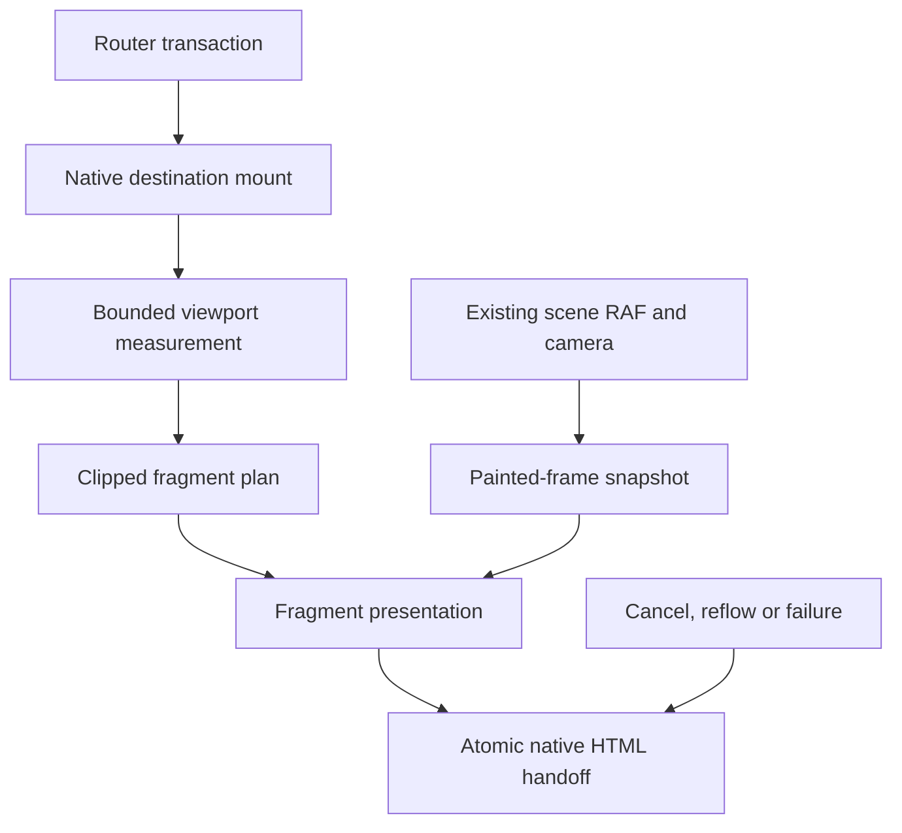

# Issue 49 — 2026-10-08 analysis and Sol handoff

Owning issue and dated anchor: [#49](https://github.com/oborskyivitalii/oborskyivitalii/issues/49#design-handoff--8-october-2026).
Owning PR route: `docs/fractal-content-flight-plan-20261008`; the live issue anchor
links the Draft PR and immutable version of this file once published.
Role: architecture/design self-analysis, not independent review or a measured prototype.
Inspected main: `aa1cfa97bf42103c0547c9332b885391f0e6fe6b`,
tree `64f68e79a1463f70075a54e0b4099861d27eebdb`.

Read README, AGENTS, CONTRIBUTING, the relevant repository-map entries, MEMORY,
site/README, the owners below, acceptance/profile contracts and live issues/PRs.
Only root AGENTS applies. Live main includes merged PR47; its tree equals the
tested d1df76f3 tree. MEMORY's pending merge/staging statements were stale;
issue45's final live record supersedes them. Issue48 is concurrent work and
must be preserved. No new visual experiment or browser performance run was made
for this design. Validation at publication is linked from the issue/PR.

## Intent and recommendation

Preserve the current fractal composition and camera. Incoming real page content
should emerge from within it as unequal pieces: parts of letters, whole letters,
word fragments and image fragments, then become the ordinary readable page.
This session delivers assessment, architecture and execution tasks only.

**Recommend a bounded DOM fragment presentation driven by the existing painted
camera, with a mandatory small visual feasibility prototype first.** Clip copies
of actual browser-rendered content; do not replace its typography with individually
animated character spans. The final page remains native HTML.

This is feasible as a spatial illusion. The hard questions are convincing depth,
correct final alignment and preparation/compositor cost, not generating random
particles. Confidence is high in mixed clipping and final native content, medium
in the proposed integration, and unmeasured for depth quality and device cost.
Do not promise a frame rate before the prototype.

## Findings from the current source

| ID | Actual owner and evidence | Implication / AC |
| --- | --- | --- |
| F01 | `review/site-scroll-sync-20261004/FLIGHT-PROTOTYPE.cjs`: `flightPose`, `createPresentation`, `setPlane` | Color transforms the entire content plane using CSS perspective 1200px. Arrival starts at z=-4200 forward but z=+1020 backward. This explains the existing front/back effect; replace presentation, not the fractal. AC02–04. |
| F02 | `site/engine/navigation.js`: `flight`, `queueMount`, `mount`, `mountNative` | Color mounts at progress .5, with a queued native mount after the hidden midpoint; `prepareMount` and scoped native measurement avoid duplicate layout. New fragmentation must join this transaction. AC04/06. |
| F03 | `site/engine/lifecycle.cjs`: `frame`, `draw`, `reportTravel`, `navigate` | The scene owns RAF and reports travel after an actual draw, including cadence-skipped frames. Flights last 1000–1700ms according to existing distance rules. Reuse these values; don't start CSS/WAAPI clocks or extend the camera flight for assembly. AC02/04. |
| F04 | `site/engine/projection.cjs`: `projectedWorld`, `formulaCamera`; Color ribbon projector | Projection is not centered at 50%: origin x is .66w desktop/.42w compact and y=.48h, with the existing focal calculation and near plane. One common mathematical projection must serve fragments; a guessed screen center is wrong. AC02. |
| F05 | `site/engine/styles.css`: `.space-scene`, `#site-content`, sticky header | Canvas is at z-index -1; HTML content forms another stacking context. CSS pieces can share projection but cannot automatically pass behind individual Canvas faces. AC02 visual feasibility gate. |
| F06 | `lifecycle.cjs`: displayedCamera, rebaseJourney, landingPose; `navigation.js`: serial, endpoint/input-tail handling | PR47 preserves displayed poses and real reverse/history landings. Don't recreate the camera or measure a destination against outgoing DOM. AC04. |
| F07 | `styles.css`, `reading-surfaces.css`, `site/content/pages/index/` | System fonts, negative heading letter spacing, nested colored ink spans, native wrapping and a transparent portrait make generic per-character recreation risky. Preserve painted runs and image fit/alpha. Paper panels are supporting paint, not giant flying white tiles. AC03/05. |
| F08 | `tools/quality/budgets.json`, SITE-CHECK-PROFILES | Tight inclusive preparation/frame/ready budgets already exist. Writing recently failed TBT before the Canvas repair. Its later passing trial does not establish spare capacity for this effect. AC06. |
| F09 | `tools/site/variants.cjs`, `tools/staging/color.cjs`, site/README | Despite its historical directory and comment, FLIGHT-PROTOTYPE is a maintained Color source consumed by current exports/staging. Extend its real owner and identity closure; don't create a second disconnected demo engine. AC07. |

## Approach comparison

| Approach | Benefit | Cost / limitation | Decision |
| --- | --- | --- | --- |
| Whole-plane CSS or split words/letters | Cheap, familiar | Cannot show parts of glyphs and pictures as requested; individually wrapping text can change shaping/wrapping | Keep existing whole-plane path as fallback only |
| Bounded clipped native paint copies + scene projection | Preserves browser fonts, inline styles and image crop; masks can cut through letters; no runtime dependency | DOM/compositor cost; not per-face Canvas occlusion | Recommended prototype |
| Raster atlas + particles in the existing sorted Canvas shapes | Real interleaving with existing fractal faces/ribbons; efficient fragment submission after preparation | Obtaining faithful arbitrary DOM pixels is the difficult part; manual text drawing must reproduce spacing/kerning/decorations and a capture layer adds cost/compatibility work | Contingency if prototype depth is insufficient, not a parallel implementation |
| Full-page screenshot, html2canvas-like runtime, or SVG foreignObject serialization | Appears generic | Full archive area, CSS/fonts/images, decode/CSP/browser behavior and copying costs; cannot assume pixel parity or zero capture latency | Not the default; do not add dependency/capture framework silently |
| View Transitions snapshots | Browser owns snapshots | Doesn't directly provide arbitrary reusable bitmap tiles in our Canvas or solve this scene's shared clock/depth composition | Not the architectural foundation |
| Rewrite the site in WebGL/Three.js | Flexible rendering | Replaces working scene/runtime, expands regression and violates the requested narrow change | Out of scope |

Browser API facts checked against primary documentation on 2026-10-08:
[CSS clip-path](https://developer.mozilla.org/en-US/docs/Web/CSS/Reference/Properties/clip-path)
defines a painted clipping region;
[Range.getClientRects](https://developer.mozilla.org/en-US/docs/Web/API/Range/getClientRects)
provides text-range layout rectangles, not glyph outlines or pixel captures;
[Canvas drawImage](https://developer.mozilla.org/en-US/docs/Web/API/CanvasRenderingContext2D/drawImage)
takes specified image/video/canvas sources, not an arbitrary HTML subtree;
[View Transitions](https://developer.mozilla.org/en-US/docs/Web/API/View_Transition_API/Using)
uses transition snapshots/pseudo-elements. The backend recommendation above is
engineering judgment from these contracts and the repository, not a browser
guarantee. No assumed unsupported-browser version list is needed: capability
checks and the repository's native browser matrix decide admission.

## Visual direction

Use a controlled assembly, not a uniform grid or confetti explosion. Begin with
a loose cluster distributed through the visible tunnel interior. Give pieces
modest depth variation, rotation and lateral offsets, then converge to their
precise destination positions. Larger word/image fragments establish structure;
smaller glyph cuts make the last part of the assembly visible. Stop all fragment
motion at the camera's actual arrival paint. No endless shimmer while reading.

Incoming content emerges from depth in both directions. Direction changes which
scene/landing is approached and the trajectories, not a switch back to a giant
plane coming from behind the reader. Header, navigation and Appearance stay
stable. First load, Credits and ordinary scrolling remain as now. Outgoing
fragment disintegration can be considered later; preserving the current departure
for the first prototype is an explicit scope choice, not missing incoming work.

Fragment only the destination landing viewport plus a small overscan. This is
the visible part of the requested whole page; the rest already exists in final
native layout, so a later scroll never exposes an unassembled page or triggers
new motion. Reverse-to-bottom must sample that bottom viewport, not page top.

Keep reading-surface paint separate from fine text shards. It may return late
with the assembly; it must reach the existing paper alpha/radius at settlement.
Don't make the text appear to originate in the fractal while its full white
panel already hides the origin.

## Proposed architecture

Proposed names below are contracts to implement, not APIs that already exist.

### 1. Keep one owner for navigation, one for time

Extend the optional presentation contract at its existing owner. A proposed
`FragmentPresentation` implements the same mount/prepare/present/clear/departure
route. Add one bounded `afterMount` preparation point inside the existing mount
transaction after native scroll/filter/anchor layout is final.

Expose a read-only painted-frame snapshot with current camera basis/projection,
viewport, phase, progress and transaction identity. Pass it from the existing
draw/reportTravel boundary; do not poll `dataset.camera` JSON every frame or
recompute another camera. It must describe the frame that was actually painted,
not a target pose or a state advanced during a skipped paint. Freeze/cancel
semantics belong to the existing lifecycle.

Keep the legacy `present` signature compatible or introduce a versioned optional
argument with explicit fallback. Existing Color/base/offline consumers must not
silently diverge. Extract projection math only if needed; prove numerical parity
for the existing world/ribbons. No world, ribbon, formula or path placement edits.

### 2. Measure once, create a bounded paint plan

At the hidden midpoint, mount real destination HTML normally, resolve actual
landing and measure untransformed native layout once. Reuse the existing scoped
measurement; do not perform read/write/read loops per piece.

Walk only bounded visible paint owners (headings, paragraphs/inline runs, image
boxes, simple labels and visible controls). Do not clone `main` or the archive
per piece. Choose the smallest owner preserving the full shaped line/context;
clipping may slice through it, but do not reconstruct shaping character by
character. Use bounded range measurements to locate line/glyph-sized regions.
Range rectangles are only layout hints: ink overhangs, combining marks and
ligatures still require actual pixel/visual validation. Preserve their shaping.

Measure/freeze necessary inherited/computed styles and actual owner width before
copying outside its selector context. Check cloned layout against the original
at identity transform. Copying a class alone is insufficient for ancestor-based
selectors. Strip or isolate IDs/names and rewrite internal SVG references with
bounded unique IDs; never duplicate active form controls, inline handlers, route
listeners or focus targets. Use inert visual surrogates for interactive controls.

Each fragment records owner/paint identity, a local clip polygon, native target
rectangle, initial world anchor/orientation, seeded path variation and lifecycle
token. Images reuse the already admitted source/currentSrc with native object-fit,
object-position, dimensions and transparency; no new image fetch per tile and
no screenshot service. Inline SVG needs preserved viewBox/styles and local refs.

Use deterministic mixed-size rectangular/convex partitions with shared boundaries.
Some heading masks cut glyphs, some align around a complete glyph, and others
cover several glyphs/parts of words. Pictures get unequal tiles too. A fixed
grid of small letters does not satisfy AC03. Partition the whole covered paint,
including larger remainder pieces, instead of omitting content when the small
piece budget is exhausted. Check overlap/gaps and reject zero/nonfinite cells.

### 3. Project pieces from scene depth

Use the common camera basis and focal/origin values. Choose a bounded cluster
inside a visible open corridor of the current destination approach; anchor it
in world coordinates for that flight segment. If a proposed anchor is behind
the near plane, it is not eligible; never substitute a fixed viewport center.
For a target pixel (sx, sy) on a camera-facing plane at positive depth d:

`world = camera + forward*d + right*((sx-cx)*d/f) + up*((cy-sy)*d/f)`.

Compute trajectories from initial world anchors toward native target rays using
the same painted camera and normalized remaining arrival progress. Blend toward
the live camera-facing target plane so the endpoint projects exactly onto the
native rectangle, including nonzero native scroll and mobile visual viewport
offsets. Map projected corners to a CSS transform; guards reject singular/near-
plane configurations. This is a moving presentation, not moved scene geometry.

Start with flat billboard pieces and mild rotation; no need to extrude letters.
Progress is normalized from **actual plan readiness** to the existing arrival
deadline. If too little time remains to show coherent assembly, use the ordinary
fallback for this transaction; never extend the flight, reveal old DOM or jump
new pieces halfway through their intended path.

DOM pieces remain a foreground layer. Choosing a clear tunnel corridor, matching
perspective and scaling can create convincing emergence, but does not establish
physical face occlusion. The prototype must show actual forward and reverse
motion in the existing scene. If it looks pasted over the fractal, stop this
backend: evaluate Canvas texture preparation and sorted composition under the
same issue, with revised measured budgets and an explicit design decision. Do
not add fake depth evidence or quietly move the fractal to accommodate it.

### 4. Settle, interrupt and recover predictably

State flow: idle -> preparing -> arriving -> settled/disposed. Every asynchronous
font/image/mount completion checks the current router serial before changing
anything. At actual arrival, reveal canonical HTML and remove decorative copies
in the same presentation transaction; preserve focus/announcement behavior and
reset transforms/inert exactly once. Test last fragment frame against first
native frame for doubled glyphs, missing ink, changed line breaks or image seams.

On rapid retarget, preserve currently displayed fragment poses as departure
state; cap the combined old/new set, dispose it before the next incoming set,
and never resurrect a canceled target. No unbounded chain of ghost layers.
If safe pose reuse cannot be prepared within limits, take the documented simple
fallback; the camera remains continuous and the destination readable.

Resize/orientation/theme/font-induced reflow invalidates targets. Coalesce a
bounded remeasure only if sufficient arrival time remains; otherwise settle the
native destination without another fragment flight. Delayed/failed images do
not delay navigation indefinitely. If required visible paint is unready, choose
whole-transition fallback and record why rather than accept a silently missing
image as successful full fragmentation.

Motion Off/reduced/Content flight disabled never allocate a fragment plan.
Visibility/print/context loss and presentation failure clear it through existing
router/lifecycle completion semantics. Background return cannot flash retained
pieces or leave invisible inert content. Initial mount still works without JS.

### 5. Resource and timing limits to try first

These are **provisional prototype limits, not measured guarantees or changes to
existing quality budgets**. Freeze exact values before collecting comparisons.

| Resource | Initial limit / behavior |
| --- | --- |
| Region | Actual landing viewport plus at most 64 CSS px overscan; exclude persistent header/popup |
| Live fragments | 96 desktop / 40 compact total, including any outgoing remnants |
| Paint owners | 32 desktop / 20 compact; coarsen covered pieces or choose explicit simple fallback |
| DOM descendants across copies | 1,500 desktop / 600 compact; reject before cloning beyond cap |
| Duplicated text across copies | 32 KiB desktop / 12 KiB compact; no archive-sized repeated subtree |
| Style/layout reads | One batched target snapshot per normal arrival; no reads in per-frame piece loop |
| Layer-area estimate | Sum of projected owner layer areas times capped DPR squared <= 8M desktop / 3M compact pixels; heuristic admission proxy, **not** a browser GPU-memory claim |
| Lifetime | At most one active transaction/fragment layer; zero copies/observers/style writes after settlement |
| Admission deadline | At least 250ms of arrival time left after preparation; otherwise fallback, with reason |
| Motion shape | Modest rotation, seeded stagger within existing arrival window, no blur/filter/shadow animation or per-glyph 3D mesh |

Per-fragment clipping does not guarantee the compositor rasterizes only the
small clip. Count full paint-owner surfaces in estimates and inspect actual
browser traces. Avoid `will-change` on hundreds of permanent elements. On weaker
devices prefer fewer, larger pieces; existing capability/device hold remains a
fallback. This reduces presentation work without reducing the fractal quality
used in the paired experiment.

Original `budgets.json` limits stay: transition callback p95 <=80ms, max <=200ms,
preparation <=160ms, paint gap <=300ms, ready <=3200ms and >=8 paints; ordinary
paint callback p95 <=33ms and idle busy <=20%; LCP <=2500ms, TBT <=200ms, CLS <=0.1.
Add a proposed incremental guard before measuring: median added preparation
<=30ms desktop/<=50ms compact CPU x4, added inclusive transition p95 <=8ms/<=12ms,
and added input-to-ready <=100ms. These are hypotheses for admission, not a waiver
of stricter original limits. Report both absolute and paired results.

## Decisions and division of work

| Decision | Recommendation / status |
| --- | --- |
| Scope now | Analysis + issue/Draft PR + tasks only, per current request. No runtime feature implemented. |
| Visual approach | Native clipped paint + shared projection; provisional until real-scene prototype depth/fidelity/cost review. |
| Fragment region | Landing viewport/overscan, with full native page already laid out. No effect on routine scroll. |
| Outgoing behavior | Preserve current departure initially. Symmetric disintegration is optional future scope. |
| Controls | Reuse Content flight on/off; an opt-in test-only prototype mode may compare old/new. No additional visitor settings panel. |
| Model roles | Astra/design role owns architecture, prototype visual judgment and difficult geometry review; Sol/execution role is suitable for the prototype and subsequent bounded integration, tests and generated output. |

**Recommended handoff: Sol can execute this plan, starting with T02–T04 only.**
Do not send him a vague instruction to animate every letter. The visual spike
should be reviewed before spending effort on route-wide integration. If the
native clip backend fails the depth/fidelity experiment, the architecture role
should decide the renderer alternative; this is the point where continued
architectural work is more valuable than faster bulk implementation. Either
role could write the code; no universal model-speed or quality claim is implied.

## Sol tasks

| Task | Owning paths and expected change | Findings / AC | Meaningful check / dependency | Status |
| --- | --- | --- | --- | --- |
| T01 | Revalidate issue, main, PR47 and concurrent #48; preserve accepted formula placement/content and read this one artifact | F06/F09; AC01/07 | Exact diff/base and live issue decisions before implementation | Pending execution |
| T02 | At the current FLIGHT owner, build an opt-in native clipping prototype using one real heading, paragraph and Home portrait; use proposed focused helper(s) under `site/engine/` only after registering source/export ownership | F01/F07; AC03 | Mixed glyph/word/image masks, identity-pose pixel comparison, unequal partition coverage; no live default change | Pending |
| T03 | Add read-only painted-frame context at lifecycle/navigation boundary, reuse/extract projection math without geometry change; project the prototype from the visible scene corridor | F03–06; AC02/04 | Existing camera/ribbon samples identical; skipped-paint, forward/reverse and near-plane cases; real retained clip | After T02 |
| T04 | Measure prototype layout/clone/paint/compositor overhead and visually review its depth and native handoff | F05/F08; AC02/03/06 | Same-source old/new bounded pairs with original budgets; author visual decision. Stop for backend redesign if flat or expensive | After T02–03; gate before broad integration |
| T05 | Extend mount transaction, actual landing-viewport measurement and deterministic mixed partitioning; integrate visible native text/images/controls with declared bounds | F02/F07; AC03/04/06 | Home picture, Writing top/filter/history and reverse-bottom targets; cap overflow triggers fallback; no full-main clones | After T04 accepted |
| T06 | Implement interruption, reflow/readiness, Off/reduced/hidden/print/failure cleanup, final native handoff and accessibility | F06; AC04/05 | Real router serial races, late image/font callback, rapid reversal, no duplicate live IDs/focus, zero retained copies after repeated routes | After T05 |
| T07 | Extend existing suites/profile registry and replace pending-only policy mappings with named implemented checks; regenerate canonical/offline/runtime identities | F08/F09; AC06/07 | No duplicate legacy full suite; identity/selection/failed-evidence cases remain; original budgets intact | With T05–06 |
| T08 | Publish through normal PR preview, inspect desktop/narrow Day/Night clips, record exact source-bound measurements and obtain independent review | All; AC02–07 | Actual clips, bounded measurements and maintainer decision; all failures retained | After focused checks |
| T09 | Update task dispositions, same issue anchor and actual AC boxes; stage/merge only under their separate applicable instruction | AC07 | Whole-criterion evidence mapping; planning/implemented/staged/production clearly distinguished | Pending |

## Test and CI allocation

Do not write tests that merely check prose mentions fragments. This design-only
PR reuses existing Basic, catalog/coupling and acceptance-runner checks; it adds
no fake runtime assertion. Its policy marks AC02/03/06 manual-only pending and
states the limited preservation scope of any shared check. Sol must add actual
feature behavior tests before claiming any feature criterion.

| Profile | Changes when implementation exists |
| --- | --- |
| PR source | Extend `tests/flight.test.cjs` for clipping/seed/partition/end poses and helper bounds; `tests/navigation.test.cjs` and `tests/browser-lifecycle.test.cjs` for transaction/painted-frame/lifecycle invariants; `tests/site-engine.test.cjs`/`tests/color-build.test.cjs` for identity/export closure. Use bounded adversarial inputs. |
| PR hosted smoke | Reuse existing Chromium desktop/narrow navigation; add one representative actual mixed text/image flight and a reverse landing, with retained progress-point frames. Avoid an unrelated full matrix. |
| Targeted prototype evidence | Same-source old/new presentation at identical scene quality: 3 serial pairs per case for desktop Home -> Writing cold, compact CPU x4 Home -> Writing cold, desktop Research -> Home with portrait, and compact CPU x4 reverse native-bottom landing. Reuse existing timing/report owners; record raw traces and source/variant/settings. This is 24 measured transitions, not 24 full Lighthouse runs. Header Home arrival and bottom landing are distinct cases. |
| Staging regression | Keep the current bounded Chromium/Firefox journeys, two Lighthouse routes and motion/four cold-warm observations. Add assertions within those cases where possible; compare original measurements, no duplicate full diagnostic campaign. |
| Production | Existing complete regression, native macOS WebKit and physical devices before release. No Linux WebKit addition. Include font shaping, SVG/image clipping and mobile compositing; existing production owner remains #13. |

In `tests/flight.test.cjs`, the current numeric forward/reverse plane assertion
remains valid for the retained legacy fallback; do not delete its coverage just
because a new presentation is introduced. Add behavior-specific fragment cases
without multiplying each old edge-scroll test. Register any new source helper,
test/probe and owner in RI/test profiles. Avoid replaying performance observations
to fix a report parser: retain raw evidence and revalidate it. A code change needs
new relevant measurements; a generic passing fixture is not device evidence.

## Acceptance evidence at the planning boundary

| AC | Available now | Remaining |
| --- | --- | --- |
| AC01 | Source-backed analysis, architecture/options, explicit limits, roles and ordered tasks in this file; publication/check results linked from issue | Verify published Draft PR, exact artifact and source/RI checks before checking this criterion |
| AC02 | Camera/projection/layering assessment and test plan | Actual implementation, geometry checks and visual depth acceptance |
| AC03 | Partition/native paint/image plan with shaping limits | Actual masks, content fidelity and Day/Night/browser evidence |
| AC04 | Source transaction/lifecycle assessment; existing Basic tests are preservation evidence only | New races/landings/cleanup behavior and actual navigation observations |
| AC05 | Accessibility/fallback contracts; no runtime changed | Implemented behavior, browser accessibility/failure checks |
| AC06 | Original budgets plus provisional added-cost/resource limits | Measured prototype and final candidate; no current performance claim |
| AC07 | Policy/RI/handoff route prepared | Full implemented policy, review, accepted source, applicable merge/release decisions |

## Issue synopsis

The current effect transforms one complete DOM plane while a separate Canvas
owns the fractal. A bounded clipped-copy presentation can deliver mixed text and
image pieces without changing the fractal or native page. Share the actual painted
camera; first prove depth, fidelity and cost with one heading/paragraph/photo.
Sol is suitable for that spike and integration; retain architecture/visual review
at the feasibility boundary. This PR is a planning handoff, not an implemented
animation or a performance pass. Continue this same file and issue route.
