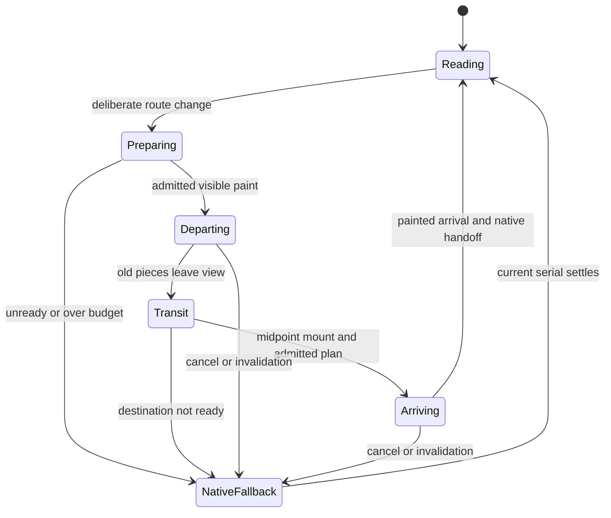

# Issue 49 — 2026-10-08 consolidated execution and Sol handoff

Owning issue: [#49](https://github.com/oborskyivitalii/oborskyivitalii/issues/49#stationary-reading-and-two-sided-fragment-flight--8-october-2026).
Owning Draft PR: [#53](https://github.com/oborskyivitalii/oborskyivitalii/pull/53).
Role: source-backed execution/handoff, with separate read-only source/design reviews.
Deterministic prototype contracts, actual visual admission and independent implementation
acceptance are separate observations.
Inspected main: `9da2476c9269345a242c7524374a645b0a21c2d4`, tree
`a1426cdf9ca1f740f56a6a66bd8f555d8820ddd6`.

This revision answers the maintainer's 8 October request: remove camera movement
caused by reading scroll, retain scroll-triggered route flights, disassemble the
outgoing visible content into unequal spatial fragments, fly through it and the
scene, then assemble the incoming content from the fractal's interior.
The original revision authorized assessment and planning only. The later dated
consolidation/execution decision below now authorizes implementation; prototype
admission, final merge and deployment remain separate gates. The earlier [7d2d889 analysis](https://github.com/oborskyivitalii/oborskyivitalii/blob/7d2d8893275c9217cb513a1be1841473ae020ff4/review/issue-49/2026-10-08-analysis.md)
is preserved history: its optional outgoing effect, old source owners and
unchanged reading-camera contract are superseded by this explicit revision.

Read root AGENTS, CONTRIBUTING, CODE-STYLE, site/README, current source owners,
acceptance/profile/budget contracts and live issue49/PR53. Only root AGENTS applies.
Issue58/PR60 is merged and closed; PMDay recording and active ribbon removal are
already in main. PR53's old seven-file planning tree is reconciled with this main,
without importing stale runtime, catalog or memory copies. Issue50/PR52 remain
closed duplicate/superseded history. Issue48 is now superseded after its full
acceptance transfer; merged PR51 stays historical delivery. Publication and
implementation checks belong in the live PR53.

## Consolidation and execution decision — 2026-10-08

The maintainer explicitly requests consolidating issues48/49 and their PR routes,
then implementing the result. **Issue49 and Draft PR53 are the sole active owner
and execution route**, including fixes, phases and model handoffs. The earlier
plan-only restriction is superseded. Do not create a phase issue or import a
second historical planning branch as another implementation authority.

Issue48 is closed `not_planned` as superseded **after** transferring all six
criteria, rather than declared completed or an identical duplicate. Its original
intent, IDs, pending gates and checked historical outcomes remain at the original
[issue48](https://github.com/oborskyivitalii/oborskyivitalii/issues/48).
[PR51](https://github.com/oborskyivitalii/oborskyivitalii/pull/51) is already merged:
tested head `3e8944af985d8d06c24348fc5227f27f97cad97d`, merge
`a06b530ee42f0ddde538f719d89f9f10fc1e156c`, identical tree
`ca02b3829ec67d806598705cfcc38cbafaf7966a`. Its source/editorial/independent/CI and
bounded stable-staging observations retain their original identities and scope.
They do not admit fragments or authorize new-fragment stable promotion.

| Current issue49 AC | Original issue48 AC | Whole-criterion disposition |
| --- | --- | --- |
| AC09 | AC01 theory association | Open: narrow Day/Night perception, wrapping and visual acceptance. |
| AC10 | AC02 formula midpoint | Open: matching narrow Day/Night placement, visibility and ambient motion. |
| AC11 | AC03 Matthew response | Accepted historical scope; preserve exact sources/claims and unrelated responses. |
| AC12 | AC04 canonical delivery | Accepted PR51 delivery only; new implementation delivery remains open under AC07. |
| AC13 | AC05 sourced Talks | Accepted historical scope; preserve event/date/language/resource identities, including separately approved later PMDay recording. |
| AC14 | AC06 shared Talks backdrop | Accepted historical scope; preserve canonical material/bounds and native wrapping. |

Original issue49 AC01-AC08 and issue48 AC01-AC06 are not renumbered or weakened.
The crosswalk creates new issue49 IDs, retaining each original issue-qualified ID.
The bounded runner accepts `AC` followed by two or three digits; no validator
change or ambiguous namespaced ID is needed. Actual issue49 checkboxes retain
AC01 and inherited AC11-AC14 checked for their accepted scope; AC02-AC10 stay open.
Current source changes must preserve those inherited outcomes and clear a tick
if its whole pass condition is invalidated.

### Current implementation checkpoint and admission boundary

T02 replaces the complete settled camera policy in the canonical lifecycle;
native Y/filter/hash/history, layout/resize, ambient phase and edge-flight
semantics remain meaningful current tests. T03 builds an **opt-in** small
heading/paragraph/portrait departure-and-arrival prototype driven by the actual
painted camera/clock. Native clipped fragments are not visually admitted merely
because geometry or DOM fixtures pass. T04 depth/native-seam/framing and isolated
measured-cost admission precede broad/default owner integration under T05-T06.
The existing reverse Back/top-edge direction and Credits instant route remain.
No formula/fractal movement, revived Ribbon or longer flight hides a defect.

This working checkpoint starts from published planning head `2b838f2` and approved
main `9da2476`; in-progress source bytes and uncommitted tests are not a published
candidate or source-bound browser/performance pass. Final exact head/tree/results,
independent review and applicable CI/preview evidence belong in PR53/issue49.
All feature visual, accessibility, navigation, measured-cost and final delivery
manual gates remain pending until their actual required observations/review.

### Current policy and test allocation

`.github/acceptance/issue-49.json` now maps all14 criteria. Its new named
`test_issue49_acceptance.Issue49AcceptanceTests` selectors run current source suites
with nonzero test accounting and zero failures/skips/cancellations/todo:

| Policy check | Current source contract | Limitation |
| --- | --- | --- |
| FRAGMENT-PLAN | `tests/fragment-plan.test.cjs`: complete seeded unequal partition, shared cap admission, canonical camera roundtrip, bounded native/world endpoints, safe near plane and executable serialized factory. | Pure geometry/resources; no perceived depth, glyph fidelity or measured browser cost. |
| FRAGMENT-DOM | `tests/fragment-dom.test.cjs`: opted-in actual paint-copy prototype, native restoration and serial/cleanup/invalid-paint behavior. | DOM fixtures are not actual browser visual/native-depth or performance acceptance. Missing/unimplemented cases fail the selector. |
| STATIONARY | Current `tests/space.test.cjs` and `tests/navigation.test.cjs`: fixed settled camera through native scroll/filter/history/reflow, ambient/freeze, painted progress, route/cancellation/head transactions. | Current thematic desktop/narrow framing and browser continuity still require observations. |
| THEORY-ASSOCIATION / FORMULA-MIDPOINT | Existing two individually selected `test_issue48_acceptance` methods. | Transferred AC09/AC10 narrow visual gates remain open. |
| MATTHEW-EVIDENCE / TALKS-CURATION / SHARED-READING-SURFACES / GENERATION-SEO | Existing individually selected semantic/source/paint-owner methods. | Preserve accepted content/surface scope and historical delivery; not fragment admission. |
| CURRENT-RI / RI-CI / OWNER / BASIC / PENDING | Existing maintained governance/source/generation/owner/accounting checks. | Do not manufacture human approval or performance from green infrastructure. |

Each shared check runs once. The historical issue48 **whole policy** remains
preserved evidence, never a second current owner. Its meaningful selected source
contracts remain usable; frozen unrelated task snapshots and superseded active
scroll-camera expectations do not become new feature gates. The provisional
fragment caps and original budgets below remain strict; browser cost is measured
against the same-source stationary-camera legacy presentation.

New canonical pure planner and opted-in DOM helper are `site/effects/fragment-plan.cjs`
and `site/effects/fragment-dom.cjs`, owned by `site/README.md`. Their meaningful
JS suites are permanent PR-targeted/staging/production contracts owned by
`guides/SITE-CHECK-PROFILES.md`; the issue49 Python selector stays issue-policy-only.
Coordinate catalog, format/lint inventory, source registry, architecture/RI/CI
routes and generated views with the implementation owner before exact-source
verification. This analysis does not claim those generated views are already fresh.

## Assessment and intended experience

The direction is coherent: native reading becomes calm and spatial movement marks
an intentional route change. It also removes the need to map changing article
length/filter results onto a camera path. This is a behavior change, not a parity
refactor, and removing one listener is insufficient. Ambient fractal motion remains;
there is no measured performance gain yet.

| User action | Intended result |
| --- | --- |
| Scroll within a page | Native text scroll; the route's settled camera stays fixed; existing ambient objects/fog remain alive when Motion is on. |
| Continue deliberately beyond a page edge | Existing wheel/touch/key intent gate starts one route transaction. Inertial tails must not skip a second route. |
| Depart | The actual visible text and images separate into varied fragments. The forward camera passes through their expanding arrangement; pieces leave the near plane safely. |
| Travel | Existing room/world composition and route flight remain visible between content layers; a giant fading paper rectangle must not conceal them. |
| Arrive | Next landing viewport's fragments emerge from a world-space corridor inside its fractal and converge exactly onto native HTML. |
| Read the next page | Ordinary complete semantic HTML is visible; fragment nodes/resources and per-frame work are gone. |

Incoming and outgoing fragmentation are both required. Pieces may be planar
paint surfaces moving/tilting in 3D; extrusion of individual letters is not assumed.
Mixed sub-glyph, glyph, word and image fragments remain the visual goal.

**Proposed direction default:** next/bottom-edge travel goes forward; previous,
top-edge and history travel preserve current route direction and native landing.
Both directions receive the fragment treatment, including emergence from depth.
The phrase "forward" describes the next-page journey here. Always-forward travel
even on Back would change room traversal/turnaround and is a separate unresolved
choreography choice, not silently included in this plan.

## Baseline source findings — before T02-T03

The table retains the reviewed approved-main9da2476 intake. In-progress T02-T03
changes are described above; these original findings are not a claim that the
latest working source still has every old scroll-camera consumer.

| ID | Verified source | Finding and consequence |
| --- | --- | --- |
| F01 | `site/engine/lifecycle.cjs`: `scrollPose`, scroll handler, `flushLayout`, `initialize`, `preferenceChanged`, `site:scene-focus`, `landingPose` | Reading Y, Writing topic paths and layout events select/retarget camera poses. Replace the complete settled-pose policy; deleting the listener alone leaves movement. AC08/04. |
| F02 | `lifecycle.cjs`: `frame`, `draw`, `reportTravel`, `advanceJourney` | One scene RAF owns actual painted camera/progress. Route duration is `min(1700, 1000 + abs(depth delta) * 2)`; use its existing deadline. AC02/04. |
| F03 | `site/engine/navigation.js`: `navigate`, `flight`, `queueMount`, `mountNative` | One router serial/AbortController owns fetched data, hidden midpoint mount, filters, native Y/hash, head metadata, focus and readiness. Capture departure before hiding; capture arrival after real mount/landing. AC03–05. |
| F04 | `site/effects/flight.cjs`: `createPresentation`, `flightPose`, `measurePlane` | Active Color moves one whole content plane using perspective 1200px and `mountAt: 0.5`. It is not a shared world-projected fragment system. The old review prototype is no longer the editing owner. AC02/07. |
| F05 | `flight.cjs`: `installEndScroll`, `endScrollGate`; navigation input-tail/endpoint owners | Deliberate edge navigation is already independent from scene scroll-pose mapping. Preserve its controls, nested-input exclusions, cooldown and native reverse-bottom behavior. AC04/08. |
| F06 | `site/engine/math.cjs`: `cameraView`; projection/world/scene paths | Camera origin is x=.66w desktop/.42w compact, y=.48h. Rooms are offset by 128; projection, not viewport 50%50%, determines perceived center. AC02. |
| F07 | `styles.css`, `reading-surfaces.css`, `renderer.cjs` | Canvas is a separate background layer. Native fragments above it do not automatically pass behind individual fractal faces. Paper panels can conceal the origin. Real motion review must admit the backend. AC02/03. |
| F08 | `projection.cjs`: `loopTransform`; lifecycle ambient/cache owners | Ambient animation is separate from camera motion. Preserve one clock, phase continuity, adaptive policy and bounded room/model caches. Do not turn Motion off to make reading stationary. AC06/08. |
| F09 | `site/README.md`, scroll/engine/functional/navigation/staging validators | At inspected main, active contracts require scroll-driven camera movement. Replace affected assertions explicitly while retaining native-scroll, route, freeze and budget checks. Historical reports keep their original identities. AC07/08. |
| F10 | `tools/quality/budgets.json`, current main build | Writing is 99,996 raw bytes against 100,000. New runtime must stay in shared declared sources; an extra inline payload or annotation can breach the limit. No byte limit increase. AC06/07. |

## Architecture and backend decision

Keep three owners: router for page transaction/semantics, scene for camera/time,
and Travel presentation for temporary content paint. Use existing explicit effect
assembly in `tools/site/effects.cjs` and export/variant consumers. Suggested pure
fragment-plan/projection helpers belong under `site/effects/`, with static rules
in canonical effect CSS. Names below are proposed contracts, not existing APIs.

| Backend | Assessment | Disposition |
| --- | --- | --- |
| Clipped native paint copies with shared world projection | Preserves browser shaping/crop/alpha; can cut inside glyphs; avoids capture dependency. DOM/compositor duplication must be bounded. No automatic per-face Canvas occlusion. | First small two-sided prototype; visual admission is mandatory. |
| Textured quads in the existing globally sorted Canvas scene | Can share actual depth ordering with fractal primitives. Faithful arbitrary HTML capture, alpha, perspective mapping and upload cost are unresolved. Existing formula bitmap handles compiled known artwork, not generic DOM. | Contingency if native pieces fail depth/fidelity; evaluate explicitly before implementation. |
| Per-character spans, full-page clones or whole-page screenshots | Character reconstruction risks shaping/wrapping; archive copies and generic capture expand memory, layout and compatibility work. Word-only motion misses partial glyphs. | Rejected default. |
| Separate WebGL/Three.js scene or independent animation timeline | Adds a second world/clock and a large unrelated migration. | Out of scope. |

Browser contracts checked against primary documentation on 8 October:
[CSS Transforms 2](https://drafts.csswg.org/css-transforms-2/#grouping-property-values)
describes flat transformed surfaces and grouping properties that flatten descendants;
[CSS Masking](https://drafts.csswg.org/css-masking-1/#clipping-paths) clips painted output;
[HTML Canvas](https://html.spec.whatwg.org/multipage/canvas.html#canvasimagesource)
does not provide arbitrary HTML subtrees as `drawImage` sources. Therefore placing
`preserve-3d` on a clipped parent is not a complete scene-composition solution.
Use one projected transform wrapper per piece with its clipped paint child and
verify the actual result. This recommendation is engineering judgment, not a
browser guarantee of depth or frame rate.

### A. Fixed reading camera, living scene

Choose one canonical settled pose per primary route using current route/scene
owners, initially the existing initial poses. Validate thematic composition and
Writing's formula in desktop/narrow Day/Night before freezing those choices.
No content-length/topic/hash-to-camera mapping remains while settled. Native
history Y, anchors, reverse-bottom and Writing filters still work normally.
Resize may recompute viewport projection/aspect, but cannot advance a path because
page height changed. Font/image/layout changes must not silently restore scroll
camera movement. Ambient world phase continues; Off/reduced/hidden/print preserve
their actual freeze/fallback behavior.

Use this same settled target for route arrival from top, bottom, hash and restored
history. Depart from the actual last painted camera, including interruption.
Removing old interior reading movement deliberately changes route endpoints when
departing from page bottom; retain room arrangement, flight algorithm and duration
rule rather than falsely claiming every old camera sample is identical. Do not
move the fractal/formula or revive ribbons to accommodate the new presentation.
Any necessary new framing choice must be shown in the prototype review.

### B. One route transaction and one painted clock

Extend the existing painted progress callback with a read-only view of camera,
viewport, projection, direction, progress and transaction identity. It describes
an actually painted frame; skipped Canvas paints cannot advance visible pieces.
Do not parse diagnostic `dataset.camera` or build a second projector/RAF/CSS clock.
The shared `math.cjs::cameraView` remains canonical; caller-specific near-plane
and visibility rules remain explicit.

After route data is ready, measure the current visible departure once before the
first breakup paint. This cost counts in input-to-ready/preparation. At the hidden
midpoint, dispose departure pieces, mount the real destination through the existing
router, apply filters/Y/hash and reuse its native layout boundary for arrival
measurement. Add a bounded post-mount presentation hook; do not clone or measure
fetched detached HTML as though it had the final layout.

Use the existing normalized progress as choreography: departing breakup before
midpoint, exposed scene transit around midpoint, assembly after midpoint, exact
native handoff at actual arrival. Ratios are prototype tuning, not added delays.
Do not make the whole camera trip longer to hide expensive capture or a late
incoming plan. Require at least 250ms of arrival window after readiness; otherwise
use the ordinary fallback for that transaction and retain the reason.

### C. Actual content fragments with safe geometry

Capture only each side's actual visible viewport plus at most 64 CSS px overscan.
Header/Appearance/skip link are persistent. Native content keeps its dimensions;
there is no permanent per-letter markup. Offscreen page content is already complete
and gets no new effect on later scroll. At a page bottom the departure contains
what the visitor actually sees there, not an invented return to the page top.

Choose the smallest bounded paint owner retaining shaped lines, inline ink and
image crop. Batch layout/style reads before writes. Bounded Range measurements
may guide glyph-sized cuts but do not provide glyph outlines or screenshots.
Preserve ligatures/combining marks/ink overhangs. Define a complete unequal mask
partition with shared boundaries and larger remainder cells; random omissions or
uniform word-only tiles do not meet AC03. Unsupported complex SVG/contextual CSS,
pseudo-elements or unready visible media trigger explicit whole-transition fallback.
Transparent portrait pixels, SVG references and responsive currentSrc must survive.
Copies are inert, aria-hidden, noninteractive and stripped of live identity/handlers;
rewrite admitted internal SVG references safely. No per-piece image download.

Initialize departure pieces at their exact native screen positions and unproject
them onto a finite plane ahead of the current camera. Give seeded bounded lateral
separation, depth offsets and mild rotation; actual camera motion supplies the
flight-through. Never project through z=0: clip/cull/fade before the near plane so
pieces leave the viewport without exploding or mirroring. Reverse trajectories
follow the selected route direction; no unreviewed camera turnaround is invented.

For arrival, derive a route-local emergence anchor from the existing world/fractal
geometry (or one explicit scene-owned anchor if needed), apply roomOffset and
project it with the painted camera. It must sit in the actual visible corridor,
not a fixed screen center. At a camera-facing endpoint depth d, unproject pixel
(x,y) using cameraPosition + right*((x-originX)*d/focal) +
up*((originY-y)*d/focal) + forward*d. Projected corners must converge onto the actual
native rectangle, including restored scroll and visual viewport offsets. Proposed
terminal corner error is at most 0.5 CSS px; actual ink/seams still need visual review.

Paper/reading surfaces have a coordinated fade/return separate from fine shards;
keep their canonical final appearance. On each handoff expose exactly one visual
representation, atomically revealing native content and removing decorative pieces.
No doubled glyph, line-wrap change, image jump or empty interval is acceptable.

### D. Cancellation and bounded work

One router serial owns preparation, fragments and disposal. Async font/image/route
results check that serial; canceled targets cannot return. Retarget from actually
displayed fragments only within the shared cap, otherwise cleanly take the ordinary
fallback. Never retain successive ghost layers. Resize/zoom/theme/font changes
allow one coalesced reprepare only when the existing deadline permits; otherwise
settle native content. Off/reduced/Content flight disabled allocate zero pieces;
no-Canvas/CSS failure, device hold, hidden, print and exceptions clear resources
through existing navigation completion/cancel paths. Controls/history/focus remain
usable, with a single announcement and no duplicate analytics event.

The previous provisional caps remain one shared experiment, not an additive budget:

| Resource | Prototype admission cap |
| --- | --- |
| Live pieces, both sides combined | 96 desktop / 40 compact, including retarget remnants |
| Distinct paint owners | 32 desktop / 20 compact |
| DOM descendants across copies | 1,500 desktop / 600 compact, bounded before cloning |
| Repeated text across copies | 32 KiB desktop / 12 KiB compact |
| Full owner surface area times actual DOM DPR squared | 8M desktop / 3M compact pixels; an admission proxy, not a GPU-memory claim. The Canvas DPR cap does not apply to native DOM copies. |
| Layout work | Batched departure snapshot plus batched native arrival snapshot; no layout reads in the frame loop |
| Steady state | Zero fragment nodes, retained copied surfaces, new observers or fragment style writes after completion |

Coarsen while preserving complete visible paint or fall back. Do not multiply caps
for departure and arrival, clone an entire archive per tile, or assume a small clip
means a small compositor surface. Avoid animated blur/shadows and permanent
will-change. Extra capture/prepare waits and allocations remain in the measured
transaction. Incoming and outgoing callbacks must preserve the existing scene tier.

## Measurement and economical verification

Keep all original budgets: transition preparation <=160ms, callback p95 <=80ms,
max <=200ms, gap <=300ms, ready <=3200ms, minimum 8 paints; ordinary callback p95
<=33ms and idle busy <=20%; Lighthouse LCP <=2500ms, TBT <=200ms, CLS <=0.1; existing
raw/gzip/asset/geometry limits. No actual performance claim is made by this plan.
Provisional incremental admission remains median added preparation <=30ms desktop/
50ms compact CPU x4, inclusive transition-work p95 delta <=8ms/12ms and added
input-to-ready <=100ms. Freeze definitions/conditions before collecting data;
report browser layout/paint/compositor work separately from JS callback timing.

Isolate the feature cost with same-source pairs: **stationary camera + legacy
presentation versus stationary camera + fragments**, with the same scene quality,
route, landing, input and cache state. Camera-policy savings cannot offset a failed
fragment budget. Measure scroll-camera removal separately only if claiming a gain;
ambient Canvas still paints while reading. Keep source/tree/artifact/served-runtime
identity, complete raw trials, fallback reasons and failed samples.

One bounded experiment: three serial pairs for each of four cases (24 measured
transitions total): desktop Home-to-Writing cold; compact CPU x4 same cold arrival;
desktop Research-to-Home portrait arrival; compact CPU x4 reverse-to-bottom with a
real picture-bearing departure. Freeze exact viewport/input/native Y and visible
owners first. These are transitions, not 24 Lighthouse runs. Retain representative
Day/Night desktop/narrow motion clips from the prototype; widen only to investigate
an observed defect. Early native macOS WebKit fidelity smoke is useful if available;
production/device gates remain with their release owners.

| Profile | Required disposition |
| --- | --- |
| Historical planning checkpoint | Five original policy checks (including Basic), formatting, bounded style and RI/CI regressions; preserve its original source identity. |
| Current consolidated checkpoint | Fourteen-criterion owning policy with named current fragment/stationary and individually inherited source checks, maintained format/lint/architecture, RI/CI and relevant regressions. Actual prototype visual/cost admission stays separate. |
| Implementation source | Extend existing flight/navigation/space/scroll-sync/engine suites with fixed reading pose, mixed partition coverage, projected endpoints/near plane, serial races, native handoff and bounded cleanup. Meaningful negative cases must fail. |
| Active behavior migration | Replace scroll-camera movement assertions in site/README, `tests/space.test.cjs`, `tools/quality/scroll-browser.cjs`, `engine-browser.cjs` writing gestures, `functional.cjs`, `navigation.cjs`, `staging-regression.cjs` and their dependent fixtures. Retain native Y/bounds/filters/history/edge-input and ambient/freeze tests. Inventory exact callers before edits. |
| PR hosted smoke | Reuse two-width persistent navigation; add one real two-sided text/image flight and reverse landing with progress frames. |
| Bounded staging | Existing Chromium/Firefox journeys, ten failures, motion windows, four cold/warm flights and two Lighthouse trials; add assertions within cases. No duplicate full diagnostic campaign. |
| Production | Existing full/native macOS WebKit/device/release coverage. No Linux WebKit expansion. |

Keep legacy whole-plane numerical assertions for the retained fallback. Old
scroll-camera route-policy expectations become dated history; pure path/projection
math tests stay where still used by route flights. Register new helpers/meaningful
tests under current RI/test-profile owners. Do not run frozen issue58 migration
snapshots as future feature semantics. Preserve CI/static identity and exact scanner
review, without widening frozen debt or changing security thresholds.

## Sol tasks

| Task | Owner and expected result | AC / verification | Dependency and status |
| --- | --- | --- | --- |
| T01 | Revalidate the bound issue49/PR53 and actual main; retain merged R2–R6, transfer issue48 AC01-AC06 as49 AC09-AC14 and preserve PMDay/no-ribbons. | AC01/07/09-14; exact branch/tree/owner/criteria crosswalk. | Consolidation decision recorded; final source/RI/CI review remains current. |
| T02 | In lifecycle and existing route/scene owners define settled reading pose; decouple scroll/filter/history/layout from camera while retaining native navigation and ambient phase. Inventory and revise the conflicting active contracts together. | AC08/04; fixed camera across native Y/filter/hash/reflow, live ambient on, correct Off/hidden and edge-triggered flight. | Authorized implementation underway; current source contracts plus actual framing, especially Writing formula, remain required. |
| T03 | Extend actual painted-frame presentation seam. Build bounded opt-in departure + arrival prototype for a real heading, paragraph and portrait using shared projection. | AC02/03; identity-pose fidelity, unequal sub-glyph/glyph/word/image coverage, correct scene anchor, safe near plane. | Authorized opt-in source prototype after T02; T04 admission before broad/default rollout. |
| T04 | Record real two-sided clips and isolated same-source performance/resource pairs; review depth, framing and native seam. | AC02/03/06; original and incremental limits, all raw failures retained; maintainer visual decision. | Gate. If flat or costly, stop and review Canvas/capture alternative. |
| T05 | Integrate bounded visible owners and native midpoint/landing capture; preserve one serial/history/head/focus transaction. | AC03/04; forward/reverse/nonadjacent, bottom/hash/filter/history landings, no full-main clones. | Only after prototype admission. |
| T06 | Complete retarget, cleanup, reflow/readiness, disabled/failure modes and semantics. | AC04/05/06; adversarial stale callbacks, no duplicate identities, no retained pieces or growing caches. | With T05. |
| T07 | Canonical/export/offline identities, CSS, mapped tests/profile registry, source scanners and RI. Replace pending-only mappings with actual named feature checks. | AC07; CS01–CS10, clean/incremental parity and exact coverage; no weakened budgets. | With implementation; update same file's task status. |
| T08 | Run relevant PR and bounded-stage evidence through existing controller; independent implementation review and final actual AC evaluation. | AC02-AC10 and preserved AC11-AC14; source-bound browser/raw evidence, author visual acceptance and final merge/main gate. | Final candidate; separate release/promotion authorization. |

Execution is now requested: Sol implements T02-T03 on this same route. Astra/design role reviews
T04's geometry, depth and failure tradeoffs before broad integration. Model names
are roles, not evidence of model superiority or independent review. The code work
is suitable for Sol; backend admission and visual judgment should not be delegated
to generic green tests.

## Decisions, acceptance and handoff

Accepted scope from this request: stationary reading camera, preserved native
edge-scroll route flights, required outgoing breakup and incoming assembly.
Recommended but not yet visually admitted: native clipped backend, initial settled
route poses, exact fragment trajectories/phase tuning and provisional caps.
Proposed navigation default: preserve reverse Back/top-edge behavior; always-forward
travel remains a separate choreography decision. The later consolidation request
authorizes execution under T02-T04; final merge/stable promotion/production retain
their applicable decisions.

Stable issue49 AC01-AC08 are retained; inherited AC09-AC14 follow the explicit
issue48 crosswalk above. AC01 covers reviewed design delivery only, while
AC11-AC14 retain historical accepted content/canonical-delivery scope. AC02-AC10
remain unchecked until their whole implementation and visual/resource conditions
are met. The executable policy maps actual prototype/stationary/source contracts
and keeps manual admission pending; it does not pass behavior with prose checks.

AC07 includes CS01-CS10: canonical ownership/dependencies, content/CSS separation,
readable bounded factories, one clock/disposal, measured limits, meaningful tests,
reviewed exceptions and accurate issue/PR evidence. Configuration and selectors
follow pinned formatting; new source/helper ownership, actual source lint/security,
current generated output and independent implementation review remain mandatory.

Two separate read-only agents reviewed current camera/source ownership and the
UX/performance/backend design. Their findings are incorporated: full pose-policy
replacement, both-sided prototype, native landings, shared caps, isolated paired
baseline and reverse-direction caveat. Those retained observations are independent design review only.
Current prototype source/check results and independent implementation review are
recorded separately; no browser visual or performance pass follows from the plan.
Exact publication and deterministic results are recorded in PR53 and the issue
anchor; the original plan/checkpoint links remain historical evidence.

## Incoming assembly refinement — 9 October 2026

The maintainer reviewed the effect and requests stronger incoming construction:
visible text and blocks should assemble in staggered pieces from the real fractal
interior over 1–2 seconds. This checkpoint stays in issue49/PR53 and focuses on
that effect. Other open visual/scene criteria retain their existing scope.

The original arrival moves every piece synchronously during the last half of
camera travel, with remaining native paint revealed by one page-wide fade. The
refinement keeps the camera path/duration unchanged and adds a finite incoming
presentation tail on the existing painted scene callback. The duration request
authorizes that content tail; it does not authorize a longer camera flight or
another animation loop. Use approximately1.8seconds and staggered piece-local
progress so text becomes progressively readable before the native handoff.

Validation belongs to the existing fragment geometry/DOM and scene/router
contracts plus the current two-width Color preview smoke. Preserve original
resource caps and ready/frame budgets; automatic passes do not supply the
maintainer's final visual acceptance or the full added-cost admission.

Implementation: incoming visible headings, paragraphs, short context text and
ready images share the existing resource allowance. A reading-order schedule
releases pieces over half of the incoming window; each travels from the actual
room anchor on a curved path and resolves at exact native coordinates. The
normal window is1800ms; late captures scale it to1000–1800ms with300ms provisional
headroom inside the existing ready budget. That headroom is not a guarantee of
full input-to-ready timing: the hosted smoke measures the actual whole transaction.
Native reading surfaces reveal during the first300ms while captured native text
and pictures remain hidden until handoff. Camera travel and departure are unchanged.

Independent implementation review found and verified fixes for three defects:
device hold could strand a settled-camera tail, candidate enumeration could
exceed its preparation deadline, and a failed browser check could discard its
raw measurements. The reviewer found no remaining implementation blocker and
independently passed four focused regressions. Local current-source checks pass
42 fragment/router cases, all46 generated-scene cases and16 collector/validator
cases, plus Basic at99996maximum HTML bytes and RI28/coupling19 regressions.
CS01–CS10 retain canonical sources, measured declarative paint, original caps,
pinned formatting, substantive review and one clock/cancellation owner.

The existing two-width Color smoke now enables fragments, observes declared and
actual assembly duration, successive settled groups, native handoff and an Off
abort, and retains inclusive callback/ready/gap/preparation evidence even on
failure. Its390px case uses DPR1; native DPR2/3/iPad fidelity remains open. Native
depth/seams, all-route acceptance and same-source paired added-cost admission
also remain open. The local browser download was unavailable, so actual browser
results must be observed through the existing hosted preview workflow.

## T02-T03 implemented prototype checkpoint — 8 October 2026

The user-authorized implementation continues solely in PR53. T02 now uses the
canonical initial route pose for settled reading, independently of native scroll,
filters, hashes, restored Y and layout changes. Ambient scene phase, deliberate
edge gestures, inter-room flights, native endpoints, freeze modes and caches retain
their owners. Active browser collectors and both report validators require native
scroll plus a fixed camera and positive ambient paints; historical diagnostics
record old camera observations without admitting them as the new contract.

T03 adds an opt-in **Fragment flight preview** control beside Content flight.
Default Color retains its legacy whole-plane presentation for the same-source
cost comparison. Enabled animated preview temporarily partitions one actual
visible heading, substantive paragraph and ready picture into unequal masks.
Native semantic DOM stays authoritative; copies are inert, hidden from accessibility,
without IDs, live links or handlers. Unsupported paint, unavailable fonts/images,
resource overflow or preparation deadlines use the existing presentation.

The existing scene progress callback supplies a frozen last-painted camera,
viewport/projection, existing destination root anchor and remaining flight time.
No extra RAF or animation clock is introduced. Departure stays in world space;
arrival waits until the actual fractal root is in the forward visible corridor.
This matters on reverse travel, where the destination root can initially be behind
the camera. Preparation deducts snapshot age and its own work from the remaining
time, retaining at least 250ms for assembly; a late arrival falls back. Assembly
normalizes from actual readiness to the existing final deadline. Near-plane
rejection prevents inversion or enormous tiles. Router cleanup atomically restores
native paint and removes pieces and subscriptions.

Independent integration review found and corrected actual-DPR undercounting,
temporary blueprint accounting, nonrepresentative paragraph selection, fallback
flashes, arrival-window accounting and behind-camera reverse anchors. The reviewer
found no remaining source blocker for this opt-in prototype and independently
roundtripped eight tilted homographies. Meaningful pure geometry and serialized
DOM tests cover coverage/caps, native corners, safe copies, one-time reads, shared
painted progress, no-allocation waiting/disabled modes and cleanup/deadlines.
These tests do not establish native glyph/compositor fidelity or measured speed.

T02-T03 source work is implemented in the candidate; T04 remains pending for actual
Day/Night desktop/narrow depth, reverse fallback frequency, optical handoff and
same-source resource/frame evidence. T05-T06 broad/default rollout stays gated.
AC02-AC10 remain open; AC01 and inherited AC11-AC14 retain their accepted
design/historical status. Current source/check/publication identities and results
belong in PR53 and the live issue evaluation; main/stable/production are unchanged.

### Published prototype observation and CI reconciliation

Published source `11252e0b09bcad766121d09929675a5b82dda3d5`, tree
`8b1aaa01381caacddf580d65442fd9d934fbb634`, produced the immutable
[prototype preview](https://b85fadee.oborskyi-author-ci-staging.pages.dev/).
Desktop Night observation at 1348 by 926 confirmed actual native Home scroll
from 0 to 734 with unchanged camera, advancing ambient phase, and no settled
fragments. With preview enabled, Home-to-Writing exposed 32 temporary pieces,
then restored complete native Writing content, focus and zero retained pieces.
This limited observation does not admit depth, narrow Day/Night framing,
reverse fallback frequency, optical seams or performance.

Navigation and Basic CI passed. Ordinary hosted journeys passed at both maintained
widths in normal and no-Canvas modes. The first published acceptance and Color
smoke failures remain retained: the workflow skipped policy49's required locked
Python/PostCSS tools, and the Color collector installed a different paint-probe
name from the shared stationary-reading observer. The follow-up reuses the same
locked tool installation and canonical actual-paint probe. It preserves positive
Canvas paints, native scroll, fixed-camera assertions, cases and original budgets.
Exact corrected source/run results belong in the live PR53 evaluation.

## Second effect refinement — 9 October 2026

Maintainer feedback on published ba74441: keep the stronger staggered assembly,
remove the heading jump at native handoff, fade letters with actual scene depth,
and make pieces varied solid shards rather than a rectangular sliced plane.
Same issue49 / Draft PR53; no additional execution owner.

### Implementation and verification

- `fragment-dom.cjs` now freezes measured native padding, border-box sizing and
  line/wrapping metrics. The archive h1 clone had left its parent-scoped8px/16px
  padding behind; its text origin differed despite a correct outer rectangle.
- `fragment-plan.cjs` partitions the visible owner with seeded angled convex
  cuts. Triangle, quadrilateral and larger polygons cover the whole native paint
  without interior overlap. Per-shard roll/tilt/pitch and thickness vary; projected
  rear sidewalls show volume during flight and vanish at exact native endpoints.
- Opacity attenuates with actual painted camera-space depth, independently of
  release timing; the native reading plane remains fully opaque at handoff.
- The canonical effect CSS owns polygon/prism appearance. Two bounded SVG paths
  per shard paint only shaded sidewalls behind clipped actual text/image copies.
  There is still one scene clock and one cleanup path. Full-viewport SVG paint
  does not own another transformed/opacity texture; per-group pixels and added
  nodes share the unchanged transaction caps. Oversized projected sidewall bounds
  are culled before paint; the original native face still flies.
- The existing two-width Color smoke samples actual settled h1 text-node Range
  rectangles and rejects glyph-line displacement above0.75CSSpx. No additional
  browser matrix or perpetual observer clock is introduced. The previous ba74441
  smoke failure is retained: assembly/timing passed both widths, but cancellation
  clicked Motion inside a closed Appearance menu. The test now opens that menu
  before starting the cancellation flight, preserving the real visible click.

Meaningful geometry tests cover polygon area/bounds/convexity and independent
separating-axis nonoverlap, depth-opacity order, finite side faces, hidden frontal
rear faces, invalid masks and exact native endpoints. A bounded384-partition
seeded stress pass covers fractional/thin text and picture owners. In-memory
mutation review rejects missing attenuation, absent facets, polygon gaps and
reversed extrusion; a same-area overlap/gap fixture fails the independent oracle.
The DOM suite covers measured paint preservation, SVG disposal and side-budget
fallbacks. Hosted glyph fidelity/timings must be observed on the published head.

### Independent source review and dispositions

A separate read-only reviewer found a reversed rear extrusion normal and an
initial full-viewport pixel reservation that would reject Retina/mobile cases.
Both were corrected before publication: rear extrusion uses consistent clockwise
front winding, and projected per-shard side bounds enforce the original cap.
The same reviewer found no remaining lifecycle/accessibility/clock boundary
blocker. Final correction/tests/scanner additions remain subject to exact review.
CS01/CS03/CS04 keep canonical effect/CSS owners; CS05 uses the pinned formatter;
CS06 preserves serial cleanup and the painted clock; CS07 retains original limits
with separate pending native-DPR/paired cost gates; CS08 uses behavioral negatives;
CS09/CS10 require current guard, lint, generation, RI and issue reconciliation.

AC01 and inheritedAC11–AC14 retain their accepted scope. AC02–AC10 stay open for
whole-criterion visual/device/added-cost and final delivery decisions. This is a
focused opt-in preview refinement, not broad default rollout or final merge.
Exact published head/tree, CI and immutable preview are recorded in PR53 and
issue49 after observation; prior failures are not rewritten as successful runs.

### Hosted observation and cancellation collector correction

The first hosted refinement (`2540879`, tree `a2a5b3b`) passed incoming assembly
at both widths: h1 glyph displacement was0.03125CSSpx at1440 and0 at390; assembly
took1854.7/1801.5ms. Painted callback p95 was15.7/4.7ms and maximum16.3/8ms;
native readiness took2536/2463.2ms, within the unchanged preview limits.
Its later cancellation wait failed because Motion Off intentionally retains the
displayed camera and pauses a still-flying journey. Native content was already
opaque/visible with zero pieces/layers. The failure remains in the original run.

A collector-only follow-up now waits for the actual target route, absent
aria-busy, Motion Off, zero resources/dataset residue, opaque visible noninert
native content. It checks that camera, ambient phase and travel stay identical
across120ms while Off. It restores Motion On before the original settled wait
and subsequent route travel. All Motion-on waits and runtime source are unchanged.
The existing staging-regression suite adds eight negative readiness fixtures.
Final hosted success and exact source identities remain recorded externally
after the new preview run; this earlier measurement is not substituted for it.

## All-route bidirectional amendment — 9 October 2026

The maintainer reports inconsistent transition coverage and requests one shared
implementation for every navigation path. The ordered depth itinerary is Home,
Research, Writing, Talks, Credits. Forward departure passes fragmented current
content behind the advancing camera; reverse departure recedes into the source
fractal while incoming content arrives from behind the retreating camera. Links
may be used at any native scroll position or during an unfinished journey. This
explicit user scope supersedes the earlier Credits utility exception and opt-in
prototype restriction for the new Color preview. Stable/production and whole
visual, device, paired-cost and final merge decisions remain separate.

### Shared ownership and repaired coverage

- `projection.cjs` owns the route-order/actual-painted-pose direction policy;
  `lifecycle.cjs` exposes frozen `SiteRoutes` before Canvas guards and immutable
  source/destination anchors in the existing painted snapshot.
- `navigation.js` invokes one transaction for header, footer, cross-links, VO,
  history and edge navigation. All five routes participate; stale fetch/mounts
  cannot win a retarget, and clicking the native current page may reverse a pending
  destination. Edge input remains deliberate, while direct links need no endpoint.
- `fragment-plan.cjs` owns the single settings object and seeded convex geometry.
  Size targets now include finer sub-glyph cells, variable cuts and small fragments;
  per-owner round-robin allocation shares the unchanged global caps. Actual clipped
  tile bounds plus facet gutters at native DPR replace full-owner-per-piece pixel
  reservation, which had unnecessarily rejected whole route effects.
- `fragment-dom.cjs` acquires visible semantic main/footer owners locally, preserves
  measured native paint and skips unsupported local owners. It shares one shard
  generator on both legs and disposes on scroll/reflow/resize/freeze/retarget.
- `flight.cjs` locks copied journey direction and uses fresh admission for each
  phase. An unsupported outgoing owner no longer suppresses valid incoming paint.
  Existing stored Off preferences remain; fresh Color preview defaults to fragments.
  Arrival still uses1.8seconds on the existing painted callback without extending
  camera travel or creating another clock.

### Focused evidence and independent review

Source checks cover all20 ordered route pairs, actual displayed-pose retargets,
shared no-Canvas route order, native scroll/history/VO and late fetch/mount races.
Shared geometry tests cover both departure/arrival directions, safe camera crossing,
actual depth opacity, exact native endpoints and captured-anchor continuity.
A384-partition stress pass and eight meaningful geometry mutations remain bounded;
two additional anchor mutations expose unsafe backward flight and moving-camera
admission switches. Flight-controller negatives cover locked context, per-phase
sticky failure reset, Off/fallback cleanup and finite completion.

Independent review found and corrected a source-anchor admission switch that could
change destination mid-flight, inherited per-phase failure state, overlarge list
owners, allocation time consuming the clone budget and stale captured coordinates
on native scroll. The Color collector's Appearance popup is explicitly closed
before edge gestures. Existing timing budgets and runtime limits remain unchanged.
The same two-width hosted smoke adds13 focused trips plus interruption per width,
observing nonzero outgoing and incoming fragment transforms with source-bound
direction, readiness, native cleanup and heading line geometry. No staging/full
release matrix is added for this preview iteration.

AC01 and accepted historicalAC11–AC14 retain their scope; AC02–AC10 retain their
whole-criterion visual/device/cost/delivery gates. Exact final head/tree, scanner/CI
results, immutable preview and remaining decisions are recorded in live issue49
and Draft PR53 after publication, without rewriting earlier failures as passes.

Regenerated public identities produced183 new hexadecimal scanner candidates.
Independent triage matched every reported line and hashed identifier to37 unique
SHA256 checksums recomputed by the canonical producer/snapshot/preview/bundle
validators. Only exact public-checksum dispositions were appended to the reviewed
ledger; all3,965 existing dispositions and the historical baseline were preserved.
RI/coupling checksum admission remains verified rather than broadly excepted.

### Hosted all-route observation and transaction-boundary repair

Publishedc36b527 (tree5ce79f0) passed Basic, navigation, owning14-check acceptance,
HTTP and generic normal/no-Canvas smoke. All13 focused two-sided trips passed at
1440/390: maximum readiness2887.6/2718.4ms, callback p95 maxima14.4/5.6ms,
paint gap maxima181.2/83.4ms and observed heading glyph displacement no more than
0.046875/0CSSpx, within unchanged limits. Full preview run37916755963 nevertheless
failed its interruption validator: the newly installed observer sampled the old
forward departure once before the VO transaction's real navigation-start. Narrow
VO activation also preceded the first changed camera paint. Original failure
artifact11610241845 and Color reportSHA256
`c2d70dd1e0fdd244e60cf75fd25f6f0f8c1426cd2c68e7be860083dd1ae6a9f1`
remain retained; this run is not represented as a full smoke pass.

A collector-only correction retains all earlier samples in the interrupted raw
record and validates the fresh transaction from its unique matching actual start.
Exact-boundary and every later sample remain; original frame/event/long-task arrays
and timing summaries stay inclusive. It also waits for actual painted camera Z
movement before VO, within the existing5second deadline. Meaningful fixtures reject
malformed starts, missing fresh work, wrong fresh direction and readiness3201ms;
20/20 passed with independent read-only review, pinned formatter and zero lint
warnings. Runtime/public bytes, caps, timing budgets and all13 cases are unchanged.
Final source-bound CI and the new true mid-flight interruption observations are
recorded in live PR53 and issue49 after the follow-up preview.

## 9 October whole-block backdrop follow-up

The author observed that text/images flew while shared paper still faded or
appeared independently. The previous observer's nonzero fragment counts did not
establish whole-block paint coverage. This follow-up stays in issue49/PR53 and
extends existing AC02/AC03/AC04/AC05/AC06/AC07 without changing release gates.

The DOM adapter now acquires the first actual painted ancestor, using resolved
native background and before/after paint rather than a duplicate route selector
list. This captures shared cards, publication rows, filters and desktop hero
paper once with all supported descendants. Unsupported/unadmittable paper owners
remain whole-block local fallback; acquisition does not detach their text over
stationary paper. On mobile, the zero-box display-contents hero wrapper descends
to the active child surfaces. Nonpainted archive lists still descend to visible
rows.

Each inert copy freezes resolved pseudo content/material/placement, including
inactive pseudos so leaving ancestor selectors cannot invent a new backdrop.
Canonical reading-surfaces.css owns the replay declarations; grid/flex/isolation
and ordinary background paint remain measured native values. Partition bounds
include the paper's negative gutters while clone coordinates and dimensions
retain the native border box, preserving glyph positions at final handoff.
Independent review also found descendant inline title paper/spread shadows outside
the outer h1 box. Acquisition now caches native descendant paint once and unions
its actual wrapped line rectangles and shadow envelopes. A reduced-transparency
preference change disposes captured alpha through the existing native fallback.
The existing settings, resource caps, finite tail and sole painted clock remain.
Home's portrait figure also captures its decoded photograph and authored static
primitive SVG backdrop together. Only bounded nonreferencing primitive geometry
is supported; namespaces, tags, attributes and resolved paint reject executable,
animated or external/referenced constructs. Unsupported figures remain atomic
native fallback. Vector viewport outsets and native ID-selected colors survive
sanitization; geometry/attribute bytes share the existing text-clone allowance.

Focused DOM negatives cover atomic whole surfaces, native/copy material, gutter
coverage, both directions, mobile inactive parent paint, grid layout and whole
unsupported fallback. The existing two-width hosted observer now records actual
native/copied pseudo styles, hidden native roots, reconstructed cell rectangles
and visible transformed backdrop-bearing shards on both legs. It also retains
heading line evidence for headings inside whole-block copies. No new staging or
full regression matrix is added. Exact independent review, current-source raw
CI/preview observations and actual boxes are recorded in the live issue/PR.

Initial focused local checks passed77/77 (38 DOM,22 geometry,17 flight),23/23 collector
fixtures and the inherited shared-surface check. Independent read-only review
reran61/61 DOM/collector cases and found no remaining concrete source blocker.
Meaningful mutations exposed detached children, missing pseudo gutters, inactive
pseudo replay, display-contents pruning, uncached acquisition, wrapped title/shadow
clipping, ignored transparency changes and uncharged actual-DPR shadow pixels.
The shared-surface guard retains all native flow/material/envelope negatives;
only two exact layer-scoped measured decorative pseudo rules may replay placement.
CS01-CS10 ownership, formatting, bounded resources and unautomated lifecycle/layout
review retain the existing owners and do not establish native-device performance.

Final static-vector source checks pass80/80 (41 DOM,22 geometry,17 flight), and
collector fixtures pass24/24. Independent review admits the supported clipped
SVG viewport/geometry contract only: no executable/reference/animated paint,
whole-figure fallback, exact source colors/ordering and attribute bytes charged
under existing limits. The two-width observer records the actual portrait SVG
viewport/overflow/polygon materials with its decoded image on both Home legs,
in addition to all paper/title checks; it adds no routes, waits or timing budgets.

Final independent checksum triage recomputes180 exact new public findings
(36 unique SHA256 values) from canonical build/snapshot/preview/bundle proof and
reported source lines. All4,148 remote prior finding objects, field/list order
and historical baseline bytes remain preserved. Whitespace-only compaction
keeps the exact audited ledger at1,988,212bytes under the unchanged2,000,000-byte
RI limit. Dynamic RI/coupling findings remain field-specifically proved, with no
blanket allowance. Earlier local scans during edits failed freshness and are
not final security passes. Exact clean-head security and hosted raw observations
follow publication and remain linked in the live issue/PR.

The first whole-block candidate db85dea passed source checks, exact public
identity, HTTP and ordinary/no-Canvas smoke. Its Color smoke failed both widths
at the unchanged strict heading border-box seam check; the later route campaign
had not started. Raw paper, title-shadow and atomic portrait observations passed
both acquired legs. Keep that failed run37927261342 and its raw artifacts; do not
interpret its absence of a settled seam as a pass.

Independent diagnosis found two precision losses introduced by atomic whole
paint: fractional paper/shadow cell origins rounded through CSS layout left/top,
and serialized descendant block dimensions rounded below the actual native box.
The correction keeps local clone offsets in a compositor translation and caches
measured descendant block dimensions during acquisition. Inline title sizing
remains native; no layout/style reads enter the painted callback. The strict
border-box and glyph thresholds, raw inclusive observations and original resource
budgets remain unchanged. Focused fractional-outset and nested-heading negatives
cover the correction before a new exact-source preview.

The corrected focused suite passes106/106 (42 DOM,22 geometry,17 flight,25
collector); independent read-only review reruns67/67 DOM/collector cases with
no source blocker. Seven mutations reject lost native dimensions, omitted
content-box padding, inline/transformed sizing, rounded offsets and rounded
heights. Base public/generated bytes and both security ledgers remain unchanged;
current Color factory identity and final hosted evidence follow the new head.

Candidate710a2c2 passes the original settled seam at both widths (desktop box
delta0.0000305176px/glyph0.03125px; narrow0/0). Its smoke run37929846009 then
rejects the new raw-placement consistency assertion because DOMMatrix stores CSS
translation components as Float32 while the serialized decimal is a double.
Retain that raw failure. The collector correction admits only the exact parsed
double or its exact Float32 representation, with meaningful inconsistent/nonfinite
negatives; the original geometry, glyph, envelope and timing thresholds remain.
This correction changes no runtime or public artifact bytes.

## 9 October embedded Research plate prototype — architecture fit and AC15

The maintainer has authorized a bounded prototype and an assessment of how it
fits the current architecture. This is an amendment within issue49/Draft PR53,
not a new owner or a site-wide scene migration. The live issue appends **AC15**;
existing AC01-AC14, pending visual/device/performance gates and release decisions
remain authoritative. This section describes work in progress. It does not
claim completed implementation, independent source admission or a passing run.

### Intended experience and bounded scope

While Home is at rest, actual paint from one Research intro paragraph is present
on a small field of solid fragments at stable world positions. A Home-to-Research
flight moves those same objects from their embedded poses into the paragraph's
native viewport envelope. The settled page then restores its ordinary semantic
HTML. The paragraph is `.archive-intro > .hero-description`; no duplicated
publication text or separately authored replacement artwork supplies its front.

The prototype uses the existing canonical partition with 12 full or 8 compact
pieces. Its Home embedded anchor is `[0, 5, -8]`; the native target is derived
from the canonical settled Research pose and its room translation, currently
Z offset -128. These values describe the experimental effect placement, not a
change to the underlying fractal, formula, camera itinerary or room positions.
Only this one paragraph receives the embedded-solid acquisition path. Other
content keeps the current fragment-flight behavior and native panel outlines.
Irregular settled panel silhouettes, all-route persistent content, full-archive
textures and automatic preload of every room are outside this prototype.

### Architecture fit

The current engine already projects world geometry into one Canvas and merges
effect commands into the same depth-sorted submission list. A closed prism is
therefore compatible with the existing rendering architecture; a second
WebGL engine, new perpetual loop or separate camera is unnecessary.

| Owner | Prototype responsibility | Boundary preserved |
| --- | --- | --- |
| `site/effects/embedded-plan.cjs` | Pure stable rest/landing geometry, closed front/back/side prisms, shared camera and haze, normal-based material shading and bounded texture painting. | No DOM, route loading or animation scheduler; front paint derives from one acquired bitmap. |
| `site/effects/embedded-texture.cjs` | Admit one simple native paragraph, measure its text and paper envelope, create a self-contained SVG foreignObject texture, decode within fixed limits and dispose its resources. | Capability-specific native paint capture, not arbitrary HTML rendering or a universal screenshot API. |
| `site/effects/embedded-scene.cjs` | Warm the bounded field, keep piece identity through assembly, cancel stale work, hide/restore its native owner and publish shared resource reservations. | One acquisition/session owner and generation token; no independent frame loop. |
| `site/effects/flight.cjs` | Serialize the three factories inside the existing travel descriptor; connect navigation presentation to the scene bridge. | Active Color remains `effects: ["travel"]`; historical ribbons stay inactive. |
| `site/engine/navigation.js` | Prime Research through the existing verified route read/cache and pass the acquired destination to presentation. | The immutable revision, engine and route hash checks remain the route-loading authority; warm failure does not initiate navigation. |
| `site/engine/lifecycle.cjs` | Supply the current page, palette, journey and ambient time to effect collection. | Existing camera, clock, freeze and successful-paint boundary remain authoritative. |
| `site/effects/fragment-dom.cjs` | Exclude the embedded owner while its mesh owns the paint and subtract its reservation from the existing fragment caps. | No duplicate native/DOM/Canvas fronts and no independent extra resource allowance. |
| `tools/site/effects.cjs` | Include new effect factories in the canonical source manifest, fingerprint and scanner routes. | Hosted and standalone delivery derive from the same authored source. |

`SiteEffects.scene(api)` returns the existing `collect(state)` / `paint(ctx,
shape)` pair. Projected solid faces join ordinary geometry before the existing
final depth sort, so visible fractal geometry and the plate can overlap in one
composition. Painter sorting is the current engine's approximate face-depth
ordering, not a GPU depth buffer or a promise of exact intersecting-solid
visibility. Shared palette and `depthVisibility` avoid a separate fog/material
system. The existing scene light direction is used for face normals.

Collection must use the current frame's scene state. The lifecycle paints before
calling the navigation presentation callback; using only the previous callback's
progress would introduce a one-frame mismatch. Passing current journey and
ambient time makes geometry observe the existing clock rather than create one.
The texture is captured and decoded before admission, never rasterized on each
animation frame. Its pieces and bitmap pixels reserve space under the existing
global fragment limits; DOM cloning receives the remaining allowance.

### AC15 execution tasks

| Task | Expected behavior and source owner | Required check | Status |
| --- | --- | --- | --- |
| T15.1 | Build closed prisms with stable piece IDs/rest anchors and exact native-plane endpoints in `embedded-plan.cjs`; preserve finite projection, near-plane rejection and bounded draw work. | Pure geometry/painter tests with malformed input, winding, shared haze, complete body, endpoint and resource negatives. | In progress; source evidence pending. |
| T15.2 | Capture actual simple Research paragraph paint through `embedded-texture.cjs`, including its measured paper gutter; reject unsupported descendants/resources and oversize/decode failure. | Texture-admission fixtures and actual-browser decode/native-fidelity observations. | In progress; capability and device admission pending. |
| T15.3 | Warm once from Home via verified router data; share collection, paint, generation cancellation and native ownership in `embedded-scene.cjs`/`flight.cjs`. | Lifecycle/route tests for stale async work, interrupted travel, cleanup and ordinary fallback. | In progress; source and hosted evidence pending. |
| T15.4 | Deduct scene pieces/texture pixels from shared budgets and prevent duplicate paragraph copies in `fragment-dom.cjs`. | Reservation/exclusion negatives, cap accounting and native restoration checks. | In progress; combined admission pending. |
| T15.5 | Regenerate canonical hosted/offline outputs, source manifests and RI; preserve inactive ribbons and the one travel descriptor. | Factory serialization, delivery identity, bounded code-style/source checks, RI verification and applicable source suites. | Pending final implementation and regeneration. |
| T15.6 | Observe the actual persistent field, same objects in flight, shared occlusion/material and native handoff on the exact preview candidate. | Focused broad/narrow Day/Night visual observation, interrupted/fallback paths and paired measured-cost evidence. | Pending published candidate; no visual or performance pass claimed. |

CS01-CS08 and CS10 apply: effect ownership and dependency direction, source-grounded
paint rather than hardcoded content, canonical CSS for capture-host styling,
one owner per concern, closure-safe readable factories, cancellation and disposal,
shared resource bounds and proportional meaningful verification. The automatic
style guard admits only its documented subset; rendering fidelity, cleanup and
measured cost still require review and browser observations.

### Limitations and test disposition

The browser has no general synchronous DOM-to-bitmap API here. Self-contained
SVG foreignObject capture is a deliberately narrow capability trial. Actual
font positioning, paper alpha, image decode behavior and Canvas security differ
between browser engines. Rejected or unavailable capture preserves the current
native/DOM fragment path; it must not hide the paragraph or leave a partial field.
Success in one browser does not establish Safari or physical-device admission.
Rasterization may also differ slightly from native text at the final handoff;
source geometry alone cannot establish visual seam fidelity.

The field contains this real paragraph only after verified loading, layout,
texture decode and budget admission. Before readiness, Home remains usable and
its ordinary fractal paints. Nonadjacent routes, hashes/history landing at a
different content region, retargets and unsupported destination layouts retain
the existing navigation fallback. This prototype does not establish that all
offscreen site content is permanently present in the scene.

New pure planner/texture and session/reservation tests belong to the relevant
PR-targeted source suites. Existing no-ribbon tests should reject actual ribbon
construction while admitting and checking the travel-owned scene extension;
their former blanket prohibition of `SiteEffects.scene` is no longer the intended
contract. Existing all-route DOM, interruption, motion preference, no-Canvas and
native handoff checks remain relevant. Use the maintained hosted profiles plus
the focused Home-to-Research observation; do not create a second all-route matrix
or raise the original limits. Update the source-suite registry and RI/CI routes
when the new permanent suites are added. Temporary capability diagnostics remain
owned by AC15 until promoted or retired explicitly.

AC15 stays open until its complete exact-source checks, visual/device observations
and required review are recorded. Earlier AC results are not transferred to this
new renderer path merely because the destination text is unchanged. The root
implementation review will append exact commits, artifacts, runs, failures and
remaining gates here and in the same live issue/PR.

### Embedded prototype implementation checkpoint

The bounded implementation now has three canonical factories: native texture
capture, closed-solid geometry and one scene/session controller. The existing
travel descriptor serializes them; lifecycle supplies the painted camera,
palette, current journey and wrapped ambient time. The router warms through its
verified pinned cache with one abortable/coalesced speculative read and an
8-second deadline. No second route state, renderer or animation loop is added.
Content/fragment Off skips preparation; unsupported capture keeps native fallback.

Independent review found and corrected a real camera-overtaking defect: the
1256ms Home-to-Research flight can pass a solid whose straight world interpolation
lasts1800ms. A finite forward correction keeps moving solids ahead of the actual
camera without changing resting anchors, identities, UVs or the fixed endpoint.
The planner samples the real camera itinerary every20ms at both widths; the
whole field no longer disappears at600–1256ms. Ordinary individual viewport
culling remains. Shared time rollover, stale viewport capture, actual piece
reservation, theme/font/preference refresh, return-Home warming and cancellation
are covered by focused source tests.

The existing CSS paper wash above Canvas would produce a color jump into native
HTML. Physical geometry now reaches its exact native endpoint at90% of the same
1800ms assembly clock. Only after the actual camera also reaches its fixed target,
the final180ms blends this paragraph's Canvas paint into aligned native paint;
other scene geometry and its wash remain unchanged. Original native visibility
and opacity are restored exactly on completion and every invalidation. This is
an intentional aligned handoff, not a claim of browser pixel identity.

T15.1–T15.5 source work is implemented. The combined planner, texture, scene,
DOM/shared-reservation, flight, navigation, effect-delivery and existing collector
suites pass151/151 with zero skips. The strengthened existing Chromium collector
requires actual decoded native texture and paint, persistent moving IDs, visible
side/front faces, exact aligned tail geometry and native line boxes, complementary
opacity and zero residual resources. Day/Night cases reuse the existing two-width
smoke rather than repeat its all-route matrix. Unsupported non-Chromium capture
retains native fallback; it does not establish cross-engine fidelity.

Actual browser execution is pending the exact preview candidate: the local
Chromium download returned a corrupt empty archive. T15.6 and G-EMBEDDED remain
open. SVG image text fidelity, perceptual occlusion/solid material, physical
Safari/device behavior and same-source paired cost still require their declared
observations. A successful paper pixel/decode alone cannot establish glyph
fidelity. Earlier failed source fixtures and stale-generation checks were corrected
before this checkpoint; their logs were not relabeled as successful runs.

The final independent source review also corrected active native scroll during
assembly/handoff: moved native bounds restore the owner and release the bitmap;
unchanged programmatic mount scroll and idle Home scroll retain the field.
CS01–CS10 source applicability was reviewed with no remaining source blocker.
Pinned lint/format and the documented style guard pass. Independent checksum
review recomputed184 new exact public generation/revision/preview/bundle
findings, preserving the frozen baseline and all prior reviewed dispositions.
These source results do not replace the pending actual-browser/device/cost gates.

Append-only exact checksum review crossed the RI adapter's2MB text-document
bound. The delivery fix treats only `tools/quality/secrets-reviewed.json` as a
hash-only navigation input: its full bytes, catalog owner and freshness identity
remain checked under the unchanged32MB per-file/250MB aggregate hash bounds;
all other text retains2MB/50MB limits. The secret scanner still reads and verifies
every exact disposition.31 RI regressions cover ledger mutation freshness,
lookalike/other-JSON rejection, hash overflow and required-owner rejection. No
runtime/performance/profile cap or frozen secret baseline was raised or weakened.

### Interrupted-session recovery — 9 October 2026

Live issue49/PR53 and the clean local branch both bind060480ff, tree945dd599.
Navigation37942600745 and owning acceptance37942600735 succeeded. Basic
37942601340 and preview37942601038 failed before deployment because the older
`color-build.test.cjs` still prohibited every `SiteEffects.scene` assignment.
The accepted AC15 prototype necessarily attaches its canonical travel-owned
closed solids through that existing shared scene contract. This failure is
retained; there was no accepted060480ff deployment or browser measurement.

The bounded correction changes the existing build contract, retaining ribbon
exclusions and all deterministic route/snapshot/variant/artifact checks. It
executes the actual emitted canonical travel serialization, instantiates its
shared scene collection/painter and proves an unrelated shape leaves the
Canvas context untouched. No runtime/public/offline bytes, flight durations,
resource caps, hosted cases or admission limits change. This extends the existing
source suite rather than installing a second matrix or rerunning a failed job
against unchanged source. CS01/CS06/CS08/CS10 apply to the test correction.

The source-only prototype observations remain separate from visual acceptance.
The decoded texture's center alpha proves paper/capture capability, not glyph
fidelity; scene diagnostics do not establish optical thickness or fractal
occlusion. Inspect the actual current browser candidate before claiming those
properties. AC15/G-EMBEDDED and the whole existing visual/device/paired-cost
gates remain open. Exact corrected source/check/preview evidence is appended
in this same PR and live issue49 after CI completes.

The same stale proxy also existed in hosted paint evidence and historical
Writing diagnostic fixtures. Generic `sceneHook` is now observed separately
from actual retired ribbon hook/probe submissions, ribbon shapes and material
datasets. The validator still requires zero ribbon activity and permits custom
paint only when its count matches the embedded field's counted faces. A live
probe fixture admits the shared embedded hook and rejects actual ribbon activity;
missing observations and unknown custom geometry remain failures. The historical
no-ribbons diagnostic retains unrelated scene effects and removes only its
explicit historical ribbon control. Original matrix/cost/resource limits remain.

Independent security review rebound only three existing RI Bandit findings to
the exact current source SHA256
`4f9210685ce3ff67bd8655e4b6a9a737bcccfbad34361165e75c528c59037320`.
The subprocess import/call AST and reviewed line hashes are unchanged; the
source delta is the exact-path checksum-ledger text-decoding disposition.
All other33 entries, expiry and trust-boundary restrictions are preserved.
Scoped triage observes36 raw/36 reviewed findings across10 tracked Python files,
zero untriaged; stale digest, altered severity and extra-finding negatives reject.

### Current-main integration before preview

Live main advanced to338e3ff through the approved issue65/PR66 harness
simplification while AC15 was being implemented. The older main pin left this
PR conflicted, so GitHub did not create PR checks for its subsequent source
updates. The earlier8455 source attempt is not a browser result; the repeated
PR event also could not bypass the actual conflicts. Integrate the approved
main instructions/protocol/style and historical issue65 artifacts, retaining
both acceptance/source-profile catalogs and the AC15 mappings. Regenerate the
derived RI/CI views from the combined authored sources. This is ordinary branch
integration in the same Draft PR, not a merge of PR53 into main or a release.

Independent review also identified one additional public RI source checksum
in the narrowly rebound Bandit policy. Its exact scanner record was appended
to the existing ledger; all4512 previous records and the frozen baseline remain
unchanged. Actual scoped matching covers4389 candidates with zero untriaged,
including1216 dynamically proved RI/CI records. The source-bound security run
before this exact record was added remains a failed observation, not a pass.

### Complete exact checksum recovery

Published head9245b2a, with both8455bcdd and current main338e3ff as parents,
passed Basic37946937541, owning acceptance37946936816, navigation37946936840
and preview37946937818, including its existing two-width Color smoke. The
immutable preview is https://c8438ff0.oborskyi-author-ci-staging.pages.dev/.
Desktop Day browser inspection observed actual text on moving faces and the
restored native Research paragraph after assembly. This is a bounded browser
observation, not perceptual solidity/occlusion or whole-AC15 acceptance.

The live branch's ledger preserved4512 records and admitted its newly reviewed
Bandit source checksum, but still lacked45 exact public Git checksum candidates
introduced by main's issue65 report and task test. Independent source review
proved those45 values as actual repository commit/tree identities in their
expected report/BASE fields. Append only their exact path/type/hashed-value
dispositions to the same ledger; preserve all4513 current entries, frozen
baseline, dynamic RI/CI proof, scanner source and original caps. The combined
ledger has4558 records. Existing append-only/unknown-finding negatives and RI
exact-ledger/lookalike/bound/owner negatives passed5/5. Retain the earlier
46-candidate scanner failure; refresh the complete security report against the
committed candidate rather than reusing an older artifact's source metadata.
Site/runtime/generated page bytes remain identical to9245b2a.

### Verified preview and architecture assessment — 9 October 2026

Source9245b2a passed Navigation37946936840, Basic37946937541,
Acceptance37946936816 and Preview37946937818. The immutable prototype is
https://c8438ff0.oborskyi-author-ci-staging.pages.dev/ . Decoded hosted job logs
bind this candidate and public digest to that origin and report1440/390 normal
and no-Canvas smoke passes. The smoke artifact11623758416 retains the detailed
browser reports; its raw JSON was not inspected locally because materialization
was unavailable. Do not substitute job success for the declared human gates.

Self-observation in the cloud Chromium browser, Day/compact at1348×926, exercised
Home → Research and saw text-bearing slabs with visible side faces, followed by
the readable native paragraph. Final DOM observation found no embedded capture
stage or fragment pieces. This is a bounded visual observation, not Safari,
physical-device, glyph-fidelity or paired-cost admission. AC15/G-EMBEDDED and
the existing whole visual/device/cost criteria remain open.

The prototype fits the current shared camera, projection, palette/haze, Canvas
depth sorting, router cache and lifecycle clock. Stable closed solids already
exist at world anchors on Home and those same IDs assemble the Research paragraph.
Independent source review distinguishes shared world composition from branch
attachment: resting anchors are fixed world positions; they do not yet inherit
a fractal root/branch loop transform. The next bounded attachment should sample
one existing root transform at the shared ambient time and blend its contribution
away on detachment. Canvas depth ordering is approximate and supplies neither
GPU depth buffering nor physical concrete lighting/shadows.

Only the forward Home → Research top-of-page paragraph is embedded. Other routes,
images, reverse travel and arbitrary-scroll assembly require a bounded neighboring
page pool and explicit world anchors. Irregular native paper should use one
canonical contour for native painting, capture and solid geometry, preserving
a safe interior for readable text. A native CSS outline alone would diverge from
the assembling geometry; current resting paper remains the existing rounded panel.

The exact-source scanner on9245b2a additionally exposed45 public Git identifiers
imported byte-for-byte from approved main338e3ff. Two independent reviews proved
43 commit and2 tree identifiers by recomputing Git object hashes, including
referenced commit trees. Append only those exact records; preserve all4513 prior
records and the frozen baseline. Scoped matching then covers4442 raw candidates,
1224 dynamically proved, with zero unmatched. This metadata follow-up changes
no runtime/public bytes and requires a new source-bound security observation.

## Home and Research paired full-content preview — 9 October 2026

Owning issue49 / Draft PR53 remains unchanged. The maintainer explicitly requests
rebasing on main, extending the new closed 3D solid route to all Home/Research
content, and publishing a reviewable preview for both directions. Live main and
PR refs were revalidated; `git rebase --rebase-merges origin/main` completed.
Main was already an ancestor through the preceding recovery merge; preserved
history and source bytes were unchanged by that rebase.

This amendment extends AC15's prior one-paragraph/forward limit to the two
requested pages. Acquisition is bounded to the actual native departure and
landing viewports, including paper, headings, links, lists, decoded portrait and
supported static SVG; below-viewport content remains its complete ordinary HTML.
Other routes keep the admitted shared DOM flight. Settled panel contours,
canonical content, camera itinerary, original shared96/40 piece and bitmap/owner
ceilings, scene clock and production settings stay under their existing owners.

Canonical changes follow CS01–CS10: the texture adapter resolves inert native
paint and owns raster readiness/disposal; the pure solid planner owns closed
geometry and staggered assembly; the paired scene session owns stable world IDs,
source departure, destination land/handoff and one resource reservation. The
router warms the other page through its verified finite cache and waits for
bounded preparation with its existing cancellation identity. The travel adapter
excludes every scene-owned native owner from DOM replay and keeps native root
coordinates/opacity during solid handoff. No new render loop is introduced.

Independent source review identified and corrected cancellation signaling and
idle prewarm disposal; source capture retains the native ancestor's displayed
pose on unsupported interrupted retargets through the existing local fallback.
Temporary inert stages preserve source IDs only while resolving native CSS,
including theme-specific portrait facets, and are removed on every exit. The
maintained two-width Color observer is extended within its current profile to
require actual closed-solid departure and arrival for both supported top pairs,
shared-cap accounting, native text placement, texture coverage and cleanup.
It does not replace physical-device, perceived depth/occlusion or paired-cost
admission. Local Playwright could not launch because its browser executable is
absent; no local browser result is claimed. Exact-head hosted observations and
final source checks are recorded in PR53 and the owning issue after publication.

| AC scope | Current implementation route | Whole-criterion status |
| --- | --- | --- |
| AC01 | Current same-owner architecture and dated maintainer amendment | Existing design acceptance retained |
| AC02–AC08 | Paired viewport solids, native lifecycle/fallback, shared budgets and source/profile mapping | Original visual/device/accessibility/paired-cost/delivery gates remain open |
| AC09–AC10 | Inherited theory/formula source owners remain preserved | Existing narrow visual gates remain open |
| AC11–AC14 | Historical accepted content/surface scope | Historical ticks retained |
| AC15 | Home/Research multi-owner persistence, closed departure/arrival, bounded native capture and handoff | Full human/device/performance acceptance remains open |

Issue49 stays open and PR53 stays Draft. User testing uses the immutable preview
of the published candidate, Home→Research and Research→Home through the header,
then native-scroll starts and browser history. Preview authorization supplies no
merge, stable-staging or production decision.

### Rejected paired preview and persistent moving-world correction

The maintainer rejected the paired preview and clarified the intended world
behavior: Research content must already be identifiable inside a distinct moving
structure in the Home fractal on first load. The content shares the exact fractal
breathing/branch formula. Forward Home breakup and camera passage converge those
Research chunks during flight. Direct Home-to-Writing passes Research chunks in
Home and Writing chunks in the Research world with one native Writing mount.
Reverse Research travel detaches and retains its same objects in the Home host.
The user explicitly authorizes this correction under the existing PR-preview
request; no merge, stable-staging or production decision is inferred.

Sourcec173ff1/tree1d22cd61 and its metadata follow-up3b4bba64 did not satisfy that
architecture. Fixed anchors, textureMix0.16 at rest, post-land-only convergence
and session disposal cannot establish moving fractal membership or persistent
reverse behavior. Hosted run37953982970 passed ordinary1440/390 normal/no-Canvas
navigation but failed the Color solid observer. Downloaded artifact11627018083
ZIP SHA256c193ab428cfb099bf9951934512f1a27d68ca20c54efb4ed8091a0bfe9c019f6
was inspected:1440 forward had45 frames with no solid phase and actual DOM
fallback;390 reverse had actual departure/assembly but an owner entirely below
the844px viewport was incorrectly required to paint a front. The viewport
observer correction preserves strict geometry coverage for actually visible
paint. That prior failure remains evidence, not a successful corrected preview.

Independent architecture review located the actual integration seam:
`projection.cjs.loopTransform(object, ambientTime)` is the same absolute formula
used by existing world branches and the Writing landmark. Content rest geometry
must use immutable cached branch descriptors and the existing room offset,
then converge toward native endpoints with branch influence reaching zero.
The lifecycle owns the bounded room cache; the effect must reuse it rather than
rebuilding a world or introducing another renderer/clock. A retained bank keeps
Research at its Home host and Writing at its Research host. Native bind must not
restart convergence; only the final180ms handoff may follow camera arrival.

To fit the original global budgets, one page-owned visible-viewport atlas may
consolidate genuine native paint ownership. Original temporary native-owner,
descendant and serialized-text caps still apply, and retained plus temporary plus
atlas pixels are charged together. Every captured subowner keeps an independent
path/text/rect/line binding for coverage and native landing validation. The bitmap
uses cropped viewport coordinates, not a scaled full-scroll root. Border-only
structural paint and decoded portrait/static SVG must be preserved. Writing's
inert preview uses the same scoped archive normalization as live mount without
listeners, history, focus events, scrolling or global duplicate-ID queries.

CS01–CS10 remain applicable: canonical renderer/scene/router/archive ownership,
exact shared transforms, one painted callback, bounded caches and capture peaks,
real native fallback and restoration, adversarial geometry/lifecycle tests,
pinned formatting/lint/scanners, generated output/RI/profile reconciliation and
honest independent and hosted evidence. Actual rendered corrected-world proof
and exact final source/run links must be recorded before presenting a new preview.
The original pending human fidelity, depth/occlusion, device/accessibility and
paired-cost gates remain open; a static image or unit fixture cannot tick them.

The frozen corrected sources passed plan/scene31, texture36, route/presentation42
and archive9 focused cases. The existing Issue49 selector run passed five of six;
its scene/effects selector ran during the oracle integration and failed, then
passed on frozen sources when rerun individually. The heavy stationary-reading
selector passed without an unnecessary second full run. Basic verifies coherent
five-route output, syntax, canonical scene geometry and original size budgets.
Independent final source review cleared runtime/security blockers including
paint fingerprints/decorations, root-managed handoff validation, real reverse
clearance, shared peak surfaces and route-specific inert/native CSS parity.
Rendered source-bound smoke artifacts and manual observation still govern the
corrected preview claim; their exact immutable URL and run IDs belong in PR53.

Corrected runtimecf5541a first stopped before publishing because the Color
packaging VM omitted the real body/data-page contract; the minimal fixture was
repaired without changing runtime bytes. Its child7194a70 published successfully
in run37960549415 but generic smoke stopped on a transient inert-stage duplicate
footer (artifact11629964121, downloaded and inspected). Native selector scoping
retains strict duplicate-live checks. Cloud self-observation showed native DOM
fallback and no identifiable resting Research fragments; corrected-world visual
acceptance remains unclaimed pending actual capture diagnostics. The additional
source regression exposed two private Writing diagnostic patches targeting the
old scene initializer; their canonical/legacy exact-one seam was updated while
retaining the real room-cache hook and unchanged public bytes. These failures
are not a green preview result.

Run37961896278 on61d1ec2 passed all ordinary preview lanes. Its downloaded
Color artifact11632500641 contained actual text-bearing idle, mid-flight and
assembly rasters at1440/390. The forward observer failed only because it expected
a handoff fraction above1 on the final sampled paint. Actual data followed the
original clamped180ms ambient clock exactly; the oracle now anchors the observed
first aligned zero-handoff paint and checks saturation without broad tolerance.
Resting 16px glyph projection was only2–3px; geometry restScale2.2 increases its
median above6px while retaining canonical contact, same texture/piece caps and
exact endpoints.32 plan/scene cases cover real Home/Research hosts at both widths.
The smoke now checks first-load Research readiness before any theme dispatch so
a fresh theme capture cannot conceal initial warm failure.33 observer fixtures
pass, including clock drift/duration and initial-warm failure negatives. Corrected
reverse and Writing passage raster proof remains required before completion.

Run37963422882 on18481ed (treebc97f3b2) published immutable8c3f1127 and
passed Basic, Navigation, Acceptance and the four ordinary preview lanes. Its
artifact11632837618 (ZIP SHA256
`d505aa82d34f742a4caba0bc79fe83c232c4003fcfb6d0fba0365e1cdad76642`)
contains38 actual rasters: cold Day Research-at-Home, forward assembly,
reverse-retained Research and direct Writing passage/native mount at1440/390
in Day/Night. Self-review confirms identifiable Research heading pieces at rest
and after reverse. The later generic fragment-assembly oracle mixed an unpainted
DOM-mount sample with previous-paint geometry and newly presented progress;
both next actual Canvas paints converge exactly. Raw mutation evidence remains
required for mount/restoration checks while geometry checks use actual paints.
Exact clean18481ed Color lint/security both passed (report SHA256
`fddae2ba72fce01c98f6ef2088acfc68d848714c496eeaac4bd302503060355b`
and`7199783f560f0ee705dd87774635c0bc25995a11b3a397fc04b891cb7aa46ad5`).

Manual cloud-browser cold Auto-Night and subsequent Day observation still show
missing resting fields despite enabled motion/fragment preferences. This is a
real unresolved preview observation; CI's cold Day capture cannot establish
cold Auto-Night behavior on that browser. Bounded cached DOM status on the
existing scene owner exposes resident route IDs and first sanitized capture
failure tokens without content, asset data, another renderer or clock. It will
identify the actual cause before any capture optimization or readiness claim.

The0995a43 follow-up (tree55ddba6a, run37965050494) passes static and ordinary
preview lanes but exposes two genuine runtime failures in artifact11633276152
(ZIP SHA256`ec9dd8afb9be9bda593feb3531305c79bd3a4dbb0e84691167228276a09b2632`).
Desktop capture rejects Home departure and uses DOM fallback; compact completes
Day/Night Home/Research/reverse/Writing checkpoints, then Talks→Writing reverse
has no painted partial incoming geometry. The stored rest-to-native straight
segment lies behind the retreating camera until late. These failures are retained;
the actual-paint oracle stays strict and later failures now retain completed
first-load/journey evidence. Manual cold0995a43 Auto-Night DOM status independently
confirms incoming Research rejection (`native-capture-failed`), rather than merely
hidden text or disabled preferences.

The texture follow-up caches resolved styles/properties within each acquisition
and snapshots active paint before raster awaits; each native oracle/capture gets
a fresh cache. Inactive pseudo markers still detect activation. Late successful
rasters now report the original preparation deadline explicitly and dispose all
surfaces.40 focused cases and independent review preserve80/160ms budgets,
strict native paint, cancellation and physical peak accounting.

Independent38-frame review also finds a real compact visibility miss:87% paper
plus the55% scene veil obscure next-page content at rest. The clarified visible
content intent authorizes a bounded Color-only screen≤640 material comparison:
72% Day/78% Night paper and0.25 scene veil opacity, with ink/control opacity1,
base/desktop87%, reduced-transparency100% and shared live/stage/fallback paint.
Canonical CSS owners, README and strict surface oracle/negative guards express
this scope explicitly; they do not bypass the prior material contract. Full
executive11, browser variants8 and targeted surface2 cases pass, as do pinned
format/Stylelint/ESLint. The generated public identities received50 exact new
checksum dispositions while preserving all4611 prior records and baseline bytes.
New rendered capture/visibility/reverse-path evidence remains required.

The reverse correction follows a real destination-room root3/depth2 branch
vertex between rest and native poses, using cached world metadata, the canonical
ambient transform and one room offset. Two smooth world segments preserve
exact rest contact, shard identities and native endpoints; clearance constrains
their local phase rather than jumping the whole plate to its final pose.
Actual0995a43 compact Talks→Writing camera/progress/clock replay now observes
partial textured fronts in at least10 recorded frames. Canonical adjacent reverse
Writing→Research, Talks→Writing and Credits→Talks at both widths each produce
at least25 partial frames in the bounded1%-step fixture.36 plan/scene cases and
scoped lint pass; original Home/Research, forward/skip, endpoint/contact and caps
checks remain. Hosted rendered proof and independent final audit are still separate.

### Resumed cold-capture and preview-observer correction — 9 October 2026

The interrupted session's live head was7002fa6, tree4fea32b1, with main338e3ff
still integrated. Basic37967265266, Navigation37967264600 and
Acceptance37967264603 passed. Preview37967264928 published immutablee02d1021
but failed before Color observations:1440 no-Canvas's full direct-anchor
navigation discarded a pending Chromium response body. Downloaded smoke
artifact11634207673, ZIP SHA256
`47fbdac2c32134049902e81548ea54f69df39c2fce6c1df53c777d173491aeeb`,
records that exact protocol error, while the other three ordinary lanes passed.
The observer now awaits all observed response-body/hash checks, including new
checks arriving during the drain, before full document navigation. It preserves
exact status, redirect and served-byte assertions. Two regressions cover delayed
bodies and rejection of mismatched bytes;13 preview-source cases pass.

Separate manual cold cloud-browser observation at1363×936 Auto Night found no
Research field: the scene reported incoming Research `acquisition-deadline` at
an actual `ul`. A later Day recapture populated Research and displayed its text,
but Home departure still reported `preparation-deadline` at a `p`. Those are
real runtime capability failures, not evidence of a corrected visual pass.
The focused texture correction snapshots each native bounding box once per
synchronous acquisition instead of three times. Unpainted structural ancestors
validate layout/effects without copying every paint property; every captured
owner/descendant retains complete CSS safety, pseudo admission, fingerprint,
text/control/media geometry, decoded paint, cancellation and peak accounting.
Each new acquisition and native matching pass gets fresh geometry/style caches.
The original80ms acquisition and160ms preparation limits remain unchanged.
Both new bounded-work regressions reject the previous7002fa6 implementation;
42 texture cases pass. No browser speed gain is inferred from those fixtures.

Independent source review confirms the clarified Home↔Research and Home→Writing
branch identity, shared transform, in-flight convergence and reverse retention.
It also reproduces an unresolved longer-corridor limit: three retained fields
include departure and destination, so Home→Talks/Credits cannot retain every
earlier intermediate page at once; reverse nonadjacent corridors are not primed.
Home→Writing fits the existing shared bound. Keep the broader nonadjacent AC
open rather than raise caps or imply every skipped page's field is retained.

CS01–CS10 apply to the same effect/observer owners and existing registered suites.
Generated offline views are refreshed from those owners. Final clean-source CI,
actual cold Auto Night, reverse/skip rasters and independent final patch review
must be recorded before presenting the corrected preview. AC01 and historical
AC11–AC14 retain their accepted scope; AC02–AC10 andAC15 remain unchecked.
Issue49 stays open and PR53 Draft; no merge, stable promotion or release.

Independent resumed-session implementation review cleared all four source/test
patches. Reviewed blobs: texture82483db7, texture testsbf66c580, preview
observere3170716 and preview tests1091a39d. Independent focused runs passed
42+13 cases. Basic, full pinned formatter, source lint, bounded style guard and
fresh RI/coupling checks passed on the prepared working tree; these local
observations are not clean-head CI evidence. The generated offline views were
stale at7002fa6 and now match the canonical current source. Independent cold
generation/snapshot/preview/bundle proof passed. All136 new generated checksum
dispositions matched exact scanner path/type/hash/line and recomputed public
values;4661 prior reviewed records and the frozen baseline stay identical.
No RI/coupling exemption, policy cap or runtime dependency was added. Final
source-bound hosted observations are recorded below after publication.

### Source-bound resumed preview findings — 9 October 2026

Published8abce999, tree7e6a5868, preserves main338e3ff. Basic37970634141,
Navigation37970633396 and Acceptance37970633524 succeeded. Preview37970633915
published immutable2b5a6d01; all four1440/390 ordinary and no-Canvas lanes passed,
confirming the response-body race correction without weakening served-byte checks.
Color observations failed on actual runtime outcomes, not an observer window:
desktop Home departure exceeded the original160ms preparation limit; compact
Credits→Home from the footer rejected native landing geometry after ten accepted
route trips. No full Color success is claimed for this source.

Downloaded smoke artifact11636480214 has ZIP SHA256
`bfa16941ebee3b60b29a4ee624fc5868e377c94d4b06fcad23225c5739e9bce6`;
its report binds8abce999, tree7e6a5868 and public digest53e8c3a8. Independent
inspection of sixteen actual rasters confirms visible native text/paper shards
with solid colored sides, compact Home→Research in-flight construction,
Home→Writing passage and clean native Writing, and retained Research after the
explicit compact reverse checkpoint. Desktop resting Research text is recognizable,
but no desktop flight rasters were emitted before its timeout. Compact resting
fragments remain faint/occluded, especially Night; the Writing corridor's Research
text is mainly a right-edge sliver beside a dominant ring. These are remaining
perceptual limitations, not grounds for whole AC15 acceptance.

Separate manual1363×936 cold Auto Night now populated Research and completed
Home→Research without a failure status. A later reverse/manual sequence lost the
retained bank; this observation does not establish correct reverse retention.
Clean-source local security passed on8abce999; its base manifest is clean and
source-bound. Follow-up correction targets sequential native-owner SVG decoding
and exact reverse landing geometry while retaining all original deadlines/caps.

The follow-up field capture packs admitted, independently clipped owner SVGs into
one decoded image, then restores separate owner canvases and their nonblank checks
before the unchanged atlas composition. Unique pseudo selectors isolate owners;
unsupported vector references remain rejected. Packed padding, all owner canvases,
inlined PNG decodes/encoding, the final atlas and retained fields count toward the
original physical pixel cap before allocation. Abort, expiry and late image events
dispose all temporary paint. Legacy individual capture uses its original path.
Four focused negatives cover overlap/pseudo isolation, a blank sibling, padded
decode admission and abort/timeout; three reject8abce999. All46 texture tests pass.
Independent review cleared texture83c3edc6 and tests63e5cb41; no browser speed or
nested-foreignObject fidelity result is inferred from those deterministic fixtures.

The compact reverse failure was specifically the Credits footer's `./#about`
landing. The staging capture aligned the target to viewport0, while native
`scrollIntoView` honors root scroll padding and target scroll margin. Incoming
hash staging now subtracts those native insets and clamps to the destination's
actual scroll range; explicit history positions keep their existing precedence.
Two regressions cover header clearance/margin and bottom/history landing. All23
scene cases pass, including strict native mismatch negatives. This corrects the
landing source rather than weakening the observer or geometry tolerance.
Independent review cleared scene0212a9d9 and testsa188b747, with23/23 independent
passes. Actual old-preview Credits→Home/#about observation measured native anchor
top97.390625px and resolved root scroll padding97px, confirming the source of the
original capture-at0 mismatch. This is cause evidence, not a patched hosted pass.

The same existing build/export and source checks apply; no new dependency,
renderer, clock, policy allowance, resource limit or routine matrix is introduced.
Matching immutable hosted evidence and remaining AC dispositions are recorded in
the live issue49 / Draft PR53 after publication, including any further failures.

### Astra visual rework after rejected b79284e — 9 October 2026

Owning issue49 and Draft PR53 remain the only route. This is implementation and
self-review by the current agent, not a new independent review. Baselineb79284e,
main338e3ff; Basic37973019003, Navigation37973018173 and Acceptance37973018158
passed, while hosted preview37973018629 failed. The maintainer explicitly rejects
its visual result and reaffirms the persistent Home/Research/Writing scenario.
Manual desktop Auto Night on immutableac2165fd reproduced a native Home capture
`departure/index/preparation-deadline`, followed by the older flat fallback.

Source diagnosis: all resident pieces occupied terminal branches of one root,
with shallow extrusion, broad randomized face rotation and strongly attenuated
paint. Rear faces carried no content. Forward departure reused the returning
field trajectory, even when that field's permanent host was behind the source
camera. The capture implementation also copied every decoded owner into a separate
canvas before copying them again into the final viewport atlas.

Changes under CS01–CS10 in the existing effect owners:

- Three actual nested fractal roots now carry the same stable field identities.
  Original world motifs and root/branch loop math are unchanged. Front/rear native
  textures, deeper beveled sides, reduced face rotations and a material visibility
  response make content and volume more legible; actual visual proof is still required.
- Forward breakup begins exactly on the native plane, spreads in three dimensions,
  then stays in source-world coordinates while the camera crosses it. It cannot
  chase the camera's near plane. Reverse detachment retains its canonical host path.
  Arrival uses a wider per-piece stagger on the same existing painted flight.
- Idle neighbor preparation also captures the current page, with existing abort,
  matching, retention and shared caps. Click preparation validates/reuses it.
- Native owners share one packed decode canvas with independent nonblank reads
  of each source rectangle. The final compositor samples those rectangles directly.
  Both padded decode surfaces, PNG intermediates and the final/retained atlases
  remain charged before allocation. No deadline or cap is raised.

Focused source verification:105/105 plan/texture/scene/flight cases pass on the
prepared source. Added outcome checks prove longitudinal content depth, native
breakup contact, fixed detached positions, actual camera passage, rear captured
paint, independent blank-sibling rejection and exact packed-surface accounting.
These source fixtures do not establish perceived depth, glyph fidelity, browser
capture latency, physical devices or paired added cost. New source-bound hosted
frames and review are required. AC01 and historicalAC11–AC14 retain accepted
scope; AC02–AC10 andAC15 remain unchecked. No merge/release is authorized.

The exact baseline smoke job113964684762 failed while saving its raw report:
`RangeError: Invalid string length` in `common.cjs:save`, not a successful smoke
result. The writer attempted one pretty-printed JSON string for all repeated
frame/owner geometry (the preceding run already produced328MB). The existing
writer now emits bounded chunks to a temporary file and atomically replaces the
report only after success. Every raw field/frame is preserved, including failures;
no sample cap, assertion or test budget is relaxed. A round-trip/escaped-text,
shared-reference and circular-failure regression rejects the old whole-object
stringify and verifies previous evidence survives a failed write. This necessary
preview-evidence fix remains in #49, with its shared source-test selection intact.

Published2706885/tree f4071e0b: Basic37975975693, Navigation37975974986 and
Acceptance37975974992 passed. Hosted37975975394 attempt1 stopped on a Chromium
response-body invalidation race in390 no-Canvas. One bounded failed-job retry
passed all four ordinary smoke lanes, then exposed a real cleanup regression:
`active departure survives handoff` at both widths. The current-page warm-up had
marked its cached paint as an active departure. Warm-up now uses explicit
`cacheOnly` acquisition; only click preparation binds the native owner/outgoing
session. A regression proves clean idle state and reuse without another capture.
The unchanged observer/assertion continues to enforce that contract.

The same-source raw artifact11639361740 (SHA256
34fbb3c521db14fab12f8e6a6a783e83b04395c875881673d4343744e8f27af8)
now preserves the full report successfully. Self-inspected1440/390 Day PNGs show
real Research text on Home before a click and large separated textured solids
mid-flight. Manual1363x936 Auto Night on4d585922 also showed Research retained in
Home after returning, but cold acquisition/preparation deadlines sometimes rejected
the first preload. Speculative preparation now waits for one cancellable browser
idle task (500ms maximum scheduling delay); ready media no longer introduces an
unnecessary async yield inside the160ms acquisition/decode transaction. Real media
decode and all original80/160ms limits remain intact. These patches need their
own hosted observation; earlier screenshots do not establish their acceptance.

Source4cfe9df/tree31bcaf02 passed all17 owning automated checks, Basic37977436919,
Navigation37977435955 and Acceptance37977435954. Hosted37977436274 produced
artifact11638364867 with complete raw report and screenshots. Both1440 and390
passed all six explicit embedded journeys (Home→Research, Research→Home,
Home→Writing, each Day/Night) plus first-load Research. All13 wide native route
cases then passed before interruption observation. Self-inspection of Night
corridor and Day Writing assembly frames confirms visible real native text and
closed sides through the actual intermediate room. Manual Night also confirms
reverse retention and cached skip travel. The slower manual cold skip still hit
capture fallback; no physical-device or paired-cost acceptance is inferred.

Two subsequent observer failures had precise timing causes. The compact general
assembly observer started immediately after enabling fragments, before the new
idle preload had produced its first atlas (its initial bank was empty; actual
moving frames had two valid entries). Chromium's general assembly/route observers
now wait through the existing bounded, painted `embeddedRestReady` oracle after
explicit enable. No atlas/coverage/cap assertion changes. Other engines retain
existing fallback coverage. The wide interruption observer exported ~700ms of
large raw paint data between seeing departure and clicking VO, allowing Research
to mount before the click. It now checks native Home + actual visible departure,
ends/restarts its observer and clicks VO inside one in-page task, then exports
both raw records. A regression rejects late/native-Research and invisible states
and verifies record/observer/click ordering. No samples or timings are dropped.
This is a test-observation correction, not a changed runtime navigation policy.

### Exact 8abce99 rendered observations and remaining corrections

The exact source8abce999, tree7e6a5868, retained integrated main338e3ff.
Basic37970634141, Navigation37970633396 and Acceptance37970633524 passed.
Preview37970633915 published immutable2b5a6d01, but Color smoke failed after
the ordinary served-byte/no-Canvas matrix passed. Artifact11636480214 has ZIP
SHA256 `bfa16941ebee3b60b29a4ee624fc5868e377c94d4b06fcad23225c5739e9bce6`.
The1440 first-load Research field was ready, then native Home departure hit
`preparation-deadline` at a div owner. The390 row validated both Day/Night
Home→Research, Research→Home and Home→Writing, followed by ten existing route
cases; Credits→Home at its bottom landing failed in-flight convergence and
recorded a landing `native-geometry-mismatch`. Preserve these actual failures.

Manual cloud-browser Auto Night at1348×926 showed genuine Research headline
pieces on first Home, a real camera flight with native content hidden during
assembly, retained Research after return and native Writing after the skipped
Research corridor. A reverse still visibly contains Home heading, portrait,
body and CTA paint on disjoint thick slabs before native handoff. These are
specific rendered observations, not a passing whole hosted matrix.

Independent raster review confirmed real heading/CTA ink on mobile departures,
Research headlines during assembly in both themes, and recognizable desktop
resting Research. Mobile resting next-page words remain faint under full-width
reading surfaces; this is a visible correction still required by the maintainer's
request, despite the earlier canonical mobile material adjustment. Current
source/time, native parity, content visibility and longer-return corrections
remain subject to exact-source rendered re-verification. AC02–AC10 andAC15
stay open; issue49 and its sole Draft PR53 remain the owners.

The next correction preserves full native-owner admission and source metadata,
but paints their isolated, exactly clipped owner forest through one SVG decode
and one atlas. Exclusive alpha regions cannot borrow another owner's paint;
fully covered/blank owners fail closed. The physical reservation now charges
decoded SVG, canvas, bounded readback and sampled PNG surfaces within the same
caps. Original80ms acquisition and160ms preparation deadlines remain absolute.
Captured content fronts retain60% material visibility plus canonical depth fog;
side/rear fog, near fading, native endpoints, branch membership and clock remain
unchanged. Hash capture now honors computed root scroll padding/target margin
and native destination range. Inert/native footer hints share one scoped pure
normalizer. The native continuation underline uses width rather than a transformed
plane so its zero-area resting paint is accurately admitted without accepting
unsupported transforms.

Independent implementation review cleared single-raster ownership/cleanup/peak
accounting and the plan/hash changes. Focused plan/scene41 and presentation42
cases passed. The original thirteen recorded postmount Credits→Home camera
poses contain at least three partially collected genuine Home fronts once native
parity remains valid; canonical reverse trips at both widths contain at least ten.
These source fixtures and model review do not establish the next hosted result.
Final focused native texture49, plan/scene41 and presentation42 cases pass,
including strict zero-area footer paint and negative outward-paint cases.
Independent final patch review cleared all four effect owners and their narrow
regressions. Basic canonical generation/geometry/syntax/size checks, full pinned
formatting, bounded style guard, layout and deterministic offline exports passed.
No native base-engine/public snapshot identities changed in this effect-only
correction. Exact clean-source scanner and hosted evidence follows publication.

### Reconciled candidate and lossless evidence correction — 9 October 2026

Remote b79284e, tree65ad6e25, preserves the previous candidate history and its
packed field/hash correction. Basic37973019003, Navigation37973018173 and
Acceptance37973018158 passed. Preview37973018629 published immutableac2165fd;
the browser evidence writer then raised `RangeError: Invalid string length`
while serializing the full Color report. This is an evidence failure, not proof
that all runtime scenarios passed. Its retained smoke ZIP11636438733 has SHA256
`2182fc7960a39c2b603f839ed6f59195783312aefdacdf71b34a8453ecbaf249`
and38 actual rasters, but no complete Color JSON. Do not infer missing checks.

The direct single-atlas correction described above supersedes the intermediate
packed decode with separate owner canvases. It preserves the admission and
blank-owner guarantees while reducing allocation/compositing work within the
original absolute deadlines. The prior packed implementation and source-bound
observations remain historical evidence. Stronger hash/history tests from that
remote candidate are preserved alongside strict units, full extent and footer
normalization. The current correction uses bounded lossless JSON serialization
to retain every frame, native owner, repeated observation and source binding;
no matrix, raw evidence, acceptance threshold or budget is reduced.

Independent raster review viewed24 retained b792 images across1440/390 and
both themes. Flight shards clearly contain genuine Home headings/CTA and Research
and Writing text/filters; native Writing is readable. Desktop exposed fragments
are recognizable, while compact at-rest text remains faint behind reading planes
and the desktop skip corridor is sparse. A reverse still shows text after return
but cannot alone prove identity or timing. These old-floor observations do not
verify the current60% content-front floor. An existing native archive intro/count
discrepancy (27 versus29) is present in both staged/native paint; it is not an
atlas mismatch or an excuse to change publication content in this transition task.

The canonical report path now writes bounded pretty JSON chunks atomically,
reads the complete report with an iterative UTF-8 parser, and hashes compact
JSON incrementally in the three existing staging consumers. Filenames, schema,
all repeated observations, source/public identity and the existing admission
validators remain unchanged. Failed serialization preserves the preceding
complete file and removes temporary output. Native byte/hash parity, bounded
chunks, shared references, Unicode, malformed/trailing/truncated input and
prototype keys are covered. Focused staging fixtures45/45 and scoped lint passed;
independent writer/digest review cleared16 compact-hash cases, with607 native
reader differential cases and a30,000-depth parse. These are source guarantees,
not a hosted runtime pass. Current frozen runtime fixtures147/147 and RI
regressions31/31 passed; deterministic native builds reused all five routes and
offline exports/bundle remain fresh. Final source-bound hosted proof is recorded
in the live PR/issue without changing the tested source merely to append results.

### Preserved270 visual rework and final reconciliation — 9 October 2026

Remote2706885, treef4071e0b, preserves the new three-root depth, captured rear
faces, deeper beveled solids, fixed source-world forward breakup, wider in-flight
stagger and idle current-viewport preparation. These changes are merged into the
direct single-atlas, content visibility and exact native hash/footer correction;
they are not replaced with the older single-root behavior. Captured front/rear
faces share the content visibility floor while sides retain canonical fog.
Texture packing/sharing is superseded by the lower-allocation direct viewport
raster with exclusive-owner alpha evidence and all physical surfaces reserved.
Focused wide/tall DPR admission covers exact placement and the unchanged cap.

Source-bound270 Basic37975975693, Navigation37975974986 and
Acceptance37975974992 passed. Preview37975975394 published immutable4d585922,
but ordinary390 no-Canvas failed on a response-body navigation race before the
Color run. Smoke ZIP11638657150 has SHA256
`f7eb4153e069bbb4a5beea3f47621c4b4c6b348f0731d81184d2d478e55aae0b`.
The other three ordinary lanes passed; no rendered Color pass is inferred.
The header-only/goto-only drain is insufficient when a late response or
same-document click aborts neighbor fetching. The correction tracks original
requests through body verification and drains before route-changing UI actions,
without refetching, discarding failures, suppressing byte checks or loosening
protocol/matrix/time/resource assertions. Exact hosted evidence remains required.

The remote inline `save.toString` VM regression is superseded by the stronger
canonical writer byte/bounds/atomic-failure fixtures in the existing unconditional
staging-regression suite. Save is a Node API with legitimate helper closures,
not a serialized browser factory. Source/report binding remains exercised through
the real common module and the existing staging consumer integration. This
explicit duplicate disposition preserves the tested outcome and adds native
scalar/Unicode, strict reader and compact-digest coverage without a parallel writer.

The complete328,281,240-byte historical raw report also produced identical
native/incremental compact SHA256
`cce5895198fc973f66f37c7606ebdeec2b8ffc25a558230ba6359e4fc708cba4`.
Incremental parsing/hashing took98.478s versus4.884s natively in this local
read-only comparison; it trades CPU for bounded document-string allocation.
This is report compatibility evidence, not runtime or paired-cost acceptance.

Independent merged-runtime review found no source blocker in fixed source-world
breakup, genuine three-root branch motion, clock/offset/contact, native endpoints
or caps. Rear UV now reflects U only inside each shard's exact source bounds,
leaving V and front/native UV unchanged. Known-corner/Canvas-transform outcomes
prove upright captured ink from either side; focused plan/scene/flight67/67 pass.
The existing4.5px projected-glyph fixture proves root1 only. New cyclic three-root
sampling measured deepest root2 minima about4.0–4.4px and medians7.2–8.5px with
all13/32 fronts visible. No threshold was weakened and no universal legibility
claim is made; actual resting-content fidelity/device/paired-cost gates remain open.

### Frozen observer/source proof before final hosted verification

Exact4cfe9df/tree31bcaf02 passed Basic37977436919, Navigation37977435955 and
Acceptance37977435954. Preview37977436274 published immutableaf50d1da and
passed all four ordinary/no-Canvas lanes. Color failed later; retained ZIP
11638364867 has SHA256
`5488e4f151f2394b3c0dc586a4a33bc0acf8d36a03a73ae68e228feb5377292a`.
Both widths had completed all six Light/Dark Home→Research, Research→Home and
Home→Writing checkpoints with zero native rect/line delta. Desktop then passed
all13 route cases before its retarget assertion observed Research already mounted;
mobile recorded an empty initial bank before asynchronous preparation, then a healthy
two-field bank during actual departure/arrival. This is specific historical
evidence; the failed whole report remains failed.

The current observer waits on the existing persistent Research/Home readiness
contract before recording the assembly baseline. Retarget detection requires
Home, forward camera motion and visible departure paint, then ends/restarts the
raw observers and clicks Home atomically in that same browser task. Both raw
traces, camera equality, source route, all frame coverage and all resource/time
checks remain mandatory. The ordinary verifier records original requests before
headers and drains original-body checks before route/history/theme/motion actions
and completion; corruption, HTTP/redirect and failed-request errors still fail.
Independent narrow harness review cleared the four source/test owners;56/56
preview/staging fixtures pass, and current runtime fixtures155/155 pass. The
existing7 staging gate cases also cover downstream evidence admission. Exact
clean-head CI, original screenshots and manual public preview proof follow in
the live owning PR/issue; no complete visual/device/paired-cost acceptance is
inferred from these local/source observations.

Remotee806601 is retained as the parent history of the final reconciliation.
Its Chromium-only embedded readiness guard is preserved for both general
assembly and route coverage; unsupported engines retain their existing fallback
checks. Its narrower retarget fixture is subsumed by the current once-only atomic
helper fixture, covering raw record identity, observer/click order, invalid
sources/phases/ink/camera and repeat polling. Original-body draining also covers
Writing filter/reset and print lifecycle actions, which can invalidate preloads.
No runtime, observer, budget or evidence assertion from that candidate is dropped.

Final observer run37978926203/e806601 kept all four ordinary smoke lanes green,
but the wide first-flight screenshot transfer outlasted the mid-flight window;
its raw90 frames contain both departure and assembly. Screenshot metadata now
exports only the same scalar fields it actually uses, while the full paint record
is still retained in the raw observer. Compact passed all six explicit journeys
and reached the sixth all-route trip, then exposed an actual retention bug:
Talks→Writing left Talks at a scrolled viewport, but idle warming tried to replace
it with a top-of-page capture and removed that returned field. Speculative warm-up
now reuses any resident neighbor unchanged; a real navigation still requires the
exact requested landing and reacquires when needed. Its regression proves no
speculative allocation/disposal, followed by correct real-landing reacquisition.
No bank/cap/identity assertion is weakened. This directly preserves the user's
requirement that detached content remains inside the previous room after return.

The retention/screenshot correction is reconciled on top of remote68004bc,
preserving its direct native raster, rear UV, strict landing/footer normalizer
and full original-response/report evidence. No remote source change is replaced.

The new remote68004bc Basic run37980024659 exposed a private Writing diagnostic
anchor still expecting three end-scroll arguments after the footer normalizer
added a fourth. The diagnostic now serializes that same exported helper, and its
VM supplies the actual SiteEffects initialization environment. Exact-once patch
matching and enabled/bypassed listener counts remain enforced.

Remote68004bc hosted37980024303 failed both first-load widths with
`native-owner-raster-blank` at Research section[0,2]. Actual native geometry
shows its top border directly adjoins the preceding nav bottom border. The
exclusive-alpha proof rounded clips outward and then added another pixel halo,
which erased the entire legitimate one-pixel border. It now uses the exact
outward-rounded clip. A two-border regression verifies both survive and still
rejects a missing second border; overlapping/blank-owner negatives stay intact.
Original deadlines, coverage, resource limits and full-field rejection remain.

Manual1b09fac/0f34b37e still rejected Research when fractional adjacent
borders shared a raster pixel. Outward geometric rounding alone cannot assign
that shared pixel to one owner. Ambiguous decorations now require both composite
ink and an isolated native raster proof; no semantic owner can borrow neighbour
alpha. The largest sequential proof image/canvas/readback is reserved before
allocation within the original cap, shares the same absolute deadline and is
disposed on all outcomes. The fractional/DPR regression checks successful proof,
blank proof rejection, full cleanup and rejection before allocation under a cap.

Exact1b09 hosted37980851790 preserved all six compact core journeys, then
Talks→Credits fallback identified a zero-width footer underline as a paper
surface. The canonical fragment paint classifier now treats an empty absolute
pseudo with truly zero border-box area and no outward paint as unpainted.
The normalizer/native text remain unchanged; a regression retains shadowed
zero-width paint. No browser paper coverage assertion is relaxed.

### Actual cold-field failure and precise pixel ownership correction

Exact68004bcb/tree17549699 retained e806 and published immutableec1eae9f.
Navigation37980023888 and Acceptance37980023826 passed; Basic37980024659
and Preview37980024303 failed. All four ordinary browser lanes passed, but both
Color widths failed their first cold Home Research readiness checkpoint. Actual
raw ZIP11640846721 has SHA256
`682cad530fb6ffa79b7b40e0e121989b0983cd52236130b03a06cae103b667cc`.
The raw failure is `native-owner-raster-blank`, incoming Research section
path `[0,2]`, with an empty bank. Manual cold Home also lacked Research paint;
no visual pass is claimed for this source.

The native Research section's one-pixel top border immediately touches the
previous navigation's one-pixel bottom border. The SVG preserves separate exact
owner clips, and floor/ceil peer bounds already exclude every pixel touched by
peer paint. An additional one-pixel dilation removed the section's remaining
exclusive physical pixel, falsely rejecting real paint. Correct only this extra
dilation; preserve conservative fractional-pixel exclusion and rejection of
blank, overlapping or fully covered owners. Integer/fractional boundary and
neighbor-contamination outcomes receive focused regression coverage. Real
preview readiness and every existing browser assertion remain required.

Independent pixel-boundary review also found that SVG's default aspect-ratio
preservation could letterbox independently rounded atlas dimensions by a fraction
of a pixel. Explicit `preserveAspectRatio="none"` makes the native SVG mapping
agree with the atlas's separate X/Y scales. The unequal-aspect regression must
reject a blank heading contaminated by a neighboring border under the former
letterbox mapping. This corrects coordinates rather than admitting neighbor ink.

Basic also found the private Writing edge-bypass diagnostic omitted the new
serialized `prepareEndScrollFooter` argument. Restore the complete exact-once
invocation, update the existing VM fixture, and reject missing, drifted or
duplicated invocations. All six focused Writing variants tests pass without
skips. This is a diagnostic contract repair, not a runtime bypass or a weakened
source check. Subsequent exact source, clean scanner and hosted evidence belongs
in the live owning PR and issue; broader visual/device/paired-cost gates stay open.

The corrected texture suite passes56/56. Independent review passed seven
targeted ownership cases and killed both in-memory mutants: restoring the
halo rejects genuine adjacent border paint, while removing the explicit SVG
mapping wrongly admits the contaminated blank heading. DPR1/1.5/2, missing
section/heading paint, capped downsampling, complete occlusion and cleanup remain
covered. The formatted fix has no independent source blocker; actual hosted
confirmation is still required and no wider human gate is inferred.

Remote1b09fac is retained as the parent: resident returned fields survive
speculative warming, while actual navigation still requests exact landing paint.
Its scalar screenshot export preserves the complete raw observer record. The
remote narrow adjacent-border fixture is superseded by the stronger current
integer/fractional/DPR, missing-ink, downsampling and aspect-mapping outcomes;
the original proof is preserved in history without duplicating its active test.
The additional exact-once Writing diagnostic negatives also remain.

### Reconciled fractional proof, overlap and cancellation

Remote1805650 remains the parent. When adjoining decorative borders share all
physical pixels after downsampling, its isolated native proof can establish their
individual paint without borrowing composite alpha. The corrected SVG mapping
remains necessary. Isolation is now restricted to geometrically disjoint/touching
native strips with raster-only ambiguity; any real overlap with any peer keeps
the original refusal. Genuine isolated ink is required, and semantic owners
cannot use this path. The largest sequential proof decode/canvas/readback remains
reserved before allocation under the original combined cap and absolute deadline.

Independent review also reproduced an outer timeout returning before a pending
isolated proof released its surface. The field now owns a cancellation controller
and synchronously aborts that proof before returning failure. A completed proof
whose readback crosses the deadline reports `preparation-deadline`. Tests cover
coincident decorations, semantic covers, isolated blank ink, outer timeout alone,
late decode, external abort and exact peak admission. The integrated texture
suite passes61/61; independent11-case review and both overlap/cancellation mutants
pass. The earlier622-test PR selection passed before this integration, and the
merged154-test runtime/harness check passed after1b09; final exact-head CI is still
required. Manual cold180 in the cloud browser hit the unchanged preparation
deadline, so that observation is retained as a failure, not a new visual pass.

### Final rendered-frame ownership and interrupted portrait correction

Exact121dca9 preserves1805650 and publishes immutable d24bd169. Its Basic,
Navigation and acceptance checks pass; Preview37982730476 fails Color smoke.
The raw180 smoke ZIP11641541250 is retained with SHA256
`ed1106c26b7a0949d0fec3816de480b232c5a467a0e94261915b80f0fc594d29`.
Both widths passed cold Research readiness and all six explicit Day/Night
Home→Research, Research→Home and Home→Writing journeys, with zero native
rectangle/line endpoint deltas. Those successful paths do not turn the later
failed run into a complete pass.

The wide last-wordmark sample reported old painted Talks faces beside the live
bank after asynchronous warming had evicted Talks. Actual paint callbacks stayed
consistent. Diagnostics now retain the bounded metadata entries from their last
collect for the reported face ownership; live resident routes and resource usage
remain separately visible and authoritative for allocation. Evicted bitmap
surfaces are still immediately zeroed. The next collect replaces the snapshot;
cancel/invalidate clears it. No face is filtered and no validator is relaxed.
Failed recapture also clears disposed incoming/outgoing references; preparation
and flight start require actual resident entries rather than stale metadata.

The compact interrupted Home→Home fallback retained39 of its40 allowed pieces
in the embedded bank, leaving the DOM adapter only one eyebrow shard. A genuinely
visible decoded portrait was consequently omitted. Before admitting a DOM
fallback, failed embedded presentation must release its fields so source and
destination can acquire their real viewport within the original shared cap.
The camera pose remains owned by the existing scene and is not reset. Preserve
the strict visible-portrait assertion and resume neighbor warming after settle.

The exact121 raw ZIP11642162516 is120,009,517 bytes, SHA256
`f0dd385f73726619d55a09d0e5167e7e3df8c3f04b0409ed2039b20c6193252f`.
Its four ordinary hosted lanes pass. Both Color widths again pass cold Research,
all six explicit Day/Night core journeys and all13 ordinary fragment routes,
with zero native rectangle/line endpoint deltas. The final interruption fails
wide with `index→index lacks actual depart fragments`, narrow with
`visible Home portrait lacks its atomic SVG/image fragments`. Both retain equal
before/after interruption camera poses and restore native content on failure.
These precise failures remain recorded; the new fallback correction must pass
the same assertions. Live resident diagnostics receive an additional original-cap
check rather than relying only on the prior painted frame's ownership snapshot.
The raw failing wide bank has96/96 pieces (32 per field), leaving zero DOM
pieces; narrow has39/40 (13 per field), leaving one. The serialized fallback
regression reproduces both exact reservations, failed departure and failed
landing, and requires complete heading/paragraph/atomic-portrait paint after
reclamation. The 71 flight/DOM cases and31 scene cases pass. Detached eviction
records retain diagnostic metadata only; disposed full models/bitmaps are not
kept alive by the last-paint snapshot.
Independent source review approves the scene/flight corrections: bitmap disposal,
metadata-only retention, residency gates, native restoration and shared fallback
admission preserve the camera/clock/caps. The additive live-resource validator is
authored by that reviewer and is self-reviewed separately; its behavioral
negatives reject hidden resident excess, duplicate routes and missing/nonfinite
resource counts while retaining historical report compatibility.
Published efecaea preserves121 and its original caps. Its clean security passes,
but Basic/lint correctly reject cognitive complexity28 in the new fallback
regression (limit25). Extracting its complete native-paint assertions into a
focused helper resolves this without changing runtime, coverage or allowances.
All71 flight/DOM cases and the scoped lint pass; removing only fallback
invalidation still makes the regression fail. The subsequent test-only candidate
must obtain current-source CI, clean scanner and actual hosted results.

Manual self-observation on121 saw recognizable Research shards on cold Home,
Research assembling while the camera was still flying, readable native Research,
and retained Research fragments on returned Home. Direct Home→Writing reached
native Writing successfully, but its intermediate frame was not caught manually.
This supplements source-bound automated evidence; complete final-head hosted
smoke, independent correction review and native/device/paired-cost gates remain
required before claiming their respective scope. Subsequent exact source, runs,
artifact and visual results belong in the live PR/issue without rewriting failed
history or inferring whole-criterion acceptance.

## Performance, stability and native fade continuation — 10 October 2026

Owner: issue49 / Draft PR53. The maintainer requests a rebase onto main,
preserving the persistent textured solid world while making it faster and stable,
and explicitly rejects scattering text as fallback. Existing native `flightPose`
fade is restored for unready/unsupported captures. No merge, stable promotion or
production activation is requested.

### Source and rebase

Inspected original PR53 source7b1a796; current main93a818d includes PR67.
An incomplete old merge was backed up and aborted, then `git rebase --rebase-merges`
replayed the execution history onto that main. Canonical Home/Credits/Talks/Writing
content, templates and issue41 checks are preserved exactly. Conflicting generated
HTML/offline/snapshots/RI were not treated as editing sources: they were rebuilt.
Both acceptance installation routes41/49 and the existing58 route remain.
Rebased source checkpoint0cfa999 retains the previous failed source history.

### Changes and actual guarantees

- Scene replacement is transactional: the old bitmap and IDs remain charged and
  resident until capture/model preparation succeeds. Commit swaps surface keys
  only after releasing the predecessor. Background warming protects the native
  route; failed or pending recapture cannot authorize stale departure/landing.
- Texture acquisition shares projected ownership bounds, skips disjoint peer
  subtraction and caches FontFace/family eligibility within the single synchronous
  measurement. Every native and generated text retains its actual fonts.check.
  Later acquisition/handoff rechecks eligibility; exclusive/isolated ownership,
  blank/tainted raster, decode, cancellation and original peak capacity still fail
  visibly. No alpha proof or deadline is removed.
- Solid preparation caches immutable topology/UV offsets; each sample shares its
  camera basis and exact branch transforms. Unused endpoint/departure branch work
  is skipped; projected whole-solid bounds reject only objects the same viewport
  oracle cannot see. Front/rear/side volume, textures, camera and endpoints match.
- Active travel never constructs legacy DOM fragments. Admitted fields use the
  existing solids; unavailable pairs use the existing whole native flightPose
  fade on the painted camera clock. Full native coverage, focus, route landing,
  Off/reduced/print/interruption cleanup remain. Descriptor code excludes the
  inactive DOM fragment factory, reducing travel payload by38,808 raw bytes when
  the same current scene/texture/geometry dependencies are held fixed.

No dependencies, budgets, quality tiers, deadlines or camera-duration changes.
This patch does not claim an adaptive content detailTier. A follow-up avoids a
known scroll-mismatched cache oracle and duplicate native ownership reads; actual
current-source browser evidence remains required.

### Evidence boundaries

[Raw bounded diagnostics](2026-10-10-performance.json) preserve all synthetic
pairs. Geometry:272 snapshots/11,219 emitted faces are bit-exact to the original;
five alternating Node rounds show1.47–1.59× lower sampling work. Independent
review compared738 further snapshots with zero numeric delta. Texture fixture:
32 text owners/100 unrelated FontFaces,25 pairs after5 warmups; median11.91→7.35ms,
projected floor/ceil calls4162→194, FontFace reads3200→100, while32 actual text font
checks, one SVG decode/canvas and318,000 pixels remain. These are synthetic CPU
work diagnostics, excluding actual SVG decoder cost, Canvas drawing, browser FPS
and physical devices. They cannot tick the performance gate.

The prior failed Color report37985227296 was downloaded and inspected. Desktop
failed Writing→Research arrival after cold deadlines; mobile failed current Home
residency during warming. Historical failures remain failures. Source changes
require new exact-head hosted proof and original budgets; no sample is discarded.

### Review and checks

Applicable CS01–CS10: canonical effects own geometry/texture/lifecycle, authored
CSS/HTML/content remain separate, factories stay closure-safe, caches have explicit
lifetimes and limits, formatting/guard/source checks run, and whole acceptance stays
mapped to the live issue. Test additions cover replacement failure/success/pending
admission, immutable geometry/cache invalidation/culling, per-text fresh font
admission, fade fallback and negative native-fade evidence. Existing checks retain
all required core embedded journeys and their original native coverage/caps.

Independent AI source review by `/root/independent_review` found no runtime blocker
in the reviewed source. It independently passed119 effect and57 flight/observer
cases, extra738 geometry comparisons and the bounded style guard. This is source
review, distinct from visual/physical-device/whole performance acceptance. Final
clean-source checks, CI/preview and actual AC reconciliation are recorded below
when observed. AC01/historicalAC11–AC14 remain accepted for their retained scope;
AC02–AC10/AC15 stay open while whole gates remain.

### Source-bound hosted continuation and admission corrections

The rebased exact tree00d846bc was published as c11293a; all41 ordered DAG commits
were preserved, with the remote tree verified against the local rebase. The
Git-data connector cannot preserve author/committer dates; original raw local
commit objects retain them. All17 owning local shared checks passed on clean
cdaa09a before publication. Exactc112 owning acceptance passed, while Basic and
Navigation correctly rejected the stale active-effect source list: fragment-dom
was no longer serialized but remained declared active. The canonical list now
matches the actual dependency closure; standalone fragment tests, tracked-file
format/lint/scanner inventory and original source-quality assertions remain.

Preview38031631640 built/published exactc112 at immutablef4563f4a. HTTP identities
passed. Both Color width lanes passed their timing budgets, but full Color smoke
failed required embedded admission: wide Writing→Talks from native middle scroll
reached a preparation-deadline; compact Talks→Credits from the footer rejected
ordinary aside ancestor[0,2]. The raw failed ZIP11663250045 has SHA256
`56de3b14a9bd1e95c9759d9293d9213d2b76163f66494b766840fc7b3a43a4bf`.
No failure is relabeled passing. The desktop navigation-to-first-rejection216.4ms
is an observation interval, not an isolated capture duration. The report lacks
raster substage timing and does not establish which raster operation dominated.

Canonical Talks uses an ordinary flex aside with a top border and supported p/a
children. Admitting that semantic container retains every ancestor/style,
resource, subtree and independent native border alpha test. Source tests reject
unsupported effects/children and missing aside border even when child paint exists.
A different current scroll key skips an inevitably stale cache measurement before
fresh capture; successful native texture matching owns its complete geometry,
text, controls, lines and paint proof without a second duplicate source read.
Original80/160ms caps and deadlines remain.

Manual self-observation on exactc112 saw cold Home ready, textured Home→Research,
Research→Home and Home→Writing with retained current/background fields, complete
native landing and zero legacy DOM layers. This is limited functional/visual
observation, not physical-device or paired-cost acceptance. New exact-source
CI and hosted smoke must verify the admission corrections; all whole gates stay
open until their actual evidence is complete.

The corrected adapter reports only optional bounded scalar capture stage timings
(measure, serialization, main decode, draw/readback, ownership proof and total).
The original preparation clock starts at the same native context and includes
all work. Scene evidence accepts only its current pending, non-aborted controller;
old/completed callbacks and nonfinite sums cannot alter the record. Proof timings
include any isolated decoder and preserve its cancellation/disposal. Diagnostics
never authorize admission or alter its budgets. A capture whose route, scroll,
hash/query or viewport changes while decoding is rejected before commit.

Independent AI source review of the corrected scene/texture passed111 cases and
found no blocker; source review remains separate from browser/device performance
admission. Scene SHA256:
`6766cc6883a132d757ce4ab005da00ad2214476d25fd4eef5eff1c240b531494`;
texture SHA256:
`091d93cb1eb3a4a672a5d0970e04dfbcde3dfab5b30bd0e48ec723bd37f354fb`.
Canonical public/preview/offline regeneration and generated cleanup pass. Basic
retains99997 maximum HTML bytes and the bounded style guard has88 scanned files,
zero legacy allowances. Final clean owning checks and hosted results are still
recorded externally against the published source; no current-hosted pass is
assumed from source tests.

### Hosted admission timing and capture contention

The corrected source was published as ab63f03 with exact treeb0c5f633.
Basic38032945268, Navigation38032944905 and owning Acceptance38032944985 pass.
The owning report contains17 passing checks,15 automated criteria,11 pending
human gates and closure=false. Preview38032945104 built and published immutable
59fd1ac2 with matching HTTP identity, but its full Color smoke remains failed.
Raw smoke ZIP11662942570 SHA256:
`2ff057935df10b5d418449cf0a4501aba60f6a40a623457b2b6bf887307773ce`.

Compact390 passes all13 required world trips, six Day/Night core checkpoints,
first load, interruption and all15 lane checks. Native rectangle/line delta is0;
callback p95 is at most8.3ms, maximum callback11.4ms and maximum paint gap65ms.
Wide1440 passes all six core checkpoints, then fails middle-scroll Writing→Talks
departure admission. Its Writing capture reports measure12.7ms, serialize1.4ms,
SVG-image completion wait167.1ms, draw/deadline-check2.2ms and total184ms against
the unchanged160ms preparation deadline. These are inclusive wall timings, not
isolated decoder CPU. The earlier403.5ms incoming Talks failure was already
observed55.1ms before navigation-start; it belongs to background preparation.
No recorded50ms long task precedes the Writing expiry; scene callbacks during
preparation take8–14.3ms. Failed middle-field pixels/envelope are not exported,
so no smaller-area estimate is asserted. The hosted wide browser is alreadyDPR1;
lowering the desktop texture scale cannot fix this particular failure and was
not retained.

The next bounded candidate retains the last valid scene bitmap and visible native
page while an idle native capture is pending. It defers expensive idle scene
projection/paint for at most100ms per burst, forces an ordinary paint between
bursts, uses the existing RAF and skips paused walltime, and never defers a
journey or initial paint. This bounds added capture deferral across chained
captures and delayed timers; the original whole-browser paint-gap gate still
includes RAF scheduling, rendering and unrelated stalls. Capture failure and abort
release the pause through the existing controller lifetime. A failed destination
prime also stops the unnecessary departure capture. Original sampling fidelity,
geometry, camera duration,80/160ms deadlines and resource caps remain. Source
tests and new exact-head hosted evidence must establish this candidate; the
ab63 desktop failure is retained and all human gates stay open.

Independent AI review of the frozen candidate found no runtime blocker and
passed120/120 lifecycle, scene and flight cases. New cases exercise bounded
capture bursts, initial/journey paint, no ambient catch-up, native layout resize,
Off/reduced static repaint, hidden/print/failure cleanup and failed-destination
fade. Reviewed lifecycle SHA256:
`d583ab97f4b491330b75781a7f47f494b598b04d7fa89673a093de7e3191e82a`.
This source review does not replace exact-head hosted performance admission.

### Hosted capture pause and hidden header paint

The bounded capture pause was published as b9c9b5b with exact tree471fb1ab.
Basic38034678144, Navigation38034677778 and owning Acceptance38034677792 pass.
The clean owning report retains17 passing checks,15 automated criteria,11 pending
human gates and closure=false. Preview38034678057 builds and publishes immutable
fb3e5215 with matching HTTP identity; its full Color smoke still fails. Raw smoke
ZIP11663655683 SHA256:
`b3ec7b4065d2f1550230de250d2354a78f1eeac96242bbd0d4d6293cf3e62aed`.
Compact390 again passes all13 required world trips and15 lane checks, with zero
native rectangle/line delta. Callback p95 is at most7ms, maximum callback11.8ms
and maximum paint gap86ms. Wide1440 passes all six Day/Night core checkpoints and
two route trips before the middle Writing→Talks check fails strict ownership
proof for publication li path[0,5,0,2,1,1]. This capture now completes in35.1ms:
measure13.6ms, serialize1.5ms, SVG-image completion13.9ms, readback5.5ms and
proof0.1ms. The prior184ms timing failure is resolved in this individual run;
this is not paired cost or physical-device acceptance. No deadline was enlarged.

Fresh native DOM observation of this exact preview identifies the failed owner
as the second2026 systems publication, Beyond Embeddings. Its border rectangle
ends above the viewport while its12px paper outset leaves only a0–5.97px stripe.
The direct-body sticky site header is an opaque full-client-width rectangle from
y0 to81, above the isolated content plane; the entire stripe is hidden. Native
border and glyph coordinates remain unchanged. Requiring this fully occluded
stripe to supply exclusive visible ink rejects paint that cannot be seen.

The next correction conservatively proves the opaque header's physical coverage
within the original acquisition/preparation clocks, then clips only final paint
envelopes and decoration strips to that visible viewport. Uncertain, transparent,
partial-width or unsupported header stacking keeps the original viewport. Full
outsets are inspected before clipping; native rectangles and text ranges stay
unchanged. A fresh proof after awaited decode must reject changed coverage before
the field can hide native content. Independent browser coverage must use its own
equivalent physical visibility proof. Visible owners retain every original ink,
alpha, deadline, pixel and lifetime gate; the recorded failure remains evidence.

The correction is implemented in the shared native measurement owner, with a
separate browser-observer proof. It admits only a known isolated native root or
fixed staging context below the direct-body header, rejects uncertain effects,
shape and common-ancestor containment, and measures any common overflow clip's
actual border-adjusted coverage. Measurement caches are acquisition-local; fresh
post-decode styles/rectangles reject changed coverage in either direction before
asset return. Tests preserve the exact hidden gutter's fractional coordinates,
partially visible owner/descendant coverage, outsets protruding below the header,
strict blank/overlap rejection, cache invalidation, cancellation/disposal and both
original clock limits. Canonical public, previews and offline generation pass.
Final independent byte-bound review and exact-head hosted results are recorded
against the published source; no whole-browser pass is inferred from fixtures.

Independent AI implementation review of the frozen correction found no source
blocker and independently passed122/122 focused cases (texture78, staging44),
including the unchanged original negative controls. Actual pinned ESLint has
zero errors/warnings without a new allowance. Reviewed texture SHA256:
`9671e1ba2b65a6ce0d3d04273b9c69dd5a4b8948767a715be605dceca85831b3`;
independent observer SHA256:
`4db44545297beb908c8581239fe314e0e5dc75307eca7c860386f54b0e68bea3`.
The canonical style guard retains88 scanned files and zero legacy allowances.
All human gates and every recorded failed hosted run retain their actual status.

### Interrupted-session integration and decoded SVG readiness

The continuation recovered live main93a818d and Draft PR53 headb9c9b5b. An
independent settled-camera audit passed128 lifecycle/navigation/flight/scroll
cases: native reading scroll has no active camera consumer, while inter-route
travel/fade, ambient scene motion, filtering and native history remain.

The raw b9 incoming Talks background capture also reports375.4ms including
363.6ms image readiness wait before navigation. That idle gap does not establish
decoder CPU, callback or screenshot causality. An isolated Chromium138
foreignObject probe demonstrates usable real text and inline PNG pixels after
Image.decode before the queued load event; raw runs live in the existing
performance diagnostic, separately from source-bound performance acceptance.
The local Chromium138 full smoke still rejects cold acquisition at the unchanged
80ms limit on both baseline and candidate; retain this environment limitation.

While the clean candidate was being verified, the remote branch advanced to
23622c736f752d9189bafde05961c6f51dd3c5b6, treeba171f17. Its complete header
occlusion proof was preserved, including stacking/shape/common-ancestor checks
and the fresh post-decode proof. The simpler unpublished scene-level clipping
candidate was discarded. No concurrent published work or merge history was lost.
Basic38037227633, Navigation38037227270 and acceptance38037227291 pass for23622;
Preview38037227559 was still running when this source checkpoint was written.

This append adds only successful decoded SVG readiness racing existing onload
through one guarded draw/proof. Unsupported/rejected decode keeps onload; abort,
timeout and expired absolute preparation deadlines prevent late paint. Native
exclusive alpha, temporary/resident resources and original80/160ms clocks remain.
Five focused regressions exercise both readiness orders, isolated-proof races,
unavailable decode, late cancellation/expiry and missing native ink. Final
combined source review, clean owning policy and exact published-head hosted
results are recorded on issue49/PR53 after delivery. No whole browser/device
or paired-cost pass is inferred from the isolated probes.

Integrated focused validation passes169 texture/scene/staging-observer cases.
The independent review finds no runtime blocker in the preserved header proof.
Its native coverage observer caches by phase/page; current header is unanimated
and resize invalidates runtime, but same-phase dynamic observer rechecks remain
a limitation rather than an asserted acceptance result.

Final independent byte-bound review passes169/169 focused cases with no blocker.
Integrated texture SHA256:
`7730c8e550bda983b9fa1c027d84cb833eaeb4b0c62ff9c766036af362c14076`;
texture fixtures:
`7dc9098f76a71f04bf50c7383944cb892c1776604244b25d76b4dd5ac919219a`.
The preserved observer remains
`4db44545297beb908c8581239fe314e0e5dc75307eca7c860386f54b0e68bea3`.

## iPad fallback investigation and WebKit sampling correction

Owning issue49 / Draft PR53; maintainer reports missing fragment flights on
iPad Pro M2 12.9. This is the same authorized implementation route. Self-analysis
by the primary agent with independent source/CPU and actual-browser diagnostic
work by capture_analysis, scroll_audit and ci_diagnostics. Baseline inspected:
`de3c41fe9530dad2179544de40edbce1651e82a0`, tree
`2c6946ced983e2db4fe613cfde80592436ee00cf`. Earlier green hosted smoke is
Chromium153 at1440/390 DPR1; it never establishes iPad/Safari compatibility.
The reader identifies the failing preview as
https://c91f3438.oborskyi-author-ci-staging.pages.dev/research. Its historical
source identity is not established by the URL alone. Physical iPad access and
the reader's Safari/iPadOS version remain unavailable.

### Findings and correction

| Finding | Evidence and implication | Disposition / AC |
| --- | --- | --- |
| Tablet admission fails | Local Chromium138 at1024×1366 and1366×1024 DPR2 presents0/10 solids, with incoming acquisition-deadline. Desktop/narrow controls also fail, so this is not an iPad-only denial. | Correct bounded native preparation; AC08/AC15 remain open. |
| Repeated font matching dominates | CDP profile attributes72.5ms to FontFaceSet.check inside84.1ms measurement. Five calls total70.7ms; property reads3.7ms. | Empty loaded registered set plus validated system families has the same true check result; retain all nonempty/unknown-size per-text checks and fresh eligibility. |
| Readback adds cold cost | Actual Linux WebKit26.6 ABBA: temporary atlas default readback73/67ms, CPU-read preference20/22ms; totals135/125 versus79/88ms. | Apply willReadFrequently only to the temporary capture atlas; scene untouched. This isolated backend comparison is not physical-device or whole performance acceptance. |
| WebKit positioned paint is misplaced | Actual WebKit rejects Research nav[0,1] and Writing section[0,5,0] native-owner-raster-blank. Isolated original Writing border has0alpha; removing CSS clipping exposes ink at unscaled coordinates, still wrong. | Identity bitmap-sized SVG viewport plus explicitly sized/scaled inner CSS plane restores788alpha pixels at the expected sampled border coordinates with original clipping. |
| Chromium-only coverage allowed the gap | Prior Color helper requires persistent native texture observations only for Chromium. | Add bounded WebKit tablet forward/reverse/corridor observations in the existing preview workflow; fallback must fail these required texture cases. Native-device gates remain pending. |

The sampling correction retains the original envelope, native coordinates, rounded
independent X/Y sampling, one decode, one atlas, exclusive owner alpha and original
CSS clips. No intrinsic bitmap growth, raised80/160ms budgets, extra renderer/clock
or relaxed missing-ink proof is introduced. The reading camera stays stationary;
inter-page camera flights, ambient motion and native fallback remain. Applicable
style rules are CS01, CS03–CS08 and CS10: source-owned measured transform, scoped
temporary context, explicit lifecycle, original caps and behavioral negatives.

CSS Font Loading §3.3 defines true for an empty matching list or system/loaded
faces: https://www.w3.org/TR/css-font-loading/#font-face-set-check. With no
registered faces and an already validated system-family list, repeated matching
cannot initiate a font swap. Loading status, unknown families, colliding faces and
nonempty sets keep their previous rejection/check routes; caches never cross
acquisitions. Meaningful regressions cover size0→1, fresh handoff, loading/unknown
fonts and positioned HTML whose engine ignores SVG viewBox scaling.

Primary mechanism references:
https://bugs.webkit.org/show_bug.cgi?id=23113 and
https://bugs.webkit.org/show_bug.cgi?id=198660. Our current actual bitmap
experiments establish the reproduced behavior; the historical reports alone do
not prove the user's particular OS. Data-URI foreignObject remains readable in
WebKit; a blob-URL diagnostic taints readback, so the URL mechanism is preserved.

### Bounded verification and remaining acceptance

Canonical unmodified texture factory passes16 real native captures across
WebKit26.6 and Chromium138, Research/Writing,1440×900,390×844 and both tablet
orientations, full/compact caps and original deadlines. WebKit totals48–102ms;
Chromium36–85.6ms. This establishes native capture, not whole-journey admission.
Full candidate journeys, maintained harness checks, independent review, source
checks and exact published-head CI are recorded below/on the owning issue.
Original failed raw observations remain failed; physical iPad, broader native
platform, visual/accessibility and paired render-cost admission remain pending.
Actual AC01 and historicalAC11–AC14 stay checked; AC02–AC10/AC15 stay unchecked.
Issue49 remains open, PR53 Draft. Preview is authorized; merge/stable/production
decisions are not supplied by this continuation.

The maintained local WebKit tablet run is an overall **failure**, preserved
with both orientation rows. Portrait1024×1366 cold Research capture exceeds the
original160ms preparation deadline: measure16ms, serialize3ms, decode199ms,
total219ms. Landscape1366×1024 passes all five actual touch journeys: Day
Home→Research→Home, Home→Writing through Research and Night forward/reverse.
Observed native handoff has0px rectangle/line seams and complete cleanup.
Peak residency96 pieces,3 fields and2,996,086 layer pixels remains bounded.
One190ms rejected departure is retained in raw history even though later
required journeys succeed. Local Chromium tablet passes10/10 journeys and
237 actual paint observations on the same candidate public digest6070b82f.

A fixed two-context WebKit portrait experiment confirms requestIdleCallback is
absent. Both the baseline and a provisional500ms timer pass cold preparation,
so causal benefit is unproved and the timer change is discarded. This pair
uses a shared plain static server, unlike the maintained gzip/cache harness;
it cannot erase that harness's failed cold observation. No capture budget,
paint-pause allowance or readiness proof is loosened. The exact hosted tablet
job is the next independent observation, not an assumed success.

Independent source review finds no blocker in the native sampling/font/readback
changes. Final integrated texture/scene/plan/flight regressions pass174/174;
the new sampling negative fails when the explicit CSS-plane scaling is removed.
The six-file tablet harness/workflow/profile change receives a separate
independent review and its three new focused cases pass. The broader focused
harness/review suite passes66/66. Failure accounting, real touch contexts,
served-byte/source binding and false fullGate/nativeDeviceProof/deployment flags
are verified independently. Generated pages, previews and both offline exports
are regenerated; Basic local, source architecture and the bounded style guard
pass. Clean-source owning acceptance and exact hosted results are subsequently
recorded in issue49/PR53 against the delivered source, without inventing physical
device or whole performance admission.
The primary agent also inspects the actual WebKit landscape mid-forward and
during-assembly PNGs: content/photo texture is visible on extruded fragments
within the scene and the fixed header remains intact. This is two local visual
checkpoints, not complete visual/device acceptance.

## Visual continuity, forward depth and solid texture correction — 10 October 2026

Owning issue49 / Draft PR53. The maintainer confirms that the reported iPad Pro
M2 12.9 now runs the fragment flights, then rejects three visual properties:
next-page content pops into the destination's ordinary fractal after arrival;
assembly feels like content sliding together sideways; textured shard faces
look overly transparent and distorted. This is a refinement of the original
persistent content world, under the same preview authorization and original caps.
The primary agent performs self-analysis; resident_continuity and flight_geometry
implement separate owners; visual_audit and delivery_contract provide independent
read-only visual/renderer and lifecycle/contract review. Physical iPad access is
still unavailable; the maintainer's report is distinct from emulated evidence.

Inspected baseline is e001f38cb9dea294be8409fc063f099f90fc5322, tree
56d5dfed51589b13252ab3a0f44d9d7734f25590, exact Color public digest
6070b82fe881a62c650360a5a14ac96122e6c4db212e52ef61a3eeeec727ac33.
The successful local baseline capture uses its verified immutable public bytes,
Chromium138, touch/mobile DPR2 at1024×1366 and1366×1024. It retains126 actual
screencast frames plus before/after PNGs; a separate initial portrait cold-ready
failure remains a failed observation. This local capture is not hosted/native
or whole visual/cost acceptance.

### Findings, treatment and check ownership

| Finding | Evidence and implication | Treatment / AC |
| --- | --- | --- |
| V01 successor pop | Existing router blocks prepareNeighbor while request is active; prime rejects every active phase. Baseline Writing first paints62 faces together1521/1411ms after Research DOM mount,263/197ms after settled camera. | Warm only the mounted logical successor in an unused third bank slot; never replace/evict the live pair or corridor. Fresh residents reveal over420ms on the existing ambientTime. AC04/06/15. |
| V02 sideways collection | Linear rest-to-native interpolation plus minimum-depth phase advancement moves large fragments inward from side branches. Actual portrait assembly frame030 shows this as lateral strips. | Incoming forward world path separates transverse alignment and longitudinal travel. Seeded24–56 world-unit depth bows form a corridor; transverse alignment completes at progress0.5 and angular alignment at0.65. Late collection moves along depth. AC02/15. |
| V03 transparent/warped faces | Textured front/rear fill disappears at textureMix1; native transparent atlas pixels remain holes and front alpha is multiplied by0.6 depth floor. Large tilted polygon fans use affine mapping without interior perspective. | Keep front/rear ink opaque away from near culling; supply palette substrate while broken and remove it exactly at native endpoint. Refine the existing fan with actual depth-weighted midpoint projection, at most8 triangles per face and one owner atlas. AC03/06/15. |

Closed front/rear/side geometry, seeded IDs, exact shared branch breathing,
original resting and native endpoints and reverse branch waypoint are preserved.
Only active incoming forward fields select the new depth path. The path is fixed
in world space, not attached to the live camera's near plane. Forward outgoing
content remains crossed by the actual advancing camera. Native reading surfaces,
stationary camera policy, route duration, one shared paint clock and ordinary
fade fallback retain their canonical owners.

The successor capture has a separate abort signal but shares all physical
resource accounting. A full Home→Writing corridor keeps its three fields and
must defer Talks preparation; the420ms reveal prevents an instantaneous late
appearance. Completion releases native session ownership without cancelling
that optional warm task; retarget/Off/hidden/print continue to abort/invalidate
through their existing signals. New resident reveal is bypassed when that same
field becomes an actual incoming/outgoing journey, so a quick click cannot
leave the native transition dim. No navigation waits for speculative work.

Original80ms acquisition,160ms preparation,100ms draw-pause allowance,
96/40 pieces,8M/3M layer pixels,1M per texture and three retained fields remain.
The renderer spends up to8 submissions on a tilted face, where many earlier
simple faces used2; preserving the prior worst-case bound does not prove equal
render cost. The independent31×31 analytic interior-glyph oracle measures mean
perspective error26.34→3.91CSSpx and maximum46.86→12.39CSSpx, with no uncovered
sample and restored Canvas stack. This is bounded approximation, not exact
projective mapping or complete browser/native fidelity. Internal triangle
coverage overlap is disabled at progress≥0.98/native endpoint so semi-transparent
native pixels retain their original alpha.

Permanent owning suites gain meaningful cases for slot admission before and
after an asynchronous read, stale retarget, full-bank corridor, preservation of
late warm ownership after complete/clear, cancellation/disposal, wrapped/frozen
resident reveal and immediate-next-click bypass. Geometry cases cover actual
three-root membership at both tablet orientations and compact390×844 through
41 staggered route phases, nonempty incoming fronts, longitudinal depth span,
late axial-only collection and camera-facing fronts, exact rest/native endpoints,
unmutated preparation, bounded perspective accuracy and native alpha. These stay
in the existing registered plan/scene/flight/navigation suites and owning policy;
no additional workflow/browser matrix or historical snapshot suite is introduced.

Applicable CS01,CS03–CS08,CS10: canonical owner edits, measured Canvas material,
finite shared-clock lifecycle, original caps, readable pure geometry and meaningful
negative tests. No source owner moves or new runtime dependency is introduced.
Generated pages/previews/both offline exports, pinned formatter/lint, bounded
style guard and RI/coupling are required on the final source. The existing17-check
policy retains15 criteria and11 pending human gates. AC01 and historicalAC11–AC14
keep accepted scope; AC02–AC10/AC15 remain unchecked. Issue49 remains open and
PR53 Draft. Preview only; merge/stable/production decisions are not supplied.

Candidate source-bound browser verification and final delivery are recorded below
and in the same live issue/PR; failed cold observations must not be erased.

### Source-bound visual comparison and remaining boundary

The preceding prepared candidate Color public digestda7752f366f7905b95d16ae959389d0c9ab84b85e3d95deabfa7e686a85177b4
passes8/8 actual local textured trips in both tablet orientations: Day forward,
reverse and Home→Writing corridor, then Night Writing→Research. It retains369
actual screencast frames,32 incoming fronts in every trip, zero page errors and
no recorded capture failure in these successful contexts. Successor Writing
first becomes visible900/897ms before Research settlement, with successive
reveal samples0,.095,.325,.606,.857,.993,1 during the same camera flight.
The original late single-paint appearance is absent on adjacent transitions.

The full three-entry corridor has an explicit remaining boundary: next Talks
first appears237/333ms after Writing settles, then reveals continuously over420ms.
Preparing it before arrival would require a fourth live field. Existing retained
reverse identities, live pair protection and caps take precedence; no resource
allowance is raised to remove that delay. This correction removes the abrupt
single-frame pop but does not promise every skipped-route successor is visible
before arrival. This matters to the original AC15 visual admission.

Independent visual_audit inspects forward phases0.19/0.41/0.62/0.82, both tablet
orientations, Writing after warm and Night reverse0.38/native. The primary agent
also inspects actual portrait0.62/0.82 and landscape0.82 frames: outgoing content
is crossed, incoming pieces approach through depth and grow toward the native
plane, with visibly stronger solid material and less affine bending than the
baseline. Header and final native page/controls remain intact. These are bounded
self/independent visual observations, not the maintainer's whole aesthetic/device
acceptance; early steep faces remain a finite perspective approximation.

Observed successor Writing acquisition totals142.9/136.1ms remain under the
original160ms preparation deadline, with next Talks35.3/35.2ms. Peak residency
is96 pieces/3 fields/~2.997M layer pixels. Instrumented local effect-stagep95
is1.9–5.8ms and whole-paintp9510.9–20.6ms across the eight trips. These recordings
are not identical-condition paired cost trials and cannot supply that gate.

The endpoint correction preceding the final readability extraction disables the
redundant outer face clip when
internal overlap is inactive, preserving the baseline single clip and affine
fan operations at the exact native endpoint. Integrated final source suites pass
208/208 with zero failures/skips. Its historical prepared Color public digest is
5a297a983c917b1691fd224828ac839a8fc6ad03da2d02088469215cb50fc447,
enginec1fdd00e7ebb49e2293bb3221bfad562cbc2f9086944a0f65e5fb3af0e580ffe.
Its separate endpoint browser observation is recorded below. The eight-trip
capture and this endpoint observation keep their preceding exact artifact
bindings; final delivery after the readability extraction has its own identity
and still requires clean policy/hosted CI.

A focused historical5a297 public-byte Home→Research observation at1024×1366 passes:
45 actual paints/42 screencast frames,32 aligned incoming frontsalpha1 at the
painted endpoint, nativeopacity1 afterwards, successor Writing139.8ms and original
96piece/3field/2,996,752pixel peaks. Independent final source review finds no
blocker. The after-native PNG is clean. Asynchronous CDP screencast readback
means its closest-time JPEG still depicts an earlier partial assembly; it is
not exact progress1 pixel proof. Raw final observation SHA256 is
6681234cd5caa3a5e1ae6ff7dd14448ce770fb1c218b748652c5f83bff6315e1.

### Prepared delivery after the readability extraction

The final source-only extraction makes the geometry/renderer functions readable
within the maintained cognitive-complexity lint limits. It changes no evaluated
geometry or Canvas operation. Current `embedded-plan.cjs` SHA256 is
8f9d994518d4ca1bf53487a957e3ad909860c248ecfbca44bc4511dbce2c5c74;
the preceding endpoint-corrected source was
61b59b454ffecae4da1ae80f902ce3ae4cdf9d5185b4303d1b96167cabfbc18c.
The primary agent independently replays 6 preparations, 16,632 geometry outputs,
648 sampled collections and 33,827 Canvas operations against those preceding
bytes, with exact equality throughout. Independent visual_audit reviews the
extraction and finds no blocker. This is exact source/output parity and source
review, not another browser capture or paired performance trial.

The prepared delivery Color public digest is
a376f881d4c328481e8754b0f61bf8857e665105f7feec9e858fd9f025630570,
engine f88f2d44d4bfc67a428c6fb160afba522cab988ef0078dd6d883294d2257f47f.
Final integrated source regressions pass208/208 with no failures/skips and full
lint passes on this prepared artifact. The bounded style guard scans88 files
with0 legacy occurrences; this is its enforced subset, not full CS01–CS10
acceptance. RI/coupling passes before this evidence append and must be regenerated
and verified after the memory/review update before the final commit.
The actual eight-trip recording remains bound to da7752f3, and the focused endpoint
observation remains bound to5a297a98. They are historical observations preceding
this exact delivered artifact; parity must not relabel them as final-source
browser evidence. Clean current-source policy, final-head hosted CI and the
immutable preview remain pending until recorded on the owning issue/PR.
Failed cold observations, original deadlines/caps and uncheckedAC02–AC10/AC15
remain. No physical iPad, whole visual, paired added-cost, merge, stable staging
or production admission is supplied by the extraction or its parity check.

## Fractal hierarchy, shared fade and painter cost — 10 October 2026

The maintainer's next correction reports lag/blink and content shards that are
large enough to obscure the fractal. The requested fragments must themselves
form finer fractal structures using the same canonical formula. This continues
issue49/Draft PR53 and its authorized preview scope, with the same owners and
acceptance route.

The published comparison baseline is source
28dde434566299affaed14eda0cda0a9843b7880, tree
c217c2e850fe3f820ccdd44a50bd5d3cc34d4ca1, Color public digest
a376f881d4c328481e8754b0f61bf8857e665105f7feec9e858fd9f025630570,
enginef88f2d44d4bfc67a428c6fb160afba522cab988ef0078dd6d883294d2257f47f.
Its Basic38056657821 passes699/699 additional cases in45 modules. Exact-source
Acceptance38056657492/38056657854 and metadata-triggered38057768397 each pass
17/17 named checks,15 automated criteria and11 pending human gates. Navigation
38056657462 tests a synthetic merge with the same tree, independently compared
by the primary agent. These results belong to the earlier source.

Preview38056657684 remains failed historical evidence. Attempt1 cold portrait293ms
and landscape167ms exceed the unchanged160ms preparation limit. Attempt2
portrait1024×1366 passes first load and5/5 journeys; landscape1366×1024 rejects
cold Research at222ms, with206ms decode, before any journey. It restores ordinary
native content without leaked stages/pieces/layers. Chromium smoke passes
independently. Successful lanes and later local observations do not erase these
failures or establish physical iPad acceptance.

### Frozen source correction and retained boundaries

The first0.6-radius local capture was rejected in primary visual review as tiny
grain. It is an abandoned design observation, not final delivery. The final
hierarchy uses model radius≤min(0.9 world units,0.85×actual branch radius),
thickness≤0.22×radius, with every fourth selected member on a real depth1 branch:
8/32 full and3/13 compact; remaining members use depth2. Coprime pool selection
spreads unique real branches across the same three roots. Selected members have
positive canonical radius, actual facet attachment and a right-handed orthonormal
surface basis. Their closed chip geometry uses the exact existing loopTransform;
a correctly moving centre alone cannot admit an oversized content plane. This
radius bound precedes the existing shared0.96–1.04 breathing scale: animated
world radius can reach0.936, while the0.85 ratio to the animated branch remains.

Native source UV, partition counts and complete endpoint coverage remain intact.
The source suites reject invalid/reflected/nonorthogonal member descriptors and
oversized geometry. The earlier≥4.5CSSpx resting body-glyph fixture is explicitly
replaced under this finer-fragment correction by actual radius/facet/contact,
canonical loop/native coverage and density/span contracts. The hierarchy includes
visible larger bits as well as grain, with bounded projected spans; source bounds
cannot establish perceived readability on the reported iPad.

Forward front footprint and extrusion grow together from phase0.35 to the exact
native volume. Existing lateral/rotation stops0.5/0.65, fixed24–56 depth corridor,
requested phase and exact native endpoints remain. Outgoing native cells shrink
to the same branch grain during the existing0.26 breakup. Closest whole-solid
near clearance now supplies one alpha fade to every visible face before the same
0.5 near cull. This is an analytic correction, not a demonstrated physical-device
cause or cure of flicker.

Settled fields paint only in their current host room. A field whose host does
not match the destination fades on the existing180ms handoff before settled
exclusion, including skipped reverse departure. IDs/assets remain retained within
the same bank. Correctly hosted Research on Home stays continuous across
completion. These source contracts alone do not establish a physical-device
blink cause or cure; the actual local captures below retain their own scope.

Painter refinement caches each triangle's projected edge error until it splits,
uses scalar source-ROI bounds instead of four temporary arrays per triangle,
avoids the seam centre when overlap is inactive and passes Canvas coordinates
directly. Fully hidden alpha0 faces submit no Canvas operation or state change,
with a meaningful negative in the existing plan suite. The same1CSSpx error,
midpoint/source geometry and eight-submission cap remain.

The fixed original28dde corpus has25,935 faces across three widths, two rooms,
three times and rest/forward/departure states. Against plan8f9d9945→5df4198e,
all36,773 drawImage submissions and Canvas commands/state/transforms/source ROIs
remain exactly equal. Six balanced ordered CPU-only pairs on a no-op Canvas
backend measure median156.413→79.974ms, median paired saving46.619%. Raw
`/tmp/issue49-painter-parity-perf.json` SHA256 is
b0a1fef1a349b81749f11de93945932fde4451deac3af15d836aa427c01dd2e3.
This isolates painter JavaScript; it excludes actual Canvas/GPU/browser/iPad and
whole-effect added cost. The three real before/new observations are recorded below.

The preceding captured candidate is a dirty snapshot based on28dde/treec217: public digest
3f62e63715c7994f386fe1ccba05c30df91ac74265243d92f6004872b4d9328c,
Color enginebb73d0519e6f83a61f7165fff73a99fc1a7d57f23aae3c489c67e5a44cafc3ce.
Actual owners are plan SHA256
5df4198e160cd18bd959c50319cae76d23738c93a18781c42bd84046f9885b91,
scene2e534e623d96d337e884126bbc257634acb788392b7989dce6fa05758e173b87,
texture1af1ce23c932092b7eb8d6311107cde18e6f61b831c3bc90fb704e54259ce952
and flight5274ce85a2cc58c9bd38b22a445809b1845b06fc57237a902f3fee4c8a29f8e4.
The primary agent records integrated297/297 in8 suites, zero failures/skips;
focused plan28/28 belongs to these geometry contracts. Neither result supplies
final committed-source hosted evidence or measured visual/device admission.

The actual preceding3f62 capture is retained at
`/workspace/scratch/fa77374a3907/issue49-fractal-refined-before-extraction/result.json`,
SHA256084a33bbae9d219973518b32b6a2e3899bba28324e1b95f5145589cb52c0ef03.
It observes8/8 local Chromium138 touch/DPR2 trips at both tablet orientations,
372 JPEGs/335 paints, zero page/capture failures and original peaks96 pieces,
three fields/~2.997M layer pixels. Primary and independent visual review finds
smaller branch structures and reduced at-rest obstruction. Sum-of-front-area
burden drops17.56→0.419% portrait and20.12→0.314% landscape, max spans563→89px
and535→60px, median spans150→16.7px and143→14.1px. Midflight incoming samples
at phases0.60/0.625 have median spans28/26px and27/32 fronts. Front-area sums are
not polygon-union coverage and exclude rear/bevel paint. These exact observations
precede the final readability extraction; they are not final-source browser proof.

The scene's collect helper extraction preserves multiplication order and removes
the cognitive-complexity warning. Scene2e534e62→ae953716d0f5af7f305a62153769a558f5c927499c3edbcf8c605e36b77ed48f
has204 full/compact rest/reveal/forward/reverse/skipped samples with identical
complete shapes/bank/resources/reveal/native output. Raw collector parity SHA256
01f44125a276d36609bfbae34c33bdf5ab1da54a80ffa7f316694e89bd07bbe8;
sample SHA256ca180054185e9afac4b23051433644a42d5ace297f8c702836cb003104384018.
This source-model parity is not a new capture. The rebuilt frozen dirty artifact
has publica43ade17d455e1b883e67a8722f9300c44a38f684bd5bc0b915dffd828623d64,
Color749a9d99b7667548436be0200c9099d694d3dc749eedb347b493003074f06dfa,
unchanged plan5df4198e and the final sceneae953716. Full lint passes. Exact new-runtime capture is recorded below; final integrated297/297 across
8 suites again passes without failures/skips. Measured cost retains the unmet/deferred conditions below; clean
committed-source/hosted proof stays pending. No preceding image is relabelled
by the extraction's parity.

Original80ms acquisition,160ms preparation,100ms draw-pause allowance,96/40 pieces,
8M/3M combined retained/transient layer pixels,1M per texture and three fields
remain unchanged. One camera, RAF and ambientTime own scene and flight. Canonical
camera path/duration, reverse/native endpoints,420ms resident reveal and ordinary
Off/reduced/hidden/print/no-Canvas fallback remain required.

### Economical evidence and source binding

Exact final-runtime raw capture at
`/workspace/scratch/fa77374a3907/issue49-fractal-final/result.json` has SHA256
5ad2d0384e2cd8f656f783c328a08273d2dd2f3c0ba08967bcd9481714a04381 and binds
publica43ade17/Color749a9d99. Both viewports pass all8 focused trips, retaining
358 JPEGs/330 actual paints, zero page errors and no capture-failure frames.
Peak residency remains96 pieces/3 fields/2,996,792 layer pixels. Resting visible
front burden is0.419/0.314%, max spans88.41/59.54px and medians16.64/14.07px.
Final incoming samples closest to phase0.6 are actual0.612/0.580, medians
29.84/21.91px and27/31 fronts. These frame-dependent descriptive sums are not
polygon-union coverage, full volume/occlusion proof or a same-clock cost pair.
The source remains dirty and these local emulated observations do not establish
physical iPad, hosted, whole visual/accessibility or performance admission.

Three serial same-profile before/new implementation probes are complete at
`/tmp/issue49-fractal-cost-{before,after}-{1,2,3}.json`, all with five observations,
zero page errors and zero capture failures. Each before arm serves clean28dde
publica376f881/Colorf88f2d44; each after arm serves dirtya43ade17/Color749a9d99
based on28dde/treec217. Exact runtime space.js SHA256 changes from
d99252bf5dc8dd5f4d7857a69b9b4c6e726bf9d8758efe22e694096cce1c0838 to
ff9ced46b1307c46c3c4136da1d4a0c42a0bf91cc5b80017eaaf790b604d5039.
All use one Chromium138 touch/DPR2 portrait context for a fixed Home/Research
round trip and short resting windows. The raw files retain every observation.

| Window | Median of three paint p50 values, before→after (ms) | Median draw submissions, before→after | Actual cadence, before→after for runs1/2/3 |
| --- | --- | --- | --- |
| Initial Home rest | 7.0→7.0 | 101→42 | 20/20/20→30/20/20 |
| Forward to Research | 8.0→6.6 | 98→48 | 20/20/20→20/20/20 |
| Research rest | 9.1→5.7 | 103→48 | 20/15/20→20/20/20 |
| Reverse to Home | 9.0→7.0 | 161→115 | 20/15/20→20/20/20 |
| Home rest after return | 7.4→6.5 | 157→42 | 20/15/20→20/20/20 |

Median of the three flight paint p95 values changes13.0→10.7ms forward and
13.2→11.2ms reverse. Actual quality is0 in all30 observations. Cadence differs
at initial Home in run1 and after forward travel in run2; the aggregate windows
therefore remain descriptive observations, not whole-run matched comparisons,
FPS/lag acceptance or proof of Canvas/GPU/iPad performance. Changed geometry and
fewer visible faces also affect work, so this is not an isolated painter-only
speed claim. The three-run aggregation takes the median of each run's summary;
it does not pool frames across different cadence windows.

Raw before1/after1 SHA256 values are
500be42d012eb70478ca959e4f0bd62e6ffe5c0204fe0020400020fa84042937 and
8f77dfb6329ae79203a36b425ab81d81b7b6d8cac42744a140d0ba595e5f1a5a;
before2/after2 are195b9cec2849035912d4fabb1b2d83d2bf1a8ebbb49e69b599d0f02d7c307e61
and eeca2401df1e67ce0ff7f3d80013c0c08ea886940c0e7a22f24541b251657152;
before3/after3 are694a932419fc17c7d6b5c43257b33d8b6c3fc30973d850f5b5ca2191325007b6
and639ba244c4e7cfa8c99d1390f86f55ce083aa74739cc6b98cdcc80ed6249a42c.
The earlier `/tmp/issue49-fractal-cost-before-0.json` remains a separate diagnostic,
SHA25665c43110051d483477b9b9d1d08ad9b3e00cbcc373f0212b876a815b64731e27.
These before/new observations cannot supply the same-source added-cost gate.

Earlier `/tmp/issue49-near-after.json` belongs to the precedingc616 geometry,
before the final mixed hierarchy/growth; the shared-solid clearance source-model
audit is also preceding evidence. Neither is relabelled final by the28-case
whole-solid analytic regression. Actual final frames retain their independent
a43 artifact binding above.

The temporary paired runner reuses writing-probe, writing-diagnosis and motion
collectors in24 serial transitions: three legacy/fragment pairs in each of the
four cases already declared under Measurement and economical verification.
Both arms serve one exact Color artifact, keep contentFlight/Motion on and
initialize fragment preview off/on before first navigation. Fresh Chromium
process/context, disabled HTTP cache, gzip loopback, native scroll/owner rectangles,
actual quality/cadence, startup/preparation and arrival work are retained. Desktop
1440×900 DPR1.5 CPU1 and compact390×844 DPR3 CPU4 use Night. Forward Home departures
centre its real portrait in the native viewport and land at Writing top. Reverse
Research departs at native top; desktop lands at Home top with its portrait,
and compact preserves the real Home bottom endpoint.

The original picture-bearing reverse departure is unavailable: Home is the only
current native picture-bearing page and the first canonical room. Compact reverse
Research→Home bottom remains measured with that picture condition unmet/deferred.
No synthetic image or forced direction is substituted; forward portrait
observations cannot satisfy the missing reverse condition.

Existing incremental limits remain median added preparation≤30ms desktop/50ms
compact CPU4, inclusive transition-work p95 delta≤8ms/12ms and added input-to-ready
≤100ms. Preparation unions existing model/layout/route and measured embedded
prime/departure elapsed spans through ready+400ms, including asynchronous capture
waits. Native work uses clipped outermost renderer-main RunTask spans in the CDP
marker window; layout/paint/compositor/raster work stays separate. Missing native
spans remain unavailable/deferred, never replaced by JS callback timing. Different
actual quality/cadence/native geometry or an invisible/fallback fragment arm
invalidates a comparable pair. All failed/partial trials and cold preparation
failures remain recorded; tracing and loopback are diagnostic limits.

The actual expected paired report is
`/tmp/issue49-paired-fractal-final/issue49-paired-cost.json`; the prepared runner
emits `issue49-paired-cost.json`, not `report.json`. An explicit dirty-diagnostic
flag preserves base commit/tree, public/engine digest, raw owner/factory/helper
hashes and exact serialized-factory match. It cannot become clean-commit evidence
by changing a label. A later clean artifact can refer to these observations only
after byte-for-byte public/runtime equality. The exact final-runtime capture above
is bound independently. The completed paired report is recorded below.

The final report SHA256 is
9909f080e857d8135adbf47927199b53cc2a90953d169da66ebe553de1640150.
It binds the same dirtya43ade17/Color749a9d99 artifact and plan5df4198e/sceneae953716;
serialized factories match the served runtime exactly. Owner hashes stay unchanged
and the artifact is still verified after all trials. Runner SHA256 is
5c6b4ac93ba0d15c5e6eba1c04099f0dbf339d33c863838e0ef95cef428321c6;
trace helper SHA256 is2345f52a8d023d2d4c128dfb106c621bfdbc8fde5c66191e2346986675873270.
Raw owner/factory/collector and individual trace hashes are retained in the report
and performance.json; no collector, deadline or source was loosened or rerun.

All24 transitions are collected with zero execution failures/page errors, but
only11 pass the original diagnostic budgets;13 do not. All24 land at their
required native scroll endpoint and pass the bounded native cleanup check.
That check observes visible content with opacity1/inertfalse and zero transient
fragment pieces/layers; it does not prove header/exclusive-ink/glyph/accessibility
admission. All six compact fragment arms retain preparation-deadline failures and
no observed embedded departure/assembly: these remain fallback observations.
All six desktop fragment arms observe embedded content and exceed the20% idle
callback busy limit. Desktop reverse legacy pair1 also exceeds that idle limit.

| Case and pair | Legacy original budgets | Fragment original budget failure | Retained fragment cold failures/snapshots |
| --- | --- | --- | --- |
| Desktop forward1 | pass | idle busy23.43% | 0/0 |
| Desktop forward2 | pass | idle busy21.77% | 0/0 |
| Desktop forward3 | pass | idle busy25.63% | 0/0 |
| Compact forward1 | pass | preparation/deadline; paint gap316.5ms | 2/2 |
| Compact forward2 | pass | preparation/deadline; idle p9533.5ms | 2/2 |
| Compact forward3 | pass | preparation/deadline; paint gap321.6ms | 3/3 |
| Desktop reverse portrait1 | idle busy21.84% | idle busy24.71% | 0/0 |
| Desktop reverse portrait2 | pass | idle busy22.26% | 0/0 |
| Desktop reverse portrait3 | pass | idle busy23.79% | 0/0 |
| Compact reverse bottom1 | pass | preparation/deadline; idle p9536.6ms | 2/2 |
| Compact reverse bottom2 | pass | preparation/deadline; idle p9537.3ms | 3/3 |
| Compact reverse bottom3 | pass | preparation/deadline; idle p9540.7ms | 3/3 |

The compact preparation spans exceeding160ms, individual failure stages/routes,
snapshot records and all24 row statuses remain in performance.json and the raw
report. For example, compact forward1 retains263.6/299.3ms prime spans and205.3ms
departure preparation. These failures are preserved alongside successful native
cleanup; collection and cleanup cannot turn them into performance passes.

The frozen trace categories emit no renderer-main RunTask spans in any of24
observations. Native inclusive-work p95 is unavailable/null throughout, with
its condition deferred. Available layout/paint unions and compositor/raster
thread unions remain separate; callback timings never replace native work.
The native definition is the wall-duration distribution of outermost renderer
tasks in the exact input→ready+400ms marker window, not total browser/GPU CPU
time. Existing preparation collectors retain a whole boundary callback and may
extend their arrival window; the exact native marker window remains separate.

Frozen native input matches10/12 pairs and ordered unique quality/cadence/geometry
combinations match9/12; that second check is not frame-by-frame or time-weighted
identity. No pair passes all original budgets, only six pairs observe fragments,
and none has native work. All four case summaries therefore have comparablefalse,
numericPartialDiagnosticPassfalse and wholeAdmissionfalse.

| Case | Diagnostic preparation delta / declared limit (ms) | Diagnostic input-to-ready delta / limit (ms) | Native-work p95 delta |
| --- | --- | --- | --- |
| Desktop forward cold | 304.1 / 30 | 571.2 / 100 | unavailable |
| Compact forward cold | 825.7 / 50 | 624.0 / 100 | unavailable |
| Desktop reverse portrait arrival | 92.7 / 30 | 652.2 / 100 | unavailable |
| Compact reverse bottom | 508.2 / 50 | 183.2 / 100 | unavailable |

These raw unmatched deltas exceed the declared preparation/ready limits, but are
not validated comparable final added-cost estimates. Native incremental limits
remain8ms desktop/12ms compact and cannot be assessed from missing task spans.
The original reverse picture departure stays unmet/deferred. Physical iPad,
whole performance/visual/fidelity/accessibility, stable/production and merge
gates remain open. The separate before/new work reduction does not resolve them.

Applicable CS01,CS03–CS08,CS10 stay mapped to the same canonical owners, pure
branch geometry, shared-clock lifecycle and bounded painter. Meaningful negatives
stay in existing embedded plan/scene, fragment, flight/navigation and effect
suites. The registry already selects these owners; no new workflow/profile/matrix,
historical task snapshot or style allowance is added. Final Basic/targeted suites,
full pinned format/lint, bounded style guard, generated/previews/both offline
outputs, independent review and RI/CI coupling require fresh final-source results.
Existing policy remains17 checks/15 criteria/11 pending human gates. AC01 and
historicalAC11–AC14 retain scope; AC02–AC10/AC15 stay unchecked. Preview only;
whole visual/device/fidelity/accessibility, paired performance, stable/production
and merge decisions remain separate.

### Frozen raw evidence

The same dated review retains raw reports, inert helper snapshots and four
selected actual forward JPEGs in [the evidence archive](2026-10-10-fractal-evidence.tar.gz),
SHA256 `5ab36ae26bb508c703004a24942efa5737e7403554643959da445f754debac6b` (3037476 bytes).
[The companion native trace archive](2026-10-10-fractal-traces.tar.gz), SHA256
`6be20a36fb290d98ba673dab7f1457d20fe7b7ecd1dcf42851743a8fe9a720f0` (8974076 bytes),
retains all24 original CDP traces. Each manifest preserves original file hashes,
paths and artifact bindings; archived helpers are inert historical snapshots,
not active runtime or a new routine profile. Full screencast sequences and native
PNGs remain temporary; all per-paint observations are retained. Missing native
RunTask and failed budgets stay missing/failed. Neither archive supplies
physical-device, clean-source, performance or visual admission.
