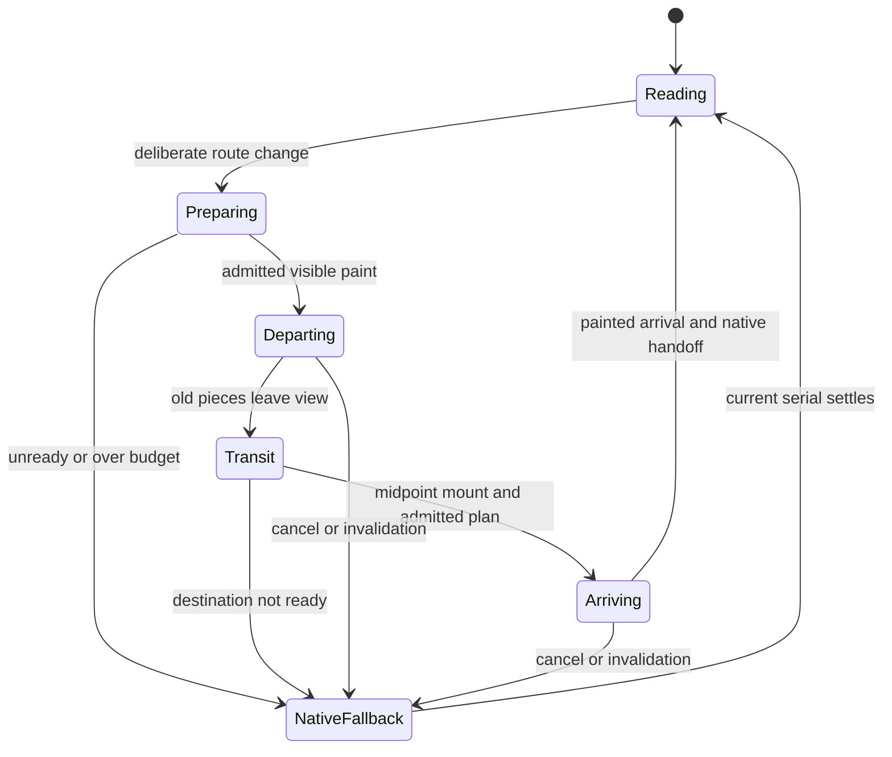

# Issue 49 — 2026-10-08 revised analysis and Sol handoff

Owning issue: [#49](https://github.com/oborskyivitalii/oborskyivitalii/issues/49#stationary-reading-and-two-sided-fragment-flight--8-october-2026).
Owning Draft PR: [#53](https://github.com/oborskyivitalii/oborskyivitalii/pull/53).
Role: architecture/design self-analysis, with separate read-only source and design
reviews; not an implemented prototype or independent implementation acceptance.
Inspected main: `9da2476c9269345a242c7524374a645b0a21c2d4`, tree
`a1426cdf9ca1f740f56a6a66bd8f555d8820ddd6`.

This revision answers the maintainer's 8 October request: remove camera movement
caused by reading scroll, retain scroll-triggered route flights, disassemble the
outgoing visible content into unequal spatial fragments, fly through it and the
scene, then assemble the incoming content from the fractal's interior.
It authorizes assessment and planning only. Runtime implementation, deployment
and merge remain subsequent work. The earlier [7d2d889 analysis](https://github.com/oborskyivitalii/oborskyivitalii/blob/7d2d8893275c9217cb513a1be1841473ae020ff4/review/issue-49/2026-10-08-analysis.md)
is preserved history: its optional outgoing effect, old source owners and
unchanged reading-camera contract are superseded by this explicit revision.

Read root AGENTS, CONTRIBUTING, CODE-STYLE, site/README, current source owners,
acceptance/profile/budget contracts and live issue49/PR53. Only root AGENTS applies.
Issue58/PR60 is merged and closed; PMDay recording and active ribbon removal are
already in main. PR53's old seven-file planning tree is reconciled with this main,
without importing stale runtime, catalog or memory copies. Issue50/PR52 remain
closed duplicate/superseded history. Publication checks belong in the live PR.

## Assessment and intended experience

The direction is coherent: native reading becomes calm and spatial movement marks
an intentional route change. It also removes the need to map changing article
length/filter results onto a camera path. This is a behavior change, not a parity
refactor, and removing one listener is insufficient. Ambient fractal motion remains;
there is no measured performance gain yet.

| User action | Intended result |
| --- | --- |
| Scroll within a page | Native text scroll; the route's settled camera stays fixed; existing ambient objects/fog remain alive when Motion is on. |
| Continue deliberately beyond a page edge | Existing wheel/touch/key intent gate starts one route transaction. Inertial tails must not skip a second route. |
| Depart | The actual visible text and images separate into varied fragments. The forward camera passes through their expanding arrangement; pieces leave the near plane safely. |
| Travel | Existing room/world composition and route flight remain visible between content layers; a giant fading paper rectangle must not conceal them. |
| Arrive | Next landing viewport's fragments emerge from a world-space corridor inside its fractal and converge exactly onto native HTML. |
| Read the next page | Ordinary complete semantic HTML is visible; fragment nodes/resources and per-frame work are gone. |

Incoming and outgoing fragmentation are both required. Pieces may be planar
paint surfaces moving/tilting in 3D; extrusion of individual letters is not assumed.
Mixed sub-glyph, glyph, word and image fragments remain the visual goal.

**Proposed direction default:** next/bottom-edge travel goes forward; previous,
top-edge and history travel preserve current route direction and native landing.
Both directions receive the fragment treatment, including emergence from depth.
The phrase "forward" describes the next-page journey here. Always-forward travel
even on Back would change room traversal/turnaround and is a separate unresolved
choreography choice, not silently included in this plan.

## Current-source findings

| ID | Verified source | Finding and consequence |
| --- | --- | --- |
| F01 | `site/engine/lifecycle.cjs`: `scrollPose`, scroll handler, `flushLayout`, `initialize`, `preferenceChanged`, `site:scene-focus`, `landingPose` | Reading Y, Writing topic paths and layout events select/retarget camera poses. Replace the complete settled-pose policy; deleting the listener alone leaves movement. AC08/04. |
| F02 | `lifecycle.cjs`: `frame`, `draw`, `reportTravel`, `advanceJourney` | One scene RAF owns actual painted camera/progress. Route duration is `min(1700, 1000 + abs(depth delta) * 2)`; use its existing deadline. AC02/04. |
| F03 | `site/engine/navigation.js`: `navigate`, `flight`, `queueMount`, `mountNative` | One router serial/AbortController owns fetched data, hidden midpoint mount, filters, native Y/hash, head metadata, focus and readiness. Capture departure before hiding; capture arrival after real mount/landing. AC03–05. |
| F04 | `site/effects/flight.cjs`: `createPresentation`, `flightPose`, `measurePlane` | Active Color moves one whole content plane using perspective 1200px and `mountAt: 0.5`. It is not a shared world-projected fragment system. The old review prototype is no longer the editing owner. AC02/07. |
| F05 | `flight.cjs`: `installEndScroll`, `endScrollGate`; navigation input-tail/endpoint owners | Deliberate edge navigation is already independent from scene scroll-pose mapping. Preserve its controls, nested-input exclusions, cooldown and native reverse-bottom behavior. AC04/08. |
| F06 | `site/engine/math.cjs`: `cameraView`; projection/world/scene paths | Camera origin is x=.66w desktop/.42w compact, y=.48h. Rooms are offset by 128; projection, not viewport 50%50%, determines perceived center. AC02. |
| F07 | `styles.css`, `reading-surfaces.css`, `renderer.cjs` | Canvas is a separate background layer. Native fragments above it do not automatically pass behind individual fractal faces. Paper panels can conceal the origin. Real motion review must admit the backend. AC02/03. |
| F08 | `projection.cjs`: `loopTransform`; lifecycle ambient/cache owners | Ambient animation is separate from camera motion. Preserve one clock, phase continuity, adaptive policy and bounded room/model caches. Do not turn Motion off to make reading stationary. AC06/08. |
| F09 | `site/README.md`, scroll/engine/functional/navigation/staging validators | Active contracts currently require scroll-driven camera movement. Replace affected assertions explicitly while retaining native-scroll, route, freeze and budget checks. Historical reports keep their original identities. AC07/08. |
| F10 | `tools/quality/budgets.json`, current main build | Writing is 99,996 raw bytes against 100,000. New runtime must stay in shared declared sources; an extra inline payload or annotation can breach the limit. No byte limit increase. AC06/07. |

## Architecture and backend decision

Keep three owners: router for page transaction/semantics, scene for camera/time,
and Travel presentation for temporary content paint. Use existing explicit effect
assembly in `tools/site/effects.cjs` and export/variant consumers. Suggested pure
fragment-plan/projection helpers belong under `site/effects/`, with static rules
in canonical effect CSS. Names below are proposed contracts, not existing APIs.

| Backend | Assessment | Disposition |
| --- | --- | --- |
| Clipped native paint copies with shared world projection | Preserves browser shaping/crop/alpha; can cut inside glyphs; avoids capture dependency. DOM/compositor duplication must be bounded. No automatic per-face Canvas occlusion. | First small two-sided prototype; visual admission is mandatory. |
| Textured quads in the existing globally sorted Canvas scene | Can share actual depth ordering with fractal primitives. Faithful arbitrary HTML capture, alpha, perspective mapping and upload cost are unresolved. Existing formula bitmap handles compiled known artwork, not generic DOM. | Contingency if native pieces fail depth/fidelity; evaluate explicitly before implementation. |
| Per-character spans, full-page clones or whole-page screenshots | Character reconstruction risks shaping/wrapping; archive copies and generic capture expand memory, layout and compatibility work. Word-only motion misses partial glyphs. | Rejected default. |
| Separate WebGL/Three.js scene or independent animation timeline | Adds a second world/clock and a large unrelated migration. | Out of scope. |

Browser contracts checked against primary documentation on 8 October:
[CSS Transforms 2](https://drafts.csswg.org/css-transforms-2/#grouping-property-values)
describes flat transformed surfaces and grouping properties that flatten descendants;
[CSS Masking](https://drafts.csswg.org/css-masking-1/#clipping-paths) clips painted output;
[HTML Canvas](https://html.spec.whatwg.org/multipage/canvas.html#canvasimagesource)
does not provide arbitrary HTML subtrees as `drawImage` sources. Therefore placing
`preserve-3d` on a clipped parent is not a complete scene-composition solution.
Use one projected transform wrapper per piece with its clipped paint child and
verify the actual result. This recommendation is engineering judgment, not a
browser guarantee of depth or frame rate.

### A. Fixed reading camera, living scene

Choose one canonical settled pose per primary route using current route/scene
owners, initially the existing initial poses. Validate thematic composition and
Writing's formula in desktop/narrow Day/Night before freezing those choices.
No content-length/topic/hash-to-camera mapping remains while settled. Native
history Y, anchors, reverse-bottom and Writing filters still work normally.
Resize may recompute viewport projection/aspect, but cannot advance a path because
page height changed. Font/image/layout changes must not silently restore scroll
camera movement. Ambient world phase continues; Off/reduced/hidden/print preserve
their actual freeze/fallback behavior.

Use this same settled target for route arrival from top, bottom, hash and restored
history. Depart from the actual last painted camera, including interruption.
Removing old interior reading movement deliberately changes route endpoints when
departing from page bottom; retain room arrangement, flight algorithm and duration
rule rather than falsely claiming every old camera sample is identical. Do not
move the fractal/formula or revive ribbons to accommodate the new presentation.
Any necessary new framing choice must be shown in the prototype review.

### B. One route transaction and one painted clock

Extend the existing painted progress callback with a read-only view of camera,
viewport, projection, direction, progress and transaction identity. It describes
an actually painted frame; skipped Canvas paints cannot advance visible pieces.
Do not parse diagnostic `dataset.camera` or build a second projector/RAF/CSS clock.
The shared `math.cjs::cameraView` remains canonical; caller-specific near-plane
and visibility rules remain explicit.

After route data is ready, measure the current visible departure once before the
first breakup paint. This cost counts in input-to-ready/preparation. At the hidden
midpoint, dispose departure pieces, mount the real destination through the existing
router, apply filters/Y/hash and reuse its native layout boundary for arrival
measurement. Add a bounded post-mount presentation hook; do not clone or measure
fetched detached HTML as though it had the final layout.

Use the existing normalized progress as choreography: departing breakup before
midpoint, exposed scene transit around midpoint, assembly after midpoint, exact
native handoff at actual arrival. Ratios are prototype tuning, not added delays.
Do not make the whole camera trip longer to hide expensive capture or a late
incoming plan. Require at least 250ms of arrival window after readiness; otherwise
use the ordinary fallback for that transaction and retain the reason.

### C. Actual content fragments with safe geometry

Capture only each side's actual visible viewport plus at most 64 CSS px overscan.
Header/Appearance/skip link are persistent. Native content keeps its dimensions;
there is no permanent per-letter markup. Offscreen page content is already complete
and gets no new effect on later scroll. At a page bottom the departure contains
what the visitor actually sees there, not an invented return to the page top.

Choose the smallest bounded paint owner retaining shaped lines, inline ink and
image crop. Batch layout/style reads before writes. Bounded Range measurements
may guide glyph-sized cuts but do not provide glyph outlines or screenshots.
Preserve ligatures/combining marks/ink overhangs. Define a complete unequal mask
partition with shared boundaries and larger remainder cells; random omissions or
uniform word-only tiles do not meet AC03. Unsupported complex SVG/contextual CSS,
pseudo-elements or unready visible media trigger explicit whole-transition fallback.
Transparent portrait pixels, SVG references and responsive currentSrc must survive.
Copies are inert, aria-hidden, noninteractive and stripped of live identity/handlers;
rewrite admitted internal SVG references safely. No per-piece image download.

Initialize departure pieces at their exact native screen positions and unproject
them onto a finite plane ahead of the current camera. Give seeded bounded lateral
separation, depth offsets and mild rotation; actual camera motion supplies the
flight-through. Never project through z=0: clip/cull/fade before the near plane so
pieces leave the viewport without exploding or mirroring. Reverse trajectories
follow the selected route direction; no unreviewed camera turnaround is invented.

For arrival, derive a route-local emergence anchor from the existing world/fractal
geometry (or one explicit scene-owned anchor if needed), apply roomOffset and
project it with the painted camera. It must sit in the actual visible corridor,
not a fixed screen center. At a camera-facing endpoint depth d, unproject pixel
(x,y) using cameraPosition + right*((x-originX)*d/focal) +
up*((originY-y)*d/focal) + forward*d. Projected corners must converge onto the actual
native rectangle, including restored scroll and visual viewport offsets. Proposed
terminal corner error is at most 0.5 CSS px; actual ink/seams still need visual review.

Paper/reading surfaces have a coordinated fade/return separate from fine shards;
keep their canonical final appearance. On each handoff expose exactly one visual
representation, atomically revealing native content and removing decorative pieces.
No doubled glyph, line-wrap change, image jump or empty interval is acceptable.

### D. Cancellation and bounded work

One router serial owns preparation, fragments and disposal. Async font/image/route
results check that serial; canceled targets cannot return. Retarget from actually
displayed fragments only within the shared cap, otherwise cleanly take the ordinary
fallback. Never retain successive ghost layers. Resize/zoom/theme/font changes
allow one coalesced reprepare only when the existing deadline permits; otherwise
settle native content. Off/reduced/Content flight disabled allocate zero pieces;
no-Canvas/CSS failure, device hold, hidden, print and exceptions clear resources
through existing navigation completion/cancel paths. Controls/history/focus remain
usable, with a single announcement and no duplicate analytics event.

The previous provisional caps remain one shared experiment, not an additive budget:

| Resource | Prototype admission cap |
| --- | --- |
| Live pieces, both sides combined | 96 desktop / 40 compact, including retarget remnants |
| Distinct paint owners | 32 desktop / 20 compact |
| DOM descendants across copies | 1,500 desktop / 600 compact, bounded before cloning |
| Repeated text across copies | 32 KiB desktop / 12 KiB compact |
| Full owner surface area times capped DPR squared | 8M desktop / 3M compact pixels; an admission proxy, not a GPU-memory claim |
| Layout work | Batched departure snapshot plus batched native arrival snapshot; no layout reads in the frame loop |
| Steady state | Zero fragment nodes, retained copied surfaces, new observers or fragment style writes after completion |

Coarsen while preserving complete visible paint or fall back. Do not multiply caps
for departure and arrival, clone an entire archive per tile, or assume a small clip
means a small compositor surface. Avoid animated blur/shadows and permanent
will-change. Extra capture/prepare waits and allocations remain in the measured
transaction. Incoming and outgoing callbacks must preserve the existing scene tier.

## Measurement and economical verification

Keep all original budgets: transition preparation <=160ms, callback p95 <=80ms,
max <=200ms, gap <=300ms, ready <=3200ms, minimum 8 paints; ordinary callback p95
<=33ms and idle busy <=20%; Lighthouse LCP <=2500ms, TBT <=200ms, CLS <=0.1; existing
raw/gzip/asset/geometry limits. No actual performance claim is made by this plan.
Provisional incremental admission remains median added preparation <=30ms desktop/
50ms compact CPU x4, inclusive transition-work p95 delta <=8ms/12ms and added
input-to-ready <=100ms. Freeze definitions/conditions before collecting data;
report browser layout/paint/compositor work separately from JS callback timing.

Isolate the feature cost with same-source pairs: **stationary camera + legacy
presentation versus stationary camera + fragments**, with the same scene quality,
route, landing, input and cache state. Camera-policy savings cannot offset a failed
fragment budget. Measure scroll-camera removal separately only if claiming a gain;
ambient Canvas still paints while reading. Keep source/tree/artifact/served-runtime
identity, complete raw trials, fallback reasons and failed samples.

One bounded experiment: three serial pairs for each of four cases (24 measured
transitions total): desktop Home-to-Writing cold; compact CPU x4 same cold arrival;
desktop Research-to-Home portrait arrival; compact CPU x4 reverse-to-bottom with a
real picture-bearing departure. Freeze exact viewport/input/native Y and visible
owners first. These are transitions, not 24 Lighthouse runs. Retain representative
Day/Night desktop/narrow motion clips from the prototype; widen only to investigate
an observed defect. Early native macOS WebKit fidelity smoke is useful if available;
production/device gates remain with their release owners.

| Profile | Required disposition |
| --- | --- |
| This planning revision | Five existing policy checks (including Basic), formatting, code-style guard, RI/CI and relevant RI regressions. No new runtime tests or browser benchmark. |
| Implementation source | Extend existing flight/navigation/space/scroll-sync/engine suites with fixed reading pose, mixed partition coverage, projected endpoints/near plane, serial races, native handoff and bounded cleanup. Meaningful negative cases must fail. |
| Active behavior migration | Replace scroll-camera movement assertions in site/README, `tests/space.test.cjs`, `tools/quality/scroll-browser.cjs`, `engine-browser.cjs` writing gestures, `functional.cjs`, `navigation.cjs`, `staging-regression.cjs` and their dependent fixtures. Retain native Y/bounds/filters/history/edge-input and ambient/freeze tests. Inventory exact callers before edits. |
| PR hosted smoke | Reuse two-width persistent navigation; add one real two-sided text/image flight and reverse landing with progress frames. |
| Bounded staging | Existing Chromium/Firefox journeys, ten failures, motion windows, four cold/warm flights and two Lighthouse trials; add assertions within cases. No duplicate full diagnostic campaign. |
| Production | Existing full/native macOS WebKit/device/release coverage. No Linux WebKit expansion. |

Keep legacy whole-plane numerical assertions for the retained fallback. Old
scroll-camera route-policy expectations become dated history; pure path/projection
math tests stay where still used by route flights. Register new helpers/meaningful
tests under current RI/test-profile owners. Do not run frozen issue58 migration
snapshots as future feature semantics. Preserve CI/static identity and exact scanner
review, without widening frozen debt or changing security thresholds.

## Sol tasks

| Task | Owner and expected result | AC / verification | Dependency and status |
| --- | --- | --- | --- |
| T01 | Revalidate this issue/PR and actual main; reconcile planning files with merged R2–R6 and preserve PMDay/no-ribbons. | AC01/07; exact branch/tree/changed-file review. | Planning revision here; revalidate again at execution. |
| T02 | In lifecycle and existing route/scene owners define settled reading pose; decouple scroll/filter/history/layout from camera while retaining native navigation and ambient phase. Inventory and revise the conflicting active contracts together. | AC08/04; fixed camera across native Y/filter/hash/reflow, live ambient on, correct Off/hidden and edge-triggered flight. | First implementation checkpoint; show route framing, especially Writing formula. |
| T03 | Extend actual painted-frame presentation seam. Build bounded opt-in departure + arrival prototype for a real heading, paragraph and portrait using shared projection. | AC02/03; identity-pose fidelity, unequal sub-glyph/glyph/word/image coverage, correct scene anchor, safe near plane. | After T02. No route-wide rollout yet. |
| T04 | Record real two-sided clips and isolated same-source performance/resource pairs; review depth, framing and native seam. | AC02/03/06; original and incremental limits, all raw failures retained; maintainer visual decision. | Gate. If flat or costly, stop and review Canvas/capture alternative. |
| T05 | Integrate bounded visible owners and native midpoint/landing capture; preserve one serial/history/head/focus transaction. | AC03/04; forward/reverse/nonadjacent, bottom/hash/filter/history landings, no full-main clones. | Only after prototype admission. |
| T06 | Complete retarget, cleanup, reflow/readiness, disabled/failure modes and semantics. | AC04/05/06; adversarial stale callbacks, no duplicate identities, no retained pieces or growing caches. | With T05. |
| T07 | Canonical/export/offline identities, CSS, mapped tests/profile registry, source scanners and RI. Replace pending-only mappings with actual named feature checks. | AC07; CS01–CS10, clean/incremental parity and exact coverage; no weakened budgets. | With implementation; update same file's task status. |
| T08 | Run relevant PR and bounded-stage evidence through existing controller; independent implementation review and final actual AC evaluation. | AC02–08; source-bound browser/raw evidence, author visual acceptance and final merge/main gate. | Final candidate; separate release/promotion authorization. |

Sol can implement T02–T03 after execution is requested. Astra/design role reviews
T04's geometry, depth and failure tradeoffs before broad integration. Model names
are roles, not evidence of model superiority or independent review. The code work
is suitable for Sol; backend admission and visual judgment should not be delegated
to generic green tests.

## Decisions, acceptance and handoff

Accepted scope from this request: stationary reading camera, preserved native
edge-scroll route flights, required outgoing breakup and incoming assembly.
Recommended but not yet visually admitted: native clipped backend, initial settled
route poses, exact fragment trajectories/phase tuning and provisional caps.
Proposed navigation default: preserve reverse Back/top-edge behavior; always-forward
travel remains a separate choreography decision. No feature execution or merge
approval is inferred from this planning request.

Stable AC01–AC07 are retained and extended through the dated issue amendment;
new AC08 owns stationary reading camera. AC01 covers this revised design delivery.
AC02–AC08 remain unchecked until implemented and evidenced. The planning policy
keeps feature gates explicitly pending, rather than passing them with prose checks.
AC07 includes CS01–CS10: canonical ownership/dependencies, content/CSS separation,
readable bounded factories, one clock/disposal, measured limits, meaningful tests,
reviewed exceptions and accurate issue/PR evidence. This revision edits only
analysis, acceptance/catalog/RI metadata and dated MEMORY; runtime rules are
implementation obligations, while touched configuration follows pinned formatting.

Two separate read-only agents reviewed current camera/source ownership and the
UX/performance/backend design. Their findings are incorporated: full pose-policy
replacement, both-sided prototype, native landings, shared caps, isolated paired
baseline and reverse-direction caveat. This is independent design review only.
No source behavior, browser visual acceptance or performance result is claimed.
Exact publication and deterministic results are recorded in PR53 and the issue
anchor; the original plan/checkpoint links remain historical evidence.
