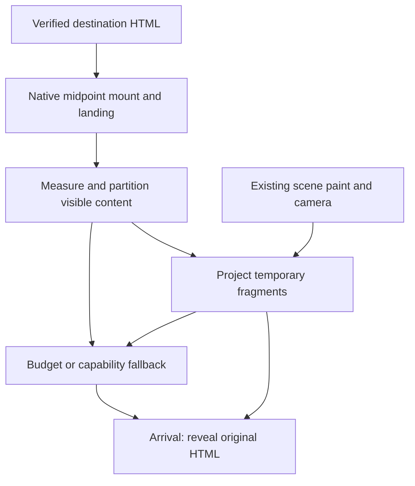

# Issue 50 — 2026-10-08 architecture and Sol handoff

Owning issue: [#50](https://github.com/oborskyivitalii/oborskyivitalii/issues/50).
Dated anchor: [architecture and execution handoff](https://github.com/oborskyivitalii/oborskyivitalii/issues/50#issuecomment-6054739896).
Owning PR: the Draft PR containing this file; its exact commit/file link is recorded at that anchor.
Role: Codex architectural analysis and self-review, not independent implementation review.
Inspected source: main `aa1cfa97bf42103c0547c9332b885391f0e6fe6b`, tree `64f68e79a1463f70075a54e0b4099861d27eebdb`.
Live GitHub confirms PR47 merged; [issue48 / PR51](https://github.com/oborskyivitalii/oborskyivitalii/pull/51) independently owns the next content/formula-depth amendment.
Scope of this commit: planning, acceptance routing and continuity only. No new runtime or visual/performance measurement is claimed.

## Intent and recommendation

Make incoming text and images seem to emerge from the existing fractal as differently sized pieces, including partial letters, then assemble into the normal page. Preserve the fractal's position and its navigation. This is a coherent visual continuation of the existing concept: information becomes legible as the visitor reaches it. It will work best as a brief controlled assembly, with small rotations and stagger, rather than a long particle storm that delays reading.

**Recommend a bounded native-DOM fragment presentation sharing the scene's projection and painted clock.** Keep the real page intact underneath; temporarily render clipped decorative copies of small paint units. Use a measured feasibility step before choosing it as the normal presentation. A renderer rewrite, a general DOM screenshot system and thousands of letter meshes are disproportionate to this request.

The important qualification: this gives perspective-correct motion relative to the current camera, but a DOM layer above the background Canvas does not have per-face depth occlusion with books/ribbons. That limitation must be judged in the prototype. If the effect still looks like a foreground overlay, AC02 has not passed; do not relabel it as physical world integration. A separately reviewed Canvas-texture route is the contingency, not an invisible scope expansion.

The requested work here is the assessment and handoff. Implement the prototype when the maintainer asks Sol to execute; use this same issue/PR. Planning completion does not complete the feature.

## Inspected implementation and findings

Read root README/AGENTS/CONTRIBUTING/MEMORY, the relevant repository-map routes, site/README, the maintained Color flight module, navigation/lifecycle/projection/math/rendering sources, shared paint and Home image sources, variant producer, acceptance contract, profile guide, budgets and motion probe. Only root AGENTS exists in the inspected checkout. MEMORY predates PR47's successful staging/merge; the live issue/PR and fetched Git refs supersede that stale status.

| ID | Current owner / evidence | Finding and implication | AC |
| --- | --- | --- | --- |
| F01 | `site/engine/navigation.js`: `flight`, `mountNative`, `navigate` | Verified immutable HTML is fetched/prepared before travel. Color hides the old page and queues the native mount at progress 0.5; archive filters, restored scroll/anchor and synchronous scene layout run before arrival. Reuse this transaction. | AC02, AC04, AC05 |
| F02 | `review/site-scroll-sync-20261004/FLIGHT-PROTOTYPE.cjs`: `flightPose`, `createPresentation`, `measurePlane` | Despite its historical directory/name, this is maintained Color source. One entire content plane currently uses `perspective(1200px) translateZ(...)`, opacity and a viewport-relative transform origin. Forward arrival starts at -4200 CSS px; backward starts at +1020. It has no glyph/image partitioning or scene projection. | AC02, AC03 |
| F03 | `site/engine/lifecycle.cjs`: `draw`, `frame`, `reportTravel`, `navigate`, `rebaseJourney` | The Canvas paint happens before progress is reported to the presentation. Flight duration is `min(1700, 1000 + abs(deltaZ)*2)` ms; retargets preserve the remaining deadline and displayed camera. Keep this single clock and actual-paint relationship. | AC02, AC05, AC06 |
| F04 | `site/engine/projection.cjs`: `projectedWorld`, `formulaCamera` | Perspective origin is `(0.66w, 0.48h)` desktop and `(0.42w, 0.48h)` at width <=640. Focal length also changes on narrow viewports. A centered CSS explosion cannot match this scene. | AC02 |
| F05 | `site/engine/styles.css`, `reading-surfaces.css` | Scene Canvas is a background layer; reading paint is shared 87% paper alpha, opaque ink and effective 12px corners. Header/Appearance are a separate stable control layer. Shattering large reading panels with every glyph would hide the fractal and inflate paint work. | AC03, AC04 |
| F06 | `site/content/pages/index/hero.html` | Actual image content includes a transparent WebP portrait over inline SVG facets. Testing only text, or only an opaque rectangular JPEG, misses the requested image behavior. | AC03 |
| F07 | `renderer.cjs`, `projection.cjs`, `tools/site/scene-assets.cjs` | The formula has a specially compiled finite vector source, one 1380x240 cache and bounded perspective submissions. This is not a general HTML capture facility. Reusing its camera math is reasonable; promising arbitrary pixel-exact HTML capture from it is not. | AC03, AC06 |
| F08 | `tools/quality/motion.cjs`: `installProbe`, `summarize`; `budgets.json` | Current callbacks include script/Canvas work and report paint intervals, not complete compositor/raster cost or display FPS. New DOM layers require bounded browser trace/visual evidence as well as these existing thresholds. | AC06 |
| F09 | `site/README.md`, `tools/site/variants.cjs` | Runtime has no third-party dependency and Color has an explicit fingerprinted effect contract. Its scene collect/paint hooks share one sort/clock. Add a small authored module through the existing producer; do not edit generated docs or invent another effect framework. | AC07 |

## Alternatives and decision

| Approach | Benefit | Main cost / limitation | Disposition |
| --- | --- | --- | --- |
| Animate whole cards/words or a uniform tile grid | Easy first visual | Does not satisfy partial-letter and mixed-scale intent; regular grid reads as a screenshot transition | Reject as final effect |
| Native clipped text/image fragments, shared camera | Native typography/image rendering; no general screenshot library; reversible decorative layer | Cloning/paint/compositor cost; exact shaping needs proof; no per-face Canvas occlusion | Recommended bounded prototype |
| Canvas texture fragments in existing depth-sorted renderer | Actual scene depth interleaving; cheap bounded draw records after a texture exists | Faithful responsive HTML-to-texture capture is the hard dependency; font/CSS/SVG/image handling and memory | Contingency if perceived depth fails |
| New WebGL engine / meshes for every glyph | Maximum 3D freedom | Duplicates established engine, glyph shaping, image surfaces and lifecycle; substantially larger scope | Defer |

Public capability check on 2026-10-08: [drawImage](https://developer.mozilla.org/en-US/docs/Web/API/CanvasRenderingContext2D/drawImage) takes image/canvas/video sources, not an arbitrary rendered HTMLElement. Chrome's [HTML-in-Canvas documentation](https://developer.chrome.com/blog/html-in-canvas-origin-trial) describes an experimental origin-trial API; it supplies no cross-browser production guarantee for this site. [Range.getClientRects](https://developer.mozilla.org/en-US/docs/Web/API/Range/getClientRects) exposes layout rectangles, not glyph outlines or DOM pixels; [document.fonts](https://developer.mozilla.org/en-US/docs/Web/API/Document/fonts) exposes font readiness. These facts motivate the native-fragment proposal; they do not prove its fidelity or cost. Do not base Safari/Firefox support on an experimental capture API or assume `foreignObject` serialization is pixel-exact.

## Proposed architecture

### Responsibilities and integration

| Owner | Proposed responsibility |
| --- | --- |
| `site/engine/navigation.js` | Own navigation serial, midpoint commit, actual landing geometry, cancellation, semantic completion and fallback. Notify the presentation after the native destination is ready. |
| `site/engine/lifecycle.cjs` | Supply a read-only context for the actual painted frame along with progress: camera, viewport, projection parameters, route, ambient phase, paint identity and completion reason. Preserve old scalar-callback compatibility. |
| `site/engine/projection.cjs` | Factor/reuse the existing view basis/projection and add a pure inverse-at-depth helper. Demonstrate numerical parity of existing world/formula projections; no path/world edits. |
| Proposed `site/engine/content-fragments.cjs` | Pure bounded partition/trajectory math and one navigation-scoped native fragment manager. This is a proposed source, not delivered implementation. Split further only if real ownership warrants it. |
| Maintained `FLIGHT-PROTOTYPE.cjs` | Keep Color control/entry adapter and the existing simple presentation as fallback. Replace incoming `translateZ` only after the prototype passes. |
| `tools/site/variants.cjs` and existing exporters | Include the new authored dependency in effect identity, hosted Color and standalone builds; declare schema changes if necessary. |

No independent RAF, CSS animation timeline, timer-based easing, full-page screenshot, application-framework migration or persistent fragment cache. Existing one-shot mount/decode scheduling is preparation, not another animation clock. Never scrape/parse the diagnostic `data-camera` string each frame; pass the actual already-computed view state through the narrow internal contract. Distinguish real painted arrival from forced completion due to failure/Off/hidden; the latter must reveal native content safely without needing a final animated frame.

### Native content and fragment construction

1. Retain the original mounted HTML, metadata, links and layout unchanged. Existing opacity hiding may cover preparation; never use `display:none` to measure it. Run filters and restore the actual top/bottom/history/anchor position first. In particular, reverse edge navigation can land at the destination bottom, not its H1.
2. Collect only paint units intersecting the destination viewport, with a small bounded margin. Units are bounded inline/text blocks, images and inline SVG; exclude header, Appearance, scene/fallback, scripts and technical widgets. Include every represented visible content region or select the simple fallback for the transition—do not silently omit surplus prose.
3. Batch layout/style reads once. Preserve the source unit's complete inline shaping context, fixed measured width, font/line metrics, decorations and relevant computed style. Do **not** replace the original text with per-letter spans, split ligatures into newly shaped letters, or clone the full page for every tile. A cropped copy of a small existing text block retains context more safely than a separately laid-out substring; it still requires visual parity checks.
4. Use `Range` line/word rectangles to guide a deterministic hierarchical partition. Some boundaries deliberately cross ink to produce partial letters; others contain complete glyphs or pieces of words. Avoid hundreds of per-character layout queries: fine sampling is capped and concentrated on the largest visible heading; merge paragraph areas into coarser pieces. A grapheme boundary alone is not evidence of a glyph's ink bounds.
5. Use a seed from pinned route/content identity plus paint-unit index; no per-frame randomness. Partition source rectangles exactly once into nonoverlapping variable-size pieces. Rectangular/inset clips are the first implementation; irregular polygons are optional after measuring cost. The source looks fragmented because the glyph ink itself is cut and pieces diverge, not because every piece is a colored tile.
6. A fixed decorative overlay outside `#site-content` and its scroll/layout observers holds tightly clipped fragment wrappers with offset small source copies. Preserve original image `currentSrc`, intrinsic dimensions, transparent pixels, `object-fit/object-position` and displayed crop. Inline SVG local IDs/references must be consistently remapped in decorative copies; remove conflicting HTML IDs and actionable/form semantics. Use `aria-hidden`, `inert` and `pointer-events:none`; no duplicate focus/live regions or metadata.
7. Do not blindly replicate 87% paper backdrops per tiny fragment: overlapping translucent panels would change color and hide the scene. Animate ink/images; fade or assemble the reading surfaces as a few larger supporting units late in arrival. Their **settled** paint comes from the existing shared CSS without new overrides. The prototype must prove ink isolation does not erase decorations or change native line geometry.
8. At actual arrival, show the original page and remove the overlay in the same completion transaction. Endpoint geometry should agree within 0.5 CSS px before the swap, with browser captures checking anti-aliasing/seams as well. Final DOM remains the exact readable/interactive page. Do not compensate for wrong fragment layout with a long crossfade.

Complex contextual selectors, pseudo-elements, list markers, inline highlights and blended SVG are explicit source-extraction risks. Support the site's real current units; unsupported elements trigger a documented fallback, not a claim of universal HTML rendering. A future article adapter is outside this issue.

### Spatial origin and trajectory

Use the scene's existing `R` (right), `U` (up), `F` (forward), camera `C`, focal length `f` and principal point `(cx,cy)`. A target point `(x,y)` on a plane at safe positive depth `d` can be unprojected as:

`P = C + F*d + R*((x-cx)*d/f) - U*((y-cy)*d/f)`.

Apply the same calculation to fragment corners, then project through the **actual current painted camera**. At the terminal frame the fragment corners must match their native viewport rectangles. Use a planar CSS matrix derived from those projected corners, not a second hard-coded perspective/center. Limit rotations and depth excursion so near-plane/singular transforms cannot occur; invalid geometry falls back.

Choose the emergence anchor from the **visible** existing scene corridor at the first eligible post-mount paint, using its view ray and current room bounds, with a narrow seeded spread around that point. The anchor is visual/presentation state only; it never mutates a room, arch, formula or ribbon. Do not assume the incoming room is in front of the camera on reverse/multi-route/history flights. If its selected corridor is behind the near plane, use an evidenced visible-corridor choice or fallback; do not project negative depth or change camera orientation to rescue the effect. The visual test must include this case.

In the first portion, pieces have coherent small scale, depth/fog attenuation and limited twist around the corridor; in the latter portion, offsets/rotations decay to the destination rectangles. Different delays produce assembly without leaving content waiting after camera arrival. Both forward and reverse arrivals emerge from the visible scene; do not mechanically reuse the current backward +1020 CSS-z entrance.

Start with existing departure and midpoint timing: departure through 0.46, hidden mount at 0.5, assembly during the remaining painted interval. Normalize from the actual first ready fragment frame `p0`: `u = clamp((p-p0)/(1-p0))`. If preparation finishes too late for several actual frames, use the simple completion path; never extend the journey just to play the effect. After normal layout retarget, rebase from the displayed shard pose to newly measured targets over the remaining deadline; for major resize/font/theme change, safe fallback is acceptable. Quick route replacement cancels the old owner and preserves the scene's displayed camera; no obsolete owner may remount/reveal content.

### Prototype budgets and fallback

These are **starting design caps**, not measured results or changes to release budgets:

| Resource | Initial proposal | Failure behavior |
| --- | --- | --- |
| Active fragment wrappers | Desktop target 80, hard cap 128; narrow target 40, hard cap 64; outgoing visual does not double the cap | Merge partitions within fidelity constraints, otherwise use simple transition |
| Paint-unit scan | At most 64 visible units; at most 256 fine text-range measurements | Coarse bounded partition or fallback; never scan the complete Writing archive per flight |
| Copied DOM | At most 1024 decorative nodes desktop / 512 narrow, including all descendants | Abort construction and release copies |
| Copied paint area | Sum **full cloned source-unit** CSS areas <=8 viewport areas desktop / <=4 narrow; account for DPR separately | Do not pretend clipped area equals compositor memory; fallback if over cap |
| Added fragment preparation | Target <=20ms desktop / <=40ms at narrow CPU x4 within the existing total limits | Abort optional enhancement; preserve existing overall preparation/ready limits |
| Lifetime | One current-navigation layer; zero retained fragments/callbacks after arrival/cancel; no image prefetch added | Idempotent destroy and normal/native content |
| Idle work | No fragment allocation, measurement or animation after arrival | Test repeated visits and frozen states |

Count alone is insufficient: one paragraph copied 80 times may rasterize far more than 80 small textures. `overflow/contain:paint` can bound intended painting but do not guarantee GPU-memory savings. Measure actual style/layout/paint/compositor events and input-to-readable time; record browser/device/DPR. Do not advertise 60fps: the current camera cadence is adaptive and normally capped at 30/20/15Hz.

All existing thresholds in `tools/quality/budgets.json` stay unchanged: flight preparation max160ms; callback p95 80ms / max200ms; maximum paint gap300ms; ready3200ms; minimum8 flight paints; idle p95 33ms / busy20%; Lighthouse LCP2500ms / TBT200ms / CLS0.1. Read the maintained validators for their exact aggregation rather than inventing a new interpretation. Proposed fragment thresholds may be tightened from evidence; raising a release budget requires a separate explicit decision.

`Content flight` off uses the current simple presentation without shards. Motion Off, reduced motion, hidden/print, unavailable Canvas, decode/font timeout, unsupported clipping and resource exhaustion finish through existing safe behavior. If font/image pixels needed for the viewport are not ready, do not wait indefinitely or capture placeholders. Hidden/print/off cleanup must not depend on another RAF. Theme or resize during assembly can discard shards and reveal valid current-theme native content. No user-facing technical error controls are needed.

## Ordered Sol tasks

| Task | Owning paths and expected outcome | Finding / AC | Check / stop condition | Dependency |
| --- | --- | --- | --- | --- |
| T01 | Revalidate main/PR/issue50 and issue48; record implementation baseline and inherited world/formula/camera identities here | F01-F09; all ACs | Exact refs and complete diff; preserve concurrent work | Execution requested |
| T02 | Prototype one real large heading with inline text plus Home portrait/SVG using bounded native clips; keep it opt-in inside this PR | F05-F07; AC03, AC06 | At rest visual parity, at least partial/whole glyph and word pieces, image alpha/crop, node/area/setup limits; reject architecture if it cannot meet them | T01 |
| T03 | Factor pure view/inverse math and add optional painted-frame context through lifecycle/navigation; preserve all existing projection outputs | F03-F04; AC02, AC05 | Existing projection/ribbon/camera fixtures plus corner roundtrip, near-plane rejection, real versus forced completion | T02 viable |
| T04 | Connect visible-corridor trajectories to actual post-mount geometry and painted progress; prototype forward, reverse and nonadjacent travel | F01-F04; AC02, AC03 | Fixed seed, bounded finite matrices, terminal <=0.5px, retarget continuity and no deadline/path change; retain short clips | T03 |
| T05 | Add exact source coverage/cleanup, native semantics, whole-transition fallback and existing control integration | F01,F05-F06; AC04, AC05 | Unsupported/decode/font/error/cancel/Off/hidden/print/resize/theme cases; no duplicate IDs, inert/opacity leak or observer loop | T04 |
| T06 | Compare unchanged baseline and candidate on same hardware/browser with existing flight probe plus bounded paint/compositor trace | F08; AC06 | Original thresholds and proposed fragment caps; report regressions honestly and refine once against a concrete cause | T04-T05 |
| T07 | After visual/fidelity/cost acceptance, generalize supported visible content across four primary routes through canonical Color producer | F09; AC03-AC07 | Hosted/offline identity and native routes/filters/anchors; Credits stays instant | T06 viable |
| T08 | Extend existing test owners and replace pending planning criteria with meaningful executable runtime mappings; regenerate dependent output/RI | All; AC07 | Basic + targeted AC + normal preview smoke; no duplicate whole-suite workflow | T07 |
| T09 | Independent source review, maintainer visual review, applicable bounded staging and eventual merge reconciliation | AC02-AC07 | Exact source/run evidence, actual issue checkboxes and documented test/profile disposition | Explicit applicable decisions |

All tasks are pending implementation. T02-T06 are one bounded feasibility iteration; do not build all routes before proving glyph fidelity, scene-origin perception and cost. If native fragments fail, update this same analysis/issue with the observed failure and a scoped Canvas-texture alternative. Do not silently ship a words-only fallback as acceptance of partial-letter assembly.

## Acceptance checks and economical allocation

| AC | Future deterministic/behavioral evidence | Browser or human evidence | Allocation |
| --- | --- | --- | --- |
| AC01 | Existing RI freshness, CI coupling, owner-selection and pending-gate semantics validate this planning delivery | Read the analysis, actual linked PR/source and limitations | Planning policy + normal Basic |
| AC02 | Extend `tests/space.test.cjs`, `tests/ribbons.test.cjs`, `tests/navigation.test.cjs`: camera parity, view roundtrip, both directions, finite corners, arrival/retarget and unchanged path/phase | Short Day/Night desktop/narrow forward/reverse/nonadjacent clips; maintainer perception of origin | Targeted PR checks; reuse normal staging journeys |
| AC03 | Extend `tests/flight.test.cjs`: seeded partition union/no overlap, variable size, deliberate glyph-ink cut fixtures, image rectangle/alpha/crop and caps | Real font/shaping/ligature/inline/SVG portrait frames; compare actual visual output, not only fixture counts | Targeted PR evidence |
| AC04 | Existing navigation/archive tests plus terminal native geometry and exact semantic restoration checks | Selection/click/focus/announcement, scroll/history/anchors/filters, zoom and Day/Night | Normal smoke plus small targeted extension |
| AC05 | Inject stale serial, failure, cancellation, readiness, forced completion and freeze into actual manager/navigation tests; bounded retained resources | Representative interrupted flight, fallback, hidden/print and resize/theme cases | Targeted source and existing failure profile |
| AC06 | Assert resource caps and no idle work; keep original raw-report validators | Paired flights and small browser traces; actual Safari/iPad observation; no claims from callback timings alone | One bounded opt-in prototype comparison; normal authorized staging |
| AC07 | Source generation, immutable/offline fingerprints, current AC policy/RI/CI and test registry | Independent review, exact CI/preview, maintainer visual and applicable merge/stage decisions | Existing PR/staging/production profiles |

Prototype performance sample: two same-environment pairs per profile (1440 native CPU and390 CPU x4), baseline/candidate order reversed for the second pair; each pair observes cold/warm Home→Writing and Writing→Home flights to include dense text and the image. Total16 paired flight observations (32 individual flights), not a new Lighthouse campaign. Retain one short representative browser trace per profile. Counts and lab limitations belong in the report; this is enough to reject a bad approach, not to prove universal device performance. A concrete collection failure does not authorize replaying successful observations; repair/revalidate retained evidence first. Re-run only affected measurements after relevant runtime changes.

Use Linux Chromium/Firefox for their existing source/PR/staging routes. Get an early **small native macOS WebKit/Safari fidelity check** before generalizing the prototype when that runner is available; it does not add WebKit to Linux. Native/physical iPad evidence remains explicit if unavailable. Full production regression stays at the production gate; this analysis requires none of it. Existing permanent tests should own enduring behavior; do not add dated duplicate suites. At completion, record what remains PR/staging/production/diagnostic and retire only truly obsolete checks while retaining independent failure coverage.

## Current evidence and remaining decisions

The planning policy intentionally leaves AC02-AC06 as `manual-only-pending` because the feature and its tests do not exist yet. Their gate descriptions specify the runtime evidence to add during execution. This is an honest preparation state, **not** a decision that these properties can only be tested manually. AC07 also retains implementation/review/merge gates. AC01's automation checks repository routing, not the semantic quality of this recommendation. Do not replace missing implementation checks with prose-keyword tests.

Prepared checks are recorded in the exact planning commit/CI at the issue anchor. No browser benchmark, new visual capture, native device check, independent review, stable-stage promotion or production release was performed for this analysis.

Recommendations needing evidence rather than more planning: native-clipped fidelity, perceived depth without face occlusion, viable shard count on Safari/iPad, and tolerable compositor cost. The user already authorized the assessment/issue/handoff. A subsequent execution request can authorize T01-T08; ordinary prototype refinements do not need repeated permission. Stable-stage/merge/publication retain their existing explicit decision routes.

**Role recommendation:** Sol should implement the bounded prototype and subsequent integration, using this ownership/acceptance plan. The architecture/visual reviewer should evaluate the first text+portrait flight and review the final integration. This is a task-fit recommendation, not a benchmark claim that one model is always more capable. Having the architecture author implement everything would save a handoff but lose the useful separation of hypothesis, execution and review; the immediate risk is browser rendering fidelity, so a measured prototype matters more than the model label.

## Issue synopsis

Recommend bounded native fragments driven by the existing painted camera, with exact ordinary-HTML completion. Current CSS plane motion is disconnected from the scene's off-center projection; typography/compositing and the lack of per-face depth occlusion are the main risks. Start Sol with a real heading plus transparent portrait/SVG prototype before generalizing. Planning delivery can satisfy AC01; implementation AC02-AC07 remain open until their actual source/browser/review evidence exists.
